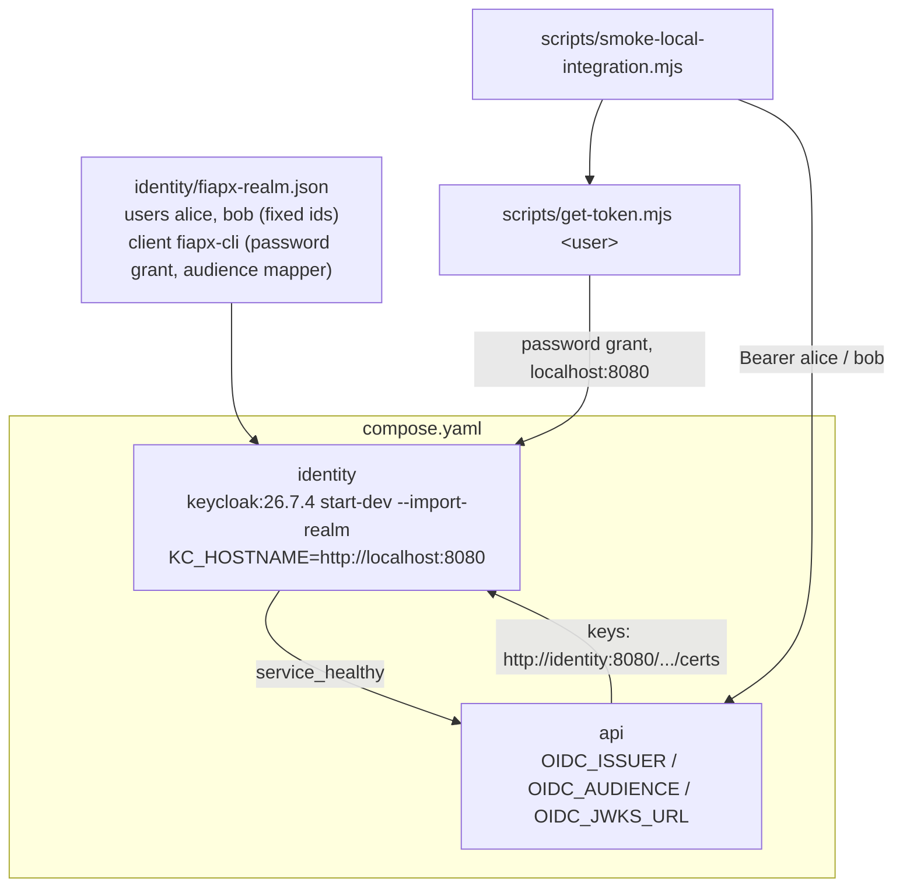

# Auth and Owner Scope Design — platform

**Spec**: `.specs/features/auth-owner-scope/spec.md`
**Context**: `.specs/features/auth-owner-scope/context.md`
**Status**: Draft

---

## Project decisions this design conforms to

| Decision | How this design conforms |
| --- | --- |
| **AD-005** — local, standard protocols; Keycloak is the OIDC provider | Keycloak 26.7.4 in the topology; the API receives an issuer, an audience and a key-set URL — nothing Keycloak-specific |
| **AD-007** — this repository owns the topology and the smoke | The provider, its realm, the token helper and the end-to-end proof live here |
| **AD-014** — verify an image is pullable before depending on it | `quay.io/keycloak/keycloak:26.7.4` checked for amd64/arm64 and pulled in the spike; mirrored at `docker.io/keycloak/keycloak` |

**No new project-level decision is proposed.** The password-grant client is a feature-local choice recorded in context.md.

---

## Spike evidence (2026-09-26)

A throwaway Keycloak 26.7.4 with a minimal realm (`start-dev --import-realm`, `KC_HOSTNAME` pinned) established every setting below:

| Question | Observed |
| --- | --- |
| Ready time | healthy after ~14 s; `Realm 'fiapx' imported` in the log |
| Healthcheck tools in the image | `bash` only — no `curl`, no `wget` |
| `iss` from the host vs from inside the network | identical, `http://localhost:<port>/realms/fiapx`, once `KC_HOSTNAME` is set |
| `aud` with an `oidc-audience-mapper` (`included.custom.audience: fiapx-api`) | `"fiapx-api"` |
| Key set from inside the network | served at `http://<service>:8080/realms/fiapx/protocol/openid-connect/certs` |
| Discovery from inside the network | advertises `jwks_uri` on the **public** hostname — unusable in-container |
| Wrong password / unknown user | `400 {"error":"invalid_grant","error_description":"Invalid user credentials"}` |
| **`sub` across a container re-create, users without an `id`** | **changed** (`317aca6c…` → `8a66ddde…`) |
| `sub` across re-creates with a fixed `id` in the realm file | stable across two starts |

The last two rows are the finding the spec did not anticipate: with no volume, every start re-imports the realm, and a user without a pinned `id` gets a new `sub` — every existing request would lose its owner.

---

## Architecture Overview

---

## Code Reuse Analysis

| Component | Location | How to Use |
| --- | --- | --- |
| Service block conventions (healthcheck, dev credentials comment, `depends_on: service_healthy`) | `compose.yaml` | The `identity` service follows them |
| Smoke step list, `runSteps`, `--self-test` | `scripts/smoke-local-integration.mjs` (S4 T20) | New checks are named steps with pure `check` functions and self-test cases — lessons L-007 to L-009 |
| Dependency-free script convention | `scripts/*.mjs` | `get-token.mjs` uses `fetch` only |
| Generated database script | `scripts/generate-db-script.mjs` → `db/create-database.sql` | Regenerated after the Catalog's new migration |

---

## Components

### `identity` service

- **Location**: `compose.yaml`
- **Image**: `quay.io/keycloak/keycloak:26.7.4`, `command: start-dev --import-realm`
- **Environment**: `KC_BOOTSTRAP_ADMIN_USERNAME` / `KC_BOOTSTRAP_ADMIN_PASSWORD` (development values), `KC_HEALTH_ENABLED=true`, `KC_HOSTNAME=http://localhost:8080`
- **Ports**: `8080:8080`; the management port (9000) stays internal
- **Volumes**: `./identity/fiapx-realm.json:/opt/keycloak/data/import/fiapx-realm.json:ro`; **no data volume**, so the file is the only source of truth
- **Healthcheck**: `bash` over `/dev/tcp` to `localhost:9000`, `GET /health/ready`, expecting `"UP"` (the image has no HTTP client); ~30 s budget
- **API**: `OIDC_ISSUER=http://localhost:8080/realms/fiapx`, `OIDC_AUDIENCE=fiapx-api`, `OIDC_JWKS_URL=http://identity:8080/realms/fiapx/protocol/openid-connect/certs`; `depends_on: identity: service_healthy`

### Realm file

- **Location**: `identity/fiapx-realm.json`
- **Content**:
  - realm `fiapx`, `registrationAllowed: false`
  - client `fiapx-cli`: public, `directAccessGrantsEnabled: true`, `standardFlowEnabled: false`, protocol mapper `oidc-audience-mapper` with `included.custom.audience: fiapx-api` on the access token
  - users `alice` and `bob`: **fixed `id` UUIDs**, `enabled`, `emailVerified`, first/last name and email filled (Keycloak's user profile otherwise demands them before issuing a token), password credential `temporary: false`
- **Notes**: Development passwords live here by the same rule as PostgreSQL's (AD-005). The file carries a note saying so.

### `scripts/get-token.mjs`

- **Interfaces**: `node scripts/get-token.mjs <user> [--password 
]` → prints the access token only; the password defaults to the demo password for `alice`/`bob`
- **Exports** for the smoke: `getToken(user, password)` — the same function the CLI runs
- **Failure**: `invalid_grant` → exit 1 naming the user and `error_description`; connection refused / DNS → exit 1 naming the `identity` service; a non-JSON answer → exit 1 with the status

### Smoke changes

- Creation sends `Authorization: Bearer <alice>` and no `ownerUserId`.
- New named steps, each an `observe` plus a pure `check`, all required by the self-test:
  - `anonymous refused` — `POST /processing-requests` without a token → `401`
  - `bob request created` — `bob` creates one request
  - `lists disjoint` — `alice`'s list lacks `bob`'s id and `bob`'s lacks every `alice` id
  - `cross-owner read 404` — `bob` reading `alice`'s id gets exactly the body a random UUID gets
  - `no internal fields` — no item in `alice`'s list carries `sourceStorageKey`, `zipStorageKey`, `failureCode` or `ownerUserId`, and her rejected request carries the safe `failureReason`
- Tokens are fetched when a step needs one and refetched on a `401` (spec edge case: expiry during a long run).
- Status polling keeps the Catalog's local observation endpoint for `zipStorageKey` (spec assumption).

### Database script

- Regenerate `db/create-database.sql` with `node scripts/generate-db-script.mjs` once the Catalog migration exists, and commit the result.

---

## Error Handling Strategy

| Error Scenario | Handling | Impact |
| --- | --- | --- |
| Realm import fails | Keycloak exits or never reports ready → `identity` unhealthy → the API never starts (`depends_on`) | `up --wait` fails visibly |
| Keycloak slow to start | Healthcheck retries within its budget | Longer `up`, not a failure |
| Token expired mid-smoke | Refetch once on `401`, then fail naming the step | Smoke stays reliable over the 5-minute token life |
| Wrong demo password | `get-token.mjs` exits 1 with Keycloak's `error_description` | Named, not a stack trace |

---

## Risks & Concerns

| Concern | Location | Impact | Mitigation |
| --- | --- | --- | --- |
| **`sub` changes on every restart without pinned ids** | realm file (spike) | Every request orphaned after `down`/`up` | Fixed `id` for each user; a task asserts `sub` is identical across two `up`s |
| **Issuer/hostname mismatch** | `KC_HOSTNAME` | Every token rejected by the API | Pinned hostname; the smoke's first authenticated call proves the pairing |
| **Healthcheck without an HTTP client** | image | A `curl`-based check would never pass | `bash /dev/tcp` probe against the management port |
| **Password grant is deprecated in OAuth 2.1** | realm client | Not suitable beyond local development | Documented in the README and the realm file; the client has no standard flow and no secret |
| **The smoke's CI job still skips (V11)** | `.github/workflows/ci.yml` | The end-to-end proof runs only locally | Unchanged here; V11 stays open |
| **One more JVM service** | compose | Longer start (~14 s) and more memory | Acceptable locally; the API waits on readiness |

---

## Tech Decisions (only non-obvious ones)

| Decision | Choice | Rationale |
| --- | --- | --- |
| Provider persistence | None (`start-dev` embedded DB, no volume) | The realm file is the source of truth; nothing hand-configured can drift |
| User identity stability | Pinned `id` per user | Spike: otherwise `sub` changes every start |
| Public hostname | `KC_HOSTNAME=http://localhost:8080` | One issuer for tokens requested from the host and validated in the network |
| Key-set URL | Internal address, passed explicitly | Spike: discovery advertises the public hostname |
