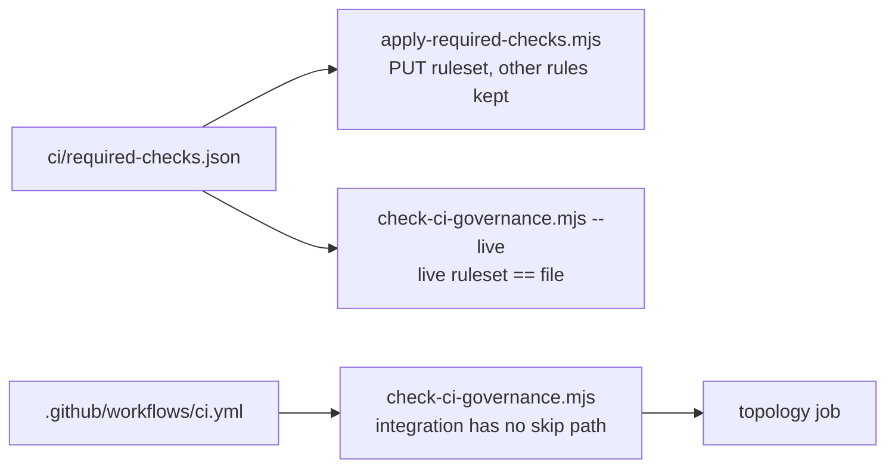

# CI Governance Design

**Spec**: `.specs/features/ci-governance/spec.md`
**Context**: `.specs/features/ci-governance/context.md`
**Status**: Draft

---

## Architecture Overview

The feature has three parts:

- a rewritten `integration` job;
- a versioned list of required checks;
- one new gate script, `scripts/check-ci-governance.mjs`, that guards both.

That script has three modes:

| Mode | What it reads | Where it runs |
| --- | --- | --- |
| default | `.github/workflows/ci.yml`: the `integration` job has no conditional step except the log collection on `failure()`, and runs the required stack commands in order | CI's `topology` job, build gate |
| `--live` | The five live `protect main` rulesets through `gh api`, compared with `ci/required-checks.json` | Build gate (needs `gh` auth); after the rulesets are applied |
| `--self-test` | Nothing external; feeds both comparisons bad, near-miss and good inputs, and spawns itself with a forced failure | CI's `topology` job, build gate |

Applying the rulesets is a separate script, `scripts/apply-required-checks.mjs`. It reads each live ruleset, replaces only the `required_status_checks` list with the versioned one, and `PUT`s the ruleset back, so every other rule is preserved. It is an externally visible change, so it runs only with an explicit go-ahead.



---

## Code Reuse Analysis

| Component | Location | How to Use |
| --- | --- | --- |
| Self-test shape (bad, near-miss and good inputs; exact messages; spawned failure) | `scripts/check-worker-sizing.mjs`, `scripts/check-identity.mjs` | Copied |
| The build gate's stack commands | `platform-gate-hardening/tasks.md`, steps 6–12 | Become the `integration` job's steps |
| `topology` job | `.github/workflows/ci.yml` | Gains the new script and its `--self-test` |
| Log collection on failure | Current `integration` job | Kept, and runs on `failure()` only |

No dependency is added. The workflow check parses the `integration` job's block as text: the repository has no `package.json`, and the scripts use only Node's standard library.

---

## Components

### `integration` job (CIG-01, CIG-02)

- **Remove** the `access` step and every `if: steps.access…` condition.
- **Checkouts**: the four services go through `actions/checkout@v4` with `repository:` and no `token:`, each at its `main`.
- **Steps, in order**:
  1. `docker compose up --build -d --wait`
  2. `node scripts/check-storage-bootstrap.mjs`
  3. `node scripts/generate-db-script.mjs --check`
  4. `node scripts/smoke-local-integration.mjs`
  5. `node scripts/check-identity.mjs`
  6. `docker compose up -d --wait --force-recreate identity storage-init api`
  7. the smoke again
  8. `check-identity` again
- **On failure**: the logs are collected and uploaded (`if: failure()`), then `docker compose down -v` runs (`if: always()`).
- **Timeout**: `timeout-minutes: 45`. Building four images plus FFmpeg on a hosted runner exceeds the current 20.
- **Ports**: no host-port overrides. The runner's 5432, 9000 and 3002 are free.

### `ci/required-checks.json` (CIG-03)

```json
{
  "tech-challenge-workshop/fiap-x-api": ["quality", "image"],
  "tech-challenge-workshop/processing-catalog": ["quality", "image"],
  "tech-challenge-workshop/processing-worker": ["quality", "image"],
  "tech-challenge-workshop/notification-service": ["quality", "image"],
  "tech-challenge-workshop/fiap-x-platform": ["topology", "docs-links", "integration"]
}
```

### `scripts/check-ci-governance.mjs` (CIG-01, CIG-03)

- **Workflow check**:
  - Inside the `integration` job's block, every `if:` must be `failure()` or `always()`.
  - No `SERVICES_READ_TOKEN` may appear anywhere in the workflow.
  - The eight stack commands must appear in order.
- **Live check**:
  - For each repository, it finds the ruleset named `protect main`, which must be active and target `~DEFAULT_BRANCH`.
  - It reads the `required_status_checks` contexts and compares them with the file as sets.
  - On a mismatch it fails with `<repo>: missing [..], unexpected [..]`.
- **`--self-test`**:
  - Workflow check: rejects a step still gated on `steps.access`, a token reference, a missing smoke and a reordered recreate; accepts the real text.
  - Live check: rejects a missing check, an extra check and a wrong target; accepts an exact match.
  - It also spawns itself with `CI_WORKFLOW_PATH` pointed at a gated copy and requires a non-zero exit.

### `scripts/apply-required-checks.mjs` (CIG-04)

- For each repository:
  1. `GET` the ruleset.
  2. Replace `rules[type=required_status_checks].parameters.required_status_checks` with `[{context}]` for each versioned check, keeping `strict_required_status_checks_policy` and every other rule.
  3. `PUT` the ruleset back.
- `--dry-run` prints the diff and changes nothing. The real run requires `--apply`.

---

## Error Handling Strategy

| Error Scenario | Handling | Impact |
| --- | --- | --- |
| A stack step fails in CI | The job fails; logs are uploaded; `down -v` runs | `integration` is red, and required once CIG-04 lands |
| `gh` is not authenticated for `--live` | Exit 1: "gh is not authenticated; --live reads the rulesets" | Build gate red until authenticated |
| A ruleset differs from the file | Exit 1, naming the repository and the difference | Drift is caught |
| The `PUT` fails for one repository | Stop, name the repository; earlier repositories keep their new list | Re-running is safe, because the update is idempotent |

---

## Risks & Concerns

| Concern | Location | Impact | Mitigation |
| --- | --- | --- | --- |
| Requiring `integration` blocks platform PRs while a service's `main` is broken | Ruleset | Platform merges wait | Intended (spec edge case); the failing step names the cause |
| The `integration` run is long (10–15 min expected) | CI | Slower feedback | Only on the platform; the other jobs run in parallel |
| A check name that never reports blocks every merge | Rulesets | A typo would lock `main` | `--dry-run` first; the names come from the workflows, and `--live` runs right after applying |
| Text parsing of YAML | `check-ci-governance.mjs` | A reformatted workflow could confuse it | It reads only the `integration` job's indented block; the self-test covers the real file, so a format change fails loudly |

---

## Tech Decisions

| Decision | Choice | Rationale |
| --- | --- | --- |
| Where rulesets are defined | A JSON file in this repository, applied by a script | Reviewable and re-appliable; one place for all five repositories |
| Live comparison in CI | No: build gate only | Reading rulesets from Actions needs a token scope we do not want to grant; the workflow check does run in CI |
