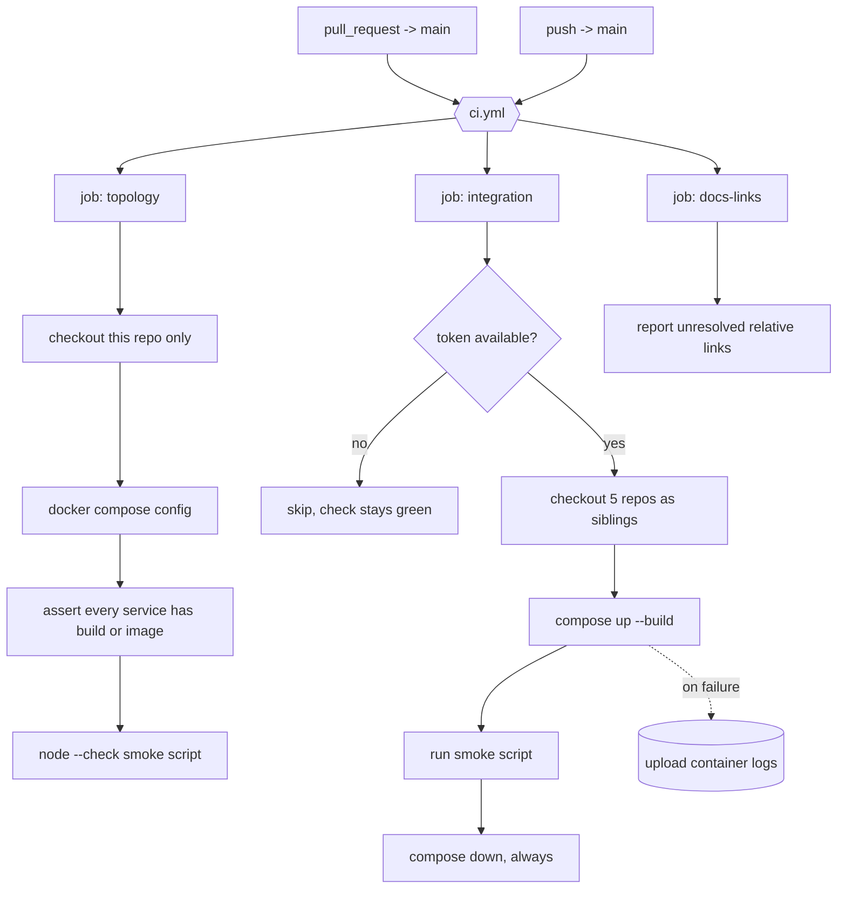

# CI Pipeline Design

**Spec**: `.specs/features/ci-pipeline/spec.md`
**Status**: Draft

---

## Architecture Overview

This repository has no `package.json`, no test runner, and no source. Its gate therefore verifies composition rather than behaviour, and splits along a credential boundary: everything that can be checked from this repository alone runs unconditionally, while the cross-repository integration runs only when it can reach the four service repositories.

---

## Code Reuse Analysis

### Existing Components to Leverage

| Component | Location | How to Use |
| --- | --- | --- |
| Topology definition | `compose.yaml` | Validated as-is; the workflow must not maintain a second copy |
| Integration driver | `scripts/smoke-local-integration.mjs` | Executed unchanged; it already drives the full flow and exits non-zero on failure |
| Broker and service health checks | `compose.yaml` `healthcheck:` blocks | Reused as the readiness signal, so no sleep-based waiting is introduced |
| Service Dockerfiles | the four sibling repositories | Built through Compose; this repository defines no build recipe |

### Integration Points

| System | Integration Method |
| --- | --- |
| Branch protection on `main` | The `topology` job name is the required status check. `integration` is deliberately **not** required, because it can legitimately skip. |
| The four service repositories | `actions/checkout` with an explicit `repository:` and a `path:` inside the workspace |
| Compose relative build contexts | Preserved by checking this repository into its own subdirectory so `../fiap-x-api` resolves exactly as it does locally |

---

## Components

### Workflow: `ci`

- **Purpose**: Verify the topology on every pull request, and the real integration when credentials allow.
- **Location**: `.github/workflows/ci.yml`
- **Interfaces**: triggers `pull_request` to `main` and `push` to `main`; published job names `topology`, `integration`, `docs-links`
- **Dependencies**: `actions/checkout`, `actions/setup-node`, `actions/upload-artifact`
- **Reuses**: `compose.yaml` and `scripts/smoke-local-integration.mjs` verbatim

### Job: `topology`

- **Purpose**: Fail the check run if the local topology is malformed.
- **Location**: `.github/workflows/ci.yml`
- **Interfaces**: `runs-on: ubuntu-latest`, `timeout-minutes: 10`, no secrets, no sibling checkout
- **Dependencies**: Docker Compose, preinstalled on the runner; Node 22 for the script parse check
- **Reuses**: `compose.yaml`, `scripts/smoke-local-integration.mjs`

### Job: `integration`

- **Purpose**: Prove the four services actually reach a completed processing request together.
- **Location**: `.github/workflows/ci.yml`
- **Interfaces**: `needs: topology`, `timeout-minutes: 20`, guarded by a token check, teardown in `if: always()`
- **Dependencies**: read access to the four service repositories
- **Reuses**: `compose.yaml`, `scripts/smoke-local-integration.mjs`

### Job: `docs-links`

- **Purpose**: Report relative links in the documentation that no longer resolve.
- **Location**: `.github/workflows/ci.yml`
- **Interfaces**: `continue-on-error: true` so it informs without blocking
- **Dependencies**: none
- **Reuses**: none

---

## Data Models (if applicable)

Not applicable - this feature adds no runtime data.

---

## Error Handling Strategy

| Error Scenario | Handling | User Impact |
| --- | --- | --- |
| `compose.yaml` is malformed | `docker compose config` exits non-zero | The check fails at the topology step with the parse error shown |
| A service declares neither build nor image | The assertion step fails | The offending service name is printed |
| The smoke script has a syntax error | `node --check` exits non-zero | The check fails before anything is started |
| A build context path does not exist | The `integration` job fails at build with the path named | Reported as a missing directory, not as an opaque build error |
| The stack never becomes healthy | The wait expires; container logs are uploaded as an artifact | The logs are attached to the run, so the cause is diagnosable without reproducing locally |
| The cross-repository token is absent | The `integration` job is skipped | The pull request check stays green; the skip is visible in the run summary |
| A job hangs | `timeout-minutes` fails it, and teardown still runs | No runner is held and no container is orphaned |

---

## Risks & Concerns

| Concern | Location (file:line) | Impact | Mitigation |
| --- | --- | --- | --- |
| `actions/checkout` refuses a `path` outside `$GITHUB_WORKSPACE`, so the local sibling layout cannot be reproduced naively | `compose.yaml:3` (`build: ../fiap-x-api`) | A direct translation of the local layout fails, and the obvious workaround - rewriting the build paths for CI - would make CI and local diverge | This repository is checked out into its own subdirectory and the four services beside it, inside the workspace. The relative paths then resolve identically in both places, and `compose.yaml` stays untouched. |
| The `integration` job depends on credentials the team may not be able to create | `.github/workflows/ci.yml` | If required as a status check, an absent token would block every pull request | `integration` is explicitly excluded from the required checks, and skips rather than fails. `topology` alone carries the gate. |
| The topology gate cannot prove that a service image actually builds | `compose.yaml` | A green `topology` job is weaker evidence than it appears | Recorded plainly here and in the spec: build verification belongs to each service's own CI, and full-stack verification to `integration` |
| `docs/FIAP X.pdf` is referenced by the README and by four service boundary documents but is absent while the board is redrawn | `README.md` | A link checker would report it on every run and train the team to ignore the job | `docs-links` cannot fail the run, and the spec's edge cases name this file explicitly so the report is expected rather than alarming |

> Lessons note: `.specs/` holds no `LESSONS.md` for this repository, so no lessons were available to load.

---

## Tech Decisions (only non-obvious ones)

| Decision | Choice | Rationale |
| --- | --- | --- |
| How to keep Compose paths identical locally and in CI | Check out all five repositories as siblings inside the workspace | Preserves `build: ../fiap-x-api` unchanged; rewriting paths for CI would mean the thing verified is not the thing developers run |
| Which job branch protection requires | `topology` only | It is the job that can always run. Requiring `integration` would hand a credential problem the power to block every merge. |
| How `integration` behaves without a token | Skip, not fail | A skipped job reports honestly; a failing one would train the team to ignore red checks |
| Teardown placement | `if: always()` | A failed run must not leave containers behind on the runner |
| Evidence on integration failure | Upload container logs as an artifact | A compose failure is unreadable from the step log alone, and reproducing it locally is exactly what CI should spare the team |
| Documentation link checking severity | Informational only | The absent modelling board would otherwise fail every run for a known, temporary reason |

> **Project-level decisions:** none here set a new convention beyond the job-name contract, recorded above as an integration point.
