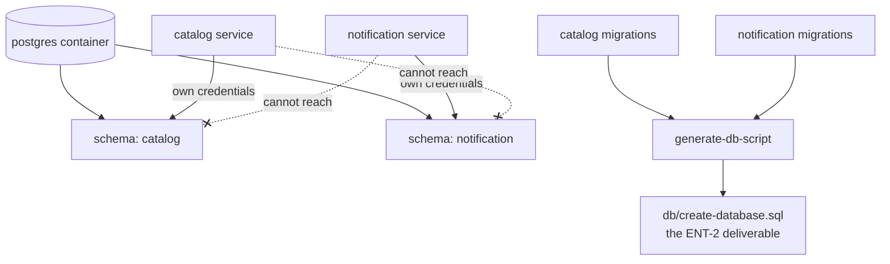

# Durable Persistence Design

**Spec**: `.specs/features/durable-persistence/spec.md`
**Status**: Draft

---

## Architecture Overview

One database service in the topology, one schema per owning service, and a creation script produced from the migrations rather than written beside them.

The boundary the foundation requires — no service reads another's tables — is enforced by granting each service rights only on its own schema. A comment in a README would not survive the first person in a hurry.

---

## Code Reuse Analysis

### Existing Components to Leverage

| Component | Location | How to Use |
| --- | --- | --- |
| Compose topology | `compose.yaml` | Gains one service and two `depends_on` conditions; every existing service keeps its shape |
| Health-gated startup | the `depends_on: condition: service_healthy` blocks already present | The same pattern, applied to the database |
| Smoke script | `scripts/smoke-local-integration.mjs` | Unchanged. It drives the flow, not the storage, and must still pass - which is what proves the move changed no behaviour |
| CI topology job | `.github/workflows/ci.yml` | Already renders and asserts the compose file; the new service is covered by the assertion that exists |

### Integration Points

| System | Integration Method |
| --- | --- |
| `processing-catalog` | Owns its schema and its migrations; this repository provides the server and generates the deliverable |
| `notification-service` | Same |

---

## Components

### PostgreSQL service

- **Purpose**: One database for the local topology.
- **Location**: `compose.yaml`
- **Interfaces**: port 5432, a health check using `pg_isready`, a named volume for its data
- **Dependencies**: none
- **Reuses**: the health-check and `depends_on` conventions already in the file

### Schema and role bootstrap

- **Purpose**: Create a schema and a least-privilege role per owning service at first start.
- **Location**: `db/init/01-schemas.sql`, mounted into the image's entry-point directory
- **Interfaces**: two schemas, two roles, each granted only its own
- **Dependencies**: the PostgreSQL image's initialisation convention
- **Reuses**: nothing; it is the one place the boundary is enforced

This runs only on an empty data volume, which is the right moment: it is bootstrap, not migration. Schema evolution stays with each service.

### `generate-db-script`

- **Purpose**: Produce the ENT-2 deliverable from the migrations that actually run.
- **Location**: `scripts/generate-db-script.mjs`
- **Interfaces**: reads each service's migrations, writes `db/create-database.sql`
- **Dependencies**: the sibling repositories being checked out, as the integration job already requires
- **Reuses**: the sibling layout the CI integration job already establishes

---

## Data Models

Not applicable — this repository owns no tables. The schemas it creates are empty containers that each service's migrations fill.

---

## Error Handling Strategy

| Error Scenario | Handling | User Impact |
| --- | --- | --- |
| Database not yet healthy | Dependent services are not started, by `depends_on` | No connection-refused storm at boot |
| Data volume from an older schema | The services apply their pending migrations at start | The stack starts instead of failing |
| A service reaching for the other's schema | Denied by role grants | The boundary fails closed and loudly, instead of working by accident |
| Sibling repositories absent when generating the script | The generator fails naming the missing path | A stale deliverable is never silently reproduced |

---

## Risks & Concerns

| Concern | Location (file:line) | Impact | Mitigation |
| --- | --- | --- | --- |
| Bootstrap SQL runs only on an empty volume | `db/init/01-schemas.sql` | A developer with an existing volume gets no schemas and a confusing failure | Documented in the README with the one-line fix, `docker compose down -v`; the tasks require that instruction to land with the file |
| A checked-in generated script drifts from the migrations | `db/create-database.sql` | The deliverable stops describing the real schema, and nobody notices until an evaluator runs it | Generated, never hand-edited, and the spec requires regeneration to produce a visible difference in review |
| The database is one more container in an already heavy local stack | `compose.yaml` | Slower startup on a machine that already builds four images | One container with two schemas rather than two containers; the alternative doubles the cost for a boundary a schema already enforces |
| Compose `depends_on` waits for health, not for migrations | `compose.yaml` | A service could start before its own migrations complete | Each service applies its own migrations at startup, before serving; this repository only guarantees the server is up |

> Lessons note: this repository has no `.specs/LESSONS.md`, so no lessons were available to load.

---

## Tech Decisions (only non-obvious ones)

| Decision | Choice | Rationale |
| --- | --- | --- |
| One container, two schemas | One | The foundation forbids shared tables, not a shared server. Two containers would double the local footprint to enforce a boundary grants already enforce |
| Where the boundary is enforced | Role grants per schema | Any weaker form is a convention, and conventions are what the first hurried change ignores |
| Who runs migrations | Each service, at its own startup | The schema belongs to the service that owns it; this repository owning migrations would recreate the coupling AD-007 avoids |
| Script generated, not written | Generated | A hand-maintained script drifts from the migrations, and the drift is invisible until someone runs it |
| Where the script lives | This repository | AD-007 assigns cross-cutting deliverables here |

> **Project-level decisions:** none beyond what AD-005 and AD-007 already fix.
