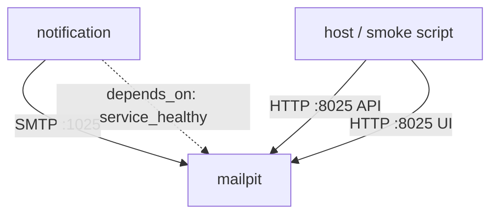

# Email Notification — Platform Design

**Spec**: `.specs/features/email-notification/spec.md`
**Status**: Draft

---

## Architecture Overview

One new compose service, one new environment block on an existing one, and one new smoke step shape reused twice.



---

## Code Reuse Analysis

### Existing Components to Leverage

| Component | Location | How to Use |
| --- | --- | --- |
| Compose service pattern | `compose.yaml` (`storage`, `rabbitmq` services) | `mailpit` follows the same shape: image, ports, healthcheck, no volume (ephemeral by design, like `rabbitmq`) |
| `notification`'s `depends_on` block | `compose.yaml` | Gains `mailpit: condition: service_healthy`, alongside its existing `rabbitmq`/`postgres` conditions |
| Smoke step shape (`{ name, observe, check, report }`) | `scripts/smoke-local-integration.mjs` | Two new steps, `failure email` and `processing failure email`, placed right after `delivery sentence`/`single delivery` and `processing failure delivery` respectively |
| `waitForNotificationDelivery`, `assertDeliverySentence` helpers | `scripts/smoke-local-integration.mjs` | Give the new steps the exact sentence and id to search Mailpit for — no new source of truth for what the email should say |

### Integration Points

| System | Integration Method |
| --- | --- |
| `notification-service` | SMTP, via the `SMTP_HOST`/`SMTP_PORT` env vars its own feature adds |
| Smoke script | Plain `fetch` against Mailpit's HTTP API, same style as every other smoke HTTP call |

---

## Components

### `mailpit` compose service (new)

- **Purpose**: The SMTP sink and its inspectable inbox.
- **Location**: `compose.yaml`
- **Interfaces**: SMTP on `1025` (internal only — not published), HTTP on `8025` (published, since both the demo and the smoke need it from the host)
- **Dependencies**: none (no database, no volume — an empty mailbox on every `docker compose up` from a torn-down stack)

Sketch (tag to confirm at implementation time, per the spec's open question):

```yaml
mailpit:
  image: axllent/mailpit:<pinned-tag>
  ports:
    - "8025:8025"
  healthcheck:
    test: ["CMD", "wget", "--no-verbose", "--tries=1", "--spider", "http://localhost:8025/"]
    interval: 5s
    timeout: 3s
    retries: 10
```

No `1025:1025` port mapping: only `notification`, inside the network, sends SMTP; the smoke and the demo only ever read the HTTP side.

### `notification` service block (modified)

- **Purpose**: Point it at Mailpit.
- **Location**: `compose.yaml`
- **Interfaces**: adds `SMTP_HOST=mailpit`, `SMTP_PORT=1025`, `SMTP_FROM=fiapx@local` (or similar) to its `environment:`; adds `mailpit: condition: service_healthy` to its `depends_on:`

### Smoke steps `failure email` / `processing failure email` (new)

- **Purpose**: The black-box proof the Definition of Done asks for.
- **Location**: `scripts/smoke-local-integration.mjs`
- **Interfaces**: same `{ name, observe, check, report }` shape as every existing step
- **Reuses**: `ctx.rejectedId`/`ctx.failedId` and the sentence already asserted by `delivery sentence`/`processing failure delivery` — the new steps do not recompute the expected sentence, they read the same context the existing steps already populated, and search Mailpit for a message containing both that sentence and that id

```js
{
  name: 'failure email',
  observe: async (ctx) => {
    ctx.failureEmail = await searchMailpit({ to: ALICE_EMAIL, contains: [ctx.rejectedId, ctx.delivery.failureReason] });
  },
  check: (ctx) => assertExactlyOneMessage(observed(ctx, 'rejectedId'), observedFor(ctx, 'failureEmail', 'rejectedId').count),
  report: (ctx) => `Mailpit holds exactly one failure email for ${ctx.rejectedId}`,
}
```

`searchMailpit` is a small new helper (`fetch` against `http://localhost:8025/api/v1/messages?query=...`), whose exact query parameter syntax is confirmed against the pinned Mailpit version during implementation rather than assumed here.

### `AD-015` entry (new, in `.specs/STATE.md`)

- **Purpose**: Make the cross-repo decision this whole feature implements a durable, dated record, in the same format as AD-005 through AD-014.
- **Location**: `.specs/STATE.md`
- **Content sketch**: decision (email resolved from the token's standard `email` claim, captured once at the API, carried on `ProcessingRequest` and the terminal event only — never re-derived via Keycloak's Admin API or a second registry); reason (Keycloak's Admin API is a vendor-specific protocol, a bigger portability cost than reading a standard claim already on the token; keeping it off every non-terminal event keeps the Worker's PII surface at zero); trade-off (touches `fiap-x-api` and `processing-catalog`, not only `notification-service`); scope (the four repositories touched by this feature); date; status active.

---

## Data Models

None. Mailpit stores its own inbox in memory (or its own database, opaque to this system); this repository configures it, it does not model its data.

---

## Error Handling Strategy

| Error Scenario | Handling | User Impact |
| --- | --- | --- |
| Mailpit unhealthy at startup | `notification` never starts (the existing `depends_on` mechanism, unchanged in kind) | Same failure shape as today's `storage-init`/`rabbitmq` dependencies |
| Mailpit reachable but the search finds zero or more than one matching message | New smoke step fails, naming the count, mirroring `archive count`'s existing message style | Smoke exits 1 with a clear reason |
| Mailpit's API shape changes after a later tag bump | Same failure path as any other smoke assertion against an external HTTP response — fails naming what it expected | Caught by the smoke, not a silent pass |

---

## Risks & Concerns

| Concern | Location (file:line) | Impact | Mitigation |
| --- | --- | --- | --- |
| The smoke's "exactly one" assertion could be checking an empty-mailbox assumption instead of a per-run filter, and pass by luck on a single run while failing on the build gate's second run | `scripts/smoke-local-integration.mjs` | A real double-send bug could hide behind a smoke that only ever ran once per mailbox | The spec's Independent Test explicitly runs the smoke twice without tearing the stack down before considering this done |
| An unpinned or wrong Mailpit tag repeats the exact incident AD-014 already recorded for MinIO | `compose.yaml` | The stack fails to build/pull, discovered late | Pin and verify pullability before merging, exactly as AD-014 now does routinely |

> Lessons note: no confirmed lessons in `.specs/LESSONS.md` yet; nothing to load as guidance.

---

## Tech Decisions (only non-obvious ones)

| Decision | Choice | Rationale |
| --- | --- | --- |
| Publish only Mailpit's HTTP port, not its SMTP port | HTTP (`8025`) published, SMTP (`1025`) internal-only | Nothing outside the network ever sends SMTP; publishing it would be an unused surface |
| Mailbox reset strategy | None added (no volume, relies on container lifecycle) | Matches `rabbitmq`'s existing "topology rebuilt from file on every start" posture; adding a reset mechanism for an ephemeral test double is complexity the smoke's own per-run filtering already makes unnecessary |
| New smoke steps vs. extending the existing delivery-record steps | New, separate steps | Keeps "the record is correct" (existing steps) and "the email actually arrived" (new steps) as two independently-failing assertions, so a failure names which guarantee broke |

> **Project-level decisions:** this document is where AD-015 gets written into `.specs/STATE.md`; see the component above.
