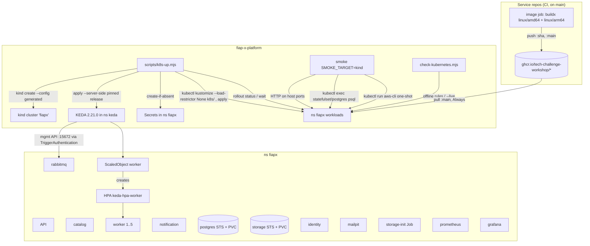

# Local Kubernetes (S9a) Design

**Spec**: `.specs/features/local-kubernetes/spec.md`
**Context**: `.specs/features/local-kubernetes/context.md`
**Status**: Draft

---

## Architecture Overview

Approach (confirmed): **Kustomize + a Node up script**. `k8s/` holds one kustomization that renders every workload of the Compose topology into namespace `fiapx`; its ConfigMaps are generated from the *same* files Compose mounts (`rabbitmq/*`, `identity/fiapx-realm.json`, `db/init/*`, `storage/bootstrap.sh`, `grafana/**`), so there is one source for each config. `scripts/k8s-up.mjs` owns everything that must not be versioned or depends on the machine: the kind config (host ports), the generated Secrets, KEDA's pinned install, the apply, and the wait. Every `kubectl` call goes through one helper that prepends `--context kind-fiapx`.



Host access keeps the Compose ports: each exposed Service is `NodePort` with a fixed `nodePort`, and the generated kind config maps `hostPort` → that `nodePort` on the single control-plane node.

| Service | Container port | nodePort | Host port (default) | Override env (same as Compose) |
| ------- | -------------- | -------- | ------------------- | ------------------------------ |
| api | 3000 | 30000 | 3000 | - |
| catalog | 3001 | 30001 | 3001 | `CATALOG_HOST_PORT` |
| notification | 3003 | 30003 | 3003 | - |
| identity | 8080 | 30080 | 8080 | - (issuer is pinned to `localhost:8080`) |
| storage | 9000 | 30900 | 9000 | `STORAGE_HOST_PORT` (also feeds the API's `STORAGE_PUBLIC_ENDPOINT`) |
| mailpit | 8025 | 30825 | 8025 | - |
| rabbitmq mgmt / metrics | 15672 / 15692 | 31672 / 31692 | 15672 / 15692 | - |
| prometheus | 9090 | 30090 | 9090 | - |
| grafana | 3000 | 30005 | 3005 | - |

Postgres (5432) and AMQP (5672) are not published: nothing on the host needs them (the smoke reads Postgres through `kubectl exec`).

---

## Code Reuse Analysis

### Existing Components to Leverage

| Component | Location | How to Use |
| --------- | -------- | ---------- |
| RabbitMQ config, plugins, topology | `rabbitmq/rabbitmq.conf`, `rabbitmq/enabled_plugins`, `rabbitmq/definitions.json` | conf + plugins via `configMapGenerator`; definitions rendered by the up script into a Secret with the generated user replacing `guest` |
| Keycloak realm (fixed user ids) | `identity/fiapx-realm.json` | ConfigMap mounted at `/opt/keycloak/data/import/`; same `start-dev --import-realm`, `KC_HOSTNAME=http://localhost:8080` |
| DB init | `db/init/01-schemas.sql` | ConfigMap mounted at `/docker-entrypoint-initdb.d` (roles/passwords unchanged - fixture) |
| Storage bootstrap | `storage/bootstrap.sh` | ConfigMap run by the `storage-init` Job (same aws-cli image, env from the storage Secret) |
| Grafana provisioning + dashboard | `grafana/provisioning/**`, `grafana/dashboards/overview.json` | ConfigMaps; datasource URL unchanged (`http://prometheus:9090`, Service DNS in ns `fiapx`) |
| Prometheus scrape jobs | `prometheus/prometheus.yml` | Copied shape into `prometheus/prometheus.k8s.yml`; only the Worker job changes to `kubernetes_sd_configs` (role `pod`, ns `fiapx`, label `app=worker`) |
| Health contract | S8: `/health` readiness, `/health/live` liveness in all 4 services | readiness/liveness probes |
| Worker sizing rule | `scripts/check-worker-sizing.mjs` (Compose) | Same rule re-expressed in `check-kubernetes.mjs` for the Deployment (CPU request = limit = `FFMPEG_THREADS`) |
| Script idiom | `scripts/*.mjs` with `--self-test`, planted corruptions, exit codes | `k8s-up.mjs`, `check-kubernetes.mjs` follow it |
| CI governance | `scripts/check-ci-governance.mjs` (`STACK_COMMANDS`, topology guard) | Extended with the `kubernetes` job's commands and the new topology steps |
| Smoke | `scripts/smoke-local-integration.mjs` `dockerCompose()` (4 call sites: 2× `exec postgres psql`, 2× `run storage-init aws s3api`) | Replaced by a target adapter; Compose remains the default target |
| Load test | `scripts/load-test.mjs` | Unchanged - it only speaks HTTP to the API on 3000 |

### Integration Points

| System | Integration Method |
| ------ | ------------------ |
| GHCR | Service CI pushes multi-arch images; manifests reference `ghcr.io/tech-challenge-workshop/<repo>:main`, `imagePullPolicy: Always` |
| KEDA | Pinned `keda-2.21.0.yaml` from the GitHub release, `kubectl apply --server-side`; `ScaledObject` + `TriggerAuthentication` in `k8s/` |
| RabbitMQ management API | KEDA reads queue depth at `http://<user>:<pass>@rabbitmq.fiapx.svc:15672/` (host from Secret) |
| Compose | Untouched; mutually exclusive with the cluster through host ports (preflight) |

---

## Components

### kind cluster config (generated)

- **Purpose**: One-node kind cluster `fiapx` with the host-port mappings above.
- **Location**: template `k8s/kind-config.template.yaml`; rendered by `k8s-up.mjs` into a temp file (never committed rendered).
- **Interfaces**: placeholders `${CATALOG_HOST_PORT}`, `${STORAGE_HOST_PORT}`; node image pinned `kindest/node:v1.36.4@sha256:099e0493…` (kubectl client here is 1.36).
- **Reuses**: Compose's host-port env names.

### Kustomization `k8s/`

- **Purpose**: Render the whole topology for namespace `fiapx`.
- **Location**: `k8s/kustomization.yaml` + one file per workload (`api.yaml`, `catalog.yaml`, `worker.yaml`, `notification.yaml`, `postgres.yaml`, `rabbitmq.yaml`, `storage.yaml`, `storage-init-job.yaml`, `identity.yaml`, `mailpit.yaml`, `prometheus.yaml` (+ ServiceAccount/Role/RoleBinding for pod discovery), `grafana.yaml`, `worker-scaling.yaml` (ScaledObject + TriggerAuthentication), `namespace.yaml`).
- **Interfaces**: rendered with `kubectl kustomize --load-restrictor LoadRestrictionsNone k8s/`; `images:` maps `fiap-x-api`, `processing-catalog`, `processing-worker`, `notification-service` to `ghcr.io/tech-challenge-workshop/<name>` tag `main`; one non-secret ConfigMap `fiapx-host` (generated by the up script, applied before the kustomization) carries `STORAGE_PUBLIC_ENDPOINT`.
- **Key rules**:
  - The Worker Deployment omits `spec.replicas` - the KEDA-created HPA owns it, so re-applying (K8S-07) never resets a scaled-out count.
  - Worker container: `resources.requests.cpu = limits.cpu = "1"`, `FFMPEG_THREADS=1`, memory request/limit 512Mi/1Gi; `terminationGracePeriodSeconds: 30`.
  - Stateful: `postgres` and `storage` are StatefulSets with one PVC each (kind's default `standard` class). `rabbitmq`, `identity`, `mailpit`, `prometheus`, `grafana` are Deployments with `emptyDir` (Keycloak's H2 on `emptyDir.medium: Memory`, as the Compose tmpfs).
  - Ordering without `depends_on`: `api` and `worker` get an initContainer that waits for the bucket (`aws s3api head-bucket` loop, storage Secret env) - the Compose `storage-init: service_completed_successfully` equivalent; catalog/notification already retry DB/broker connections and are gated by readiness (`/health` 503 until ready, S8).
- **Reuses**: every Compose config file listed above.

### Secrets (generated, never versioned)

- **Purpose**: Carry every credential (K8S-13..15).
- **Location**: created by `k8s-up.mjs` only if absent (`kubectl create secret generic … --dry-run=client -o yaml | kubectl apply` guarded by an existence check), so a re-run never rotates them.
- **Layout**:

| Secret | Keys | Values |
| ------ | ---- | ------ |
| `fiapx-postgres` | `POSTGRES_PASSWORD`, `CATALOG_DB_PASSWORD`, `NOTIFICATION_DB_PASSWORD` | superuser random; the two role passwords are the `db/init` fixtures (`catalog`, `notification`) |
| `fiapx-storage` | `ACCESS_KEY`, `SECRET_KEY` | random alphanumeric (RustFS root + every S3 client) |
| `fiapx-rabbitmq` | `USERNAME`, `PASSWORD`, `URL` (`amqp://u:p@rabbitmq:5672`), `definitions.json` | random alphanumeric user/pass; definitions = repo file with `users`/`permissions` rewritten to the generated user |
| `fiapx-keda-rabbitmq` | `host` (`http://u:p@rabbitmq.fiapx.svc:15672/`) | same generated user (KEDA forbids special characters → alphanumeric only) |
| `fiapx-identity-admin` | `KC_BOOTSTRAP_ADMIN_USERNAME`, `KC_BOOTSTRAP_ADMIN_PASSWORD` | `admin` + random |
| `fiapx-grafana-admin` | `GF_SECURITY_ADMIN_USER`, `GF_SECURITY_ADMIN_PASSWORD` | `admin` + random (the up script prints how to read it) |
| `ghcr-pull` (only if `GHCR_TOKEN` is set) | `.dockerconfigjson` | fallback while GHCR packages are private (spec assumption) |

### `scripts/k8s-up.mjs`

- **Purpose**: The documented up command (K8S-01..08, K8S-15).
- **Interfaces**:
  - `node scripts/k8s-up.mjs` - preflight → create/reuse cluster → KEDA → namespace + `fiapx-host` + Secrets → apply kustomization → wait → print endpoints.
  - `node scripts/k8s-up.mjs --self-test` - pure checks (kind config rendering, secret generation shape, definitions rewrite, the kubectl helper always injecting the context, preflight messages) with planted corruptions.
  - Exported `kubectl(args)` helper: throws if `args` already contains `--context`/`--kubeconfig`, always prepends `--context kind-fiapx`; never calls `config use-context`/`current-context`.
- **Steps & failure modes**: preflight tools (`docker`, `kind`, `kubectl` on PATH; Docker daemon reachable) → host ports free (TCP bind probe) unless the `fiapx` cluster already exists with the same port map (recorded in the `fiapx-host` ConfigMap; a different map → exit "run k8s-down first") → `kind create cluster --name fiapx --config <rendered> --wait 120s` (skip if `kind get clusters` lists `fiapx` and the node is Ready; exists-but-unhealthy → exit with the down hint) → KEDA: download `https://github.com/kedacore/keda/releases/download/v2.21.0/keda-2.21.0.yaml`, verify pinned sha256, `apply --server-side`, wait for `keda-operator` and `keda-operator-metrics-apiserver` Available → Secrets → `apply -f <(kustomize)` → wait: `rollout status` for every Deployment/StatefulSet and `wait --for=condition=complete job/storage-init`, total budget 600 s; on timeout list each not-Ready workload with its pod's waiting reason (`ImagePullBackOff`, `CrashLoopBackOff`, …) and exit 1.
- **Reuses**: `get-token.mjs` style of HTTP; `node:child_process` like the other scripts.

### `scripts/k8s-down.mjs`

- **Purpose**: `kind delete cluster --name fiapx` (K8S-08); never touches another cluster or context. Exit 0 when the cluster does not exist.

### `scripts/check-kubernetes.mjs`

- **Purpose**: Offline manifest check (K8S-16, K8S-17, K8S-23, K8S-32, K8S-33) + `--live` cluster check (K8S-19, K8S-25..27).
- **Interfaces**:
  - default: renders the kustomization and asserts: no `Secret` with `data`/`stringData`; no literal `value` for env names matching `/PASSWORD|SECRET|ACCESS_KEY|TOKEN/`; the four service Deployments have readiness `/health` and liveness `/health/live` on their port; Worker CPU request = limit = `FFMPEG_THREADS`; Worker Deployment has no `spec.replicas`; ScaledObject min 1 / max 5, triggers `processing` 2 and `video-validation` 20 with `protocol: http` and an `authenticationRef`; every service image on `ghcr.io/tech-challenge-workshop/`; every `kubectl` invocation in `scripts/*.mjs` goes through the context helper (static scan: no raw `'kubectl'` spawn outside the helper).
  - `--self-test`: one planted corruption per rule, each must exit non-zero with its message.
  - `--live`: every workload Ready; `get hpa` lists `keda-hpa-worker`; Prometheus targets `up==1` with one worker target per worker pod; Grafana `/api/dashboards/uid/fiapx-overview` 200.
- **Reuses**: `check-observability.mjs` structure (default/`--self-test`/`--live`).

### Smoke cluster target

- **Purpose**: K8S-10.
- **Location**: `scripts/smoke-local-integration.mjs`.
- **Interfaces**: `SMOKE_TARGET=compose` (default, unchanged) | `kind`. `dockerCompose()` call sites move behind `observe.psql(sql, vars)` and `observe.s3api(args)`:
  - compose: unchanged commands.
  - kind: `kubectl --context kind-fiapx -n fiapx exec -i statefulset/postgres -- psql -U postgres -d fiapx …` and `kubectl … run smoke-s3-<rand> --rm -i --restart=Never --image=amazon/aws-cli:2.37.4 --overrides=<env from fiapx-storage, AWS_ENDPOINT_URL=http://storage:9000> -- s3api …`.
- **Reuses**: the context helper from `k8s-up.mjs`; the existing self-test gains cases for the kind adapter's argument building (never a raw kubectl, always the context).

### `prometheus/prometheus.k8s.yml`

- **Purpose**: K8S-25/26. Same jobs and intervals as `prometheus.yml`; `worker` job uses `kubernetes_sd_configs: [{role: pod, namespaces: {names: [fiapx]}}]` with relabel keep `app=worker`, port 3002, and the pod name as `instance`. Prometheus runs with a ServiceAccount bound to a namespaced Role (`get/list/watch pods`).

### Worker scaling `k8s/worker-scaling.yaml`

- **Purpose**: K8S-18..21, K8S-24.
- `ScaledObject` `worker`: `minReplicaCount: 1`, `maxReplicaCount: 5`, `pollingInterval: 5`, `advanced.horizontalPodAutoscalerConfig.behavior.scaleDown.stabilizationWindowSeconds: 60` (with min 1, KEDA's `cooldownPeriod` does not apply - scale-in is the HPA's), triggers `rabbitmq` `protocol: http`, `mode: QueueLength`, `processing` value `"2"`, `video-validation` value `"20"`, both `authenticationRef: rabbitmq-management`.
- `TriggerAuthentication` `rabbitmq-management`: `secretTargetRef` `host` ← `fiapx-keda-rabbitmq/host`.

### Service image publishing (4 service repos)

- **Purpose**: K8S-28..31.
- **Location**: `.github/workflows/ci.yml` `image` job in `fiap-x-api`, `processing-catalog`, `processing-worker`, `notification-service`.
- **Shape**: `permissions: contents: read, packages: write` on the job; `docker/setup-qemu-action`, `docker/setup-buildx-action`, `docker/login-action` (registry `ghcr.io`, `github.actor` / `GITHUB_TOKEN`, only when pushing), `docker/build-push-action` with `platforms: linux/amd64,linux/arm64`, `push: ${{ github.event_name == 'push' && github.ref == 'refs/heads/main' }}`, tags `ghcr.io/tech-challenge-workshop/<repo>:${{ github.sha }}` and `:main`, label `org.opencontainers.image.source`. The job name stays `image` (it is a required check).

### Platform CI

- `topology`: add `node scripts/check-kubernetes.mjs`, `--self-test`, `node scripts/k8s-up.mjs --self-test`, and kubeconform (pinned v0.8.0 binary + sha256) over the rendered manifests with `-strict -summary -schema-location default -schema-location <datreeio CRDs-catalog URL>` for the KEDA CRDs.
- New job `kubernetes` (needs `topology`): checkout platform, setup-node, install pinned kind v0.33.0 (sha256-checked binary), `node scripts/k8s-up.mjs`, `SMOKE_TARGET=kind node scripts/smoke-local-integration.mjs`, `node scripts/check-kubernetes.mjs --live`; logs of `fiapx` pods on failure; `kind delete` in an `always()` teardown - same guard pattern as `integration`.
- `check-ci-governance.mjs`: the `kubernetes` job's commands join the protected list (no `if:`, `continue-on-error`, `|| true`, `shell:` on those steps; job has no `if:` and `needs: [topology]`).

---

## Data Models

```typescript
// Recorded by k8s-up.mjs in ConfigMap fiapx-host (namespace fiapx), non-secret.
interface HostMap {
  catalogHostPort: number;   // default 3001
  storageHostPort: number;   // default 9000
  storagePublicEndpoint: string; // `http://localhost:${storageHostPort}`
}
```

No application data model changes.

---

## Error Handling Strategy

| Error Scenario | Handling | User Impact |
| -------------- | -------- | ----------- |
| Missing docker/kind/kubectl or Docker daemon down | Preflight exit 1 before any change | "kind not found on PATH - install kind v0.33+" |
| Host port busy (e.g. Compose running) | Preflight exit 1 | Names the port and suggests `docker compose down` or the override env |
| Cluster exists with a different port map, or unhealthy | Exit 1 | "run node scripts/k8s-down.mjs first" |
| KEDA download checksum mismatch | Exit 1 | Names expected vs actual sha256 |
| Image pull failure (GHCR down, private package, missing tag) | Wait loop reports the pod's waiting reason | "worker: ImagePullBackOff (ghcr.io/…:main)" |
| Workload not Ready in 600 s | Exit 1 listing each workload + reason | Exact list, no partial success |
| `storage-init` Job fails | Exit 1 naming the Job; api/worker initContainers keep them not-Ready | Clear failure instead of 502s |
| Wrong KEDA credentials | KEDA reports the error on the ScaledObject; Worker keeps its replica count | `kubectl describe scaledobject worker` shows it; `--live` fails on HPA metrics |

---

## Risks & Concerns

| Concern | Location (file:line) | Impact | Mitigation |
| ------- | -------------------- | ------ | ---------- |
| Security: the machine's current kube context is a real EKS cluster | `~/.kube/config` (current-context `tech-challenge-eks-cluster`) | One raw `kubectl apply` would deploy the topology to AWS | Single `kubectl()` helper always injecting `--context kind-fiapx`; static rule in `check-kubernetes.mjs` rejects any raw kubectl spawn; self-test plants one |
| Architecture: service images are built amd64-only today | `processing-worker/.github/workflows/ci.yml` `image` job (`docker build`) | kind on this arm64 Mac cannot run amd64-only images (containerd: no matching platform) | Multi-arch buildx (`linux/amd64,linux/arm64`) with QEMU; build time grows (arm64 `npm ci` + `apk add ffmpeg` under emulation) - acceptable, noted in the PR |
| Shutdown: the Worker never calls `enableShutdownHooks` | `processing-worker/src/main.ts:8-14` | SIGTERM on scale-in exits Node immediately; the S4 graceful path (`shutdown-signal.ts`) does not run | Correctness holds: the connection drops and RabbitMQ redelivers the unacked job (quorum queue; counts toward `delivery-limit: 5`); K8S-22 is proven live by killing a Worker pod mid-job. Enabling hooks is a service follow-up, not this slice |
| Re-apply resetting a scaled Worker | `k8s/worker.yaml` | `replicas: 1` in the manifest would snap the Worker back on every re-run | No `spec.replicas` on the Worker; offline rule enforces it |
| GHCR package visibility unknown | org package settings | Cluster/CI cannot pull private packages anonymously | After the first publish, check `docker pull` anonymously; if private, set public in the org UI (manual, recorded) or use `GHCR_TOKEN` → `ghcr-pull` secret |
| Presigned URL host | `compose.yaml:18-20` (`STORAGE_PUBLIC_ENDPOINT`) | A URL signed for the wrong host:port is unusable from the host | `STORAGE_PUBLIC_ENDPOINT` derived from the same `STORAGE_HOST_PORT` that renders the kind port map; smoke proves the download |
| Keycloak issuer | `compose.yaml:13-16`, `:63` | Token `iss` must equal the API's `OIDC_ISSUER` | Same `KC_HOSTNAME=http://localhost:8080` and fixed host port 8080; JWKS fetched internally from `http://identity:8080/…` |
| Resource pressure | Docker VM 10 CPUs / 14.6 GB | 5 Workers (5 CPU) + dependencies may starve | Requests sized small for non-Worker pods (≤250m each); load-test burst runs within limits; recorded in T-live |
| Test gap: nothing today proves manifests | - | Drift like V10/V37 | `topology` offline rules + kubeconform; `kubernetes` job end to end |
| This machine: ports 3001/9000 held by unrelated containers | host | Up preflight fails with defaults | `CATALOG_HOST_PORT`/`STORAGE_HOST_PORT` overrides, same as Compose |

---

## Tech Decisions (only non-obvious ones)

| Decision | Choice | Rationale |
| -------- | ------ | --------- |
| Scaler protocol | `http` (management API) | AMQP counts only ready messages; the Worker's prefetch hides the backlog as unacked |
| Scale-in timing | HPA `scaleDown.stabilizationWindowSeconds: 60` | With `minReplicaCount: 1`, `cooldownPeriod` is not used; the default 300 s window would miss K8S-21's 300 s budget |
| KEDA install | Pinned release YAML, server-side apply, sha256-checked | No Helm dependency; CRDs exceed client-side apply annotation limits |
| Config reuse | `--load-restrictor LoadRestrictionsNone` | One copy of every config file for Compose and the cluster (verified locally) |
| Secret creation | create-if-absent | Idempotent re-run (K8S-07) without rotating credentials under running pods |
| `:main` + `imagePullPolicy: Always` | vs pinning `:sha` in the kustomization | The cluster follows `main` (CD); pinning would need a platform commit per service merge |
| Bucket-ready gating | initContainer `head-bucket` loop in api/worker | Kubernetes has no `service_completed_successfully`; the Job alone does not gate Deployments |
| kind node image | `kindest/node:v1.36.4` pinned by digest | Matches the local kubectl 1.36 client; KEDA 2.21 targets current Kubernetes |

> **Project-level decisions:** implementation records **AD-018** in `.specs/STATE.md`: the cluster is only ever addressed as `--context kind-fiapx` by versioned scripts; service images are published multi-arch to GHCR on `main` and the cluster runs `:main`; credentials are generated per cluster into Secrets, never versioned; Compose remains the dev loop and CI integration gate alongside the `kubernetes` job.
