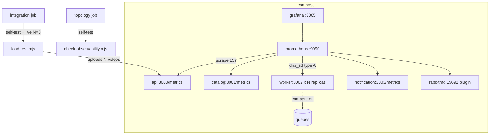

# Observability Design — FIAP X Platform

**Spec**: `.specs/features/observability/spec.md` (OBS-61..75)
**Status**: Draft

---

## Architecture Overview

Two new containers (`prometheus`, `grafana`) join the stack with config mounted read-only from this repo; the RabbitMQ container grows the built-in `rabbitmq_prometheus` plugin on 15692; the Worker becomes `deploy.replicas`-parameterized. Two new scripts provide the honesty layer: `check-observability.mjs` (structural validation, self-tested, runs in `topology`) and `load-test.mjs` (N concurrent pipelines, self-tested, small live run in `integration`). Nothing depends on the monitoring containers — the business stack must boot even if they fail.

---

## Code Reuse Analysis

### Existing Components to Leverage

| Component | Location | How to Use |
| --- | --- | --- |
| Compose service conventions | `compose.yaml` (healthchecks, depends_on, pinned images) | Prometheus/Grafana follow the same shape |
| `get-token.mjs` | `scripts/get-token.mjs` | Load test spawns it for one token (same as the smoke) |
| Smoke pipeline patterns | `scripts/smoke-local-integration.mjs` (presigned multipart upload, status polling, Mailpit assertions) | Load test re-implements the drive loop with fetch (the smoke stays untouched; importing from it would couple a gate to another gate) |
| Fixture video | `fixtures/sample-8s.mp4` (39 KB, 8 s) | Uploaded N times — distinct storage keys per request make reuse safe |
| Gate conventions | `scripts/check-*.mjs --self-test` pattern | Both new scripts follow it |
| `check-ci-governance.mjs` | topology job wiring | Template for adding a new check step to the job |

### Integration Points

| System | Integration Method |
| --- | --- |
| 4 service repos | Scraped at their `/metrics` (delivered by the sibling specs) |
| `db/create-database.sql` | **Regenerated** by `scripts/generate-db-script.mjs` — the Catalog's new migration lands in this PR; merge order: the 4 service PRs first, this one last (same constraint shape as AD-015) |
| GitHub Actions | topology += `check-observability.mjs --self-test`; integration += `load-test.mjs --self-test` (in topology actually — see Tasks) + live `--videos 3` |

---

## Components

### RabbitMQ metrics plugin

- **Purpose**: OBS-63 — queue depth/age source.
- **Location**: `rabbitmq/enabled_plugins` (`[rabbitmq_management,rabbitmq_prometheus].`) mounted to `/etc/rabbitmq/enabled_plugins`; `rabbitmq/rabbitmq.conf` gains `prometheus.tcp.port = 15692` (explicit, even though it is the default)
- **Interfaces**: `http://rabbitmq:15692/metrics` (text exposition)
- **Dependencies**: none
- **Reuses**: existing `rabbitmq.conf`/`definitions.json` mounts; **both** plugins listed so management is not dropped when the file overrides the image default

### Prometheus service + config

- **Purpose**: OBS-61/64/66.
- **Location**: `prometheus/prometheus.yml`; compose service `prometheus` (image pinned at task time, e.g. `prom/prometheus:v3.x`), config volume read-only, healthcheck `wget :9090/-/healthy`, no `depends_on` from any business service
- **Interfaces**: scrape_configs: static targets `api:3000`, `catalog:3001`, `notification:3003`, `rabbitmq:15692`; **`dns_sd_configs` `{names: [worker], type: A, port: 3002}`** so all `WORKER_REPLICAS` replicas are scraped; `scrape_interval: 15s`, `scrape_timeout: 10s`
- **Dependencies**: the compose network only
- **Reuses**: compose conventions

### Grafana service + provisioning

- **Purpose**: OBS-62/65.
- **Location**: `grafana/provisioning/datasources/prometheus.yml` (type `prometheus`, url `http://prometheus:9090`, isDefault), `grafana/provisioning/dashboards/dashboards.yml` (provider, `foldersFromFilesStructure: false`), `grafana/dashboards/overview.json`; compose service `grafana` (pinned image), env `GF_SECURITY_ADMIN_USER/PASSWORD=admin/admin`, healthcheck `curl :3005/api/health`
- **Interfaces**: `:3005` host port; dashboard UID `fiapx-overview`
- **Dependencies**: prometheus service
- **Reuses**: provisioning-as-code replaces any UI setup

**Dashboard panels (foundation minimum set)**: row "Traffic" — upload outcomes rate, download authorized/denied, HTTP request rate + 5xx; row "Pipeline" — `rabbitmq_queue_messages{queue=~"(video-validation|processing|notification.terminal)"}` depth, outbox pending/oldest gauges, `fiapx_processing_total` rate, `fiapx_processing_duration_seconds` p95, `fiapx_jobs_inflight`; row "Notifications" — `fiapx_email_delivery_total` by outcome; row "Scrape targets" — Prometheus's own `up` per job and instance (the worker count is the number of replicas discovered).

> SPEC_DEVIATION (T4): the planned row "Node" (`fiapx_node_*` defaults per instance) is replaced by "Scrape targets". No service registers prom-client's default metrics (`collectDefaultMetrics` appears in none of the four `src/observability/metrics.ts`), so `fiapx_node_*` has no series and the row would be empty; `up` is always present and shows each replica.

### Worker replicas

- **Purpose**: OBS-67.
- **Location**: `compose.yaml` worker service: `deploy: { replicas: ${WORKER_REPLICAS:-1} }`; `.env`-style host override only (no `.env` file committed — documented in README; the integration job runs with default 1)
- **SPEC_DEVIATION (T5)**: the worker's host port becomes the range `${WORKER_HOST_PORT:-3010-3019}:3002` (was `3002:3002`). One host port binds one replica only, so a fixed port makes a second replica fail to start; a range starting at 3002 would contain 3003 (notification) and 3005 (grafana). Docker picks any free port in the range; `docker compose port --index N worker 3002` names it. A single `WORKER_HOST_PORT` still works for one replica.
- **Interfaces**: `WORKER_REPLICAS=3 docker compose up -d worker`
- **Dependencies**: none
- **Reuses**: the S4 concurrency model (replicas compete on the same queues); smoke/deliveries assertions are per-request-id, so replicas don't disturb them

### scripts/load-test.mjs

- **Purpose**: OBS-68..71.
- **Location**: `scripts/load-test.mjs` (+ shared assertion helpers inline, no new deps)
- **Interfaces**:
  - `--videos N` (integer, 1..50, default 6), `--timeout-seconds` (per video, default 120), `--base-url`, `--token-cmd` overridable for CI
  - Flow: one token (spawn `get-token.mjs`) → N × (start upload → PUT presigned parts of `fixtures/sample-8s.mp4` → confirm with unique idempotency key) fired concurrently → poll each to terminal → print latency table + status counts → exit non-zero naming stuck/failed videos
  - Assertions never rely on global mailbox/queue emptiness — everything filtered by the run's own request ids (S7 smoke lesson)
  - `--self-test`: injects a fake fetch driver; asserts N parallel starts, aggregation math, timeout → non-zero exit listing the stuck id; no live stack needed
- **Dependencies**: node ≥20, fetch
- **Reuses**: token command, fixture, status names from the smoke

### scripts/check-observability.mjs

- **Purpose**: OBS-74.
- **Location**: `scripts/check-observability.mjs`
- **Interfaces**:
  - `--self-test`: prometheus config parses (structural check without a yaml dep — targeted assertions: expected target hosts present, `dns_sd_configs` used for worker, interval bounds), every `grafana/dashboards/*.json` parses as JSON and its panels reference the provisioned `Prometheus` datasource uid/name, provisioning files reference existing paths, compose declares prometheus+grafana services with healthchecks and **no business service depends_on them**
  - `--live` (optional, integration): each service `/metrics` responds 200 containing a `fiapx_`-prefixed line and `/health/live` responds 200
- **Dependencies**: node only
- **Reuses**: `check-*` script conventions

### CI wiring + README + regenerated DB script

- **Purpose**: OBS-72/73 (+ AD-016/017 records).
- **Location**: `.github/workflows/ci.yml`, `README.md`, `db/create-database.sql`
- **Interfaces**: topology job += `node scripts/check-observability.mjs --self-test`; integration job += after the second smoke: `node scripts/load-test.mjs --videos 3` (default replica count; adds ~2 min with 8 s videos); README gains the observability section (ports 9090/3005/15672, `WORKER_REPLICAS`, load-test commands, dashboard walkthrough); `generate-db-script.mjs` output committed
- **Dependencies**: sibling service PRs merged first (migration on Catalog's main)
- **Reuses**: existing job structure; `check-ci-governance.mjs` keeps guarding the `integration` job shape

---

## Data Models

No new persisted data. New versioned config artifacts: `prometheus/prometheus.yml`, `grafana/provisioning/**`, `grafana/dashboards/overview.json`, `rabbitmq/enabled_plugins`.

---

## Error Handling Strategy

| Error Scenario | Handling | User Impact |
| --- | --- | --- |
| Prometheus/Grafana container fails | Business stack unaffected (no depends_on); `up --wait` still fails the *integration* job — deliberate: monitoring is part of the delivered stack | CI red until fixed |
| Load test video stuck | Per-video timeout → non-zero exit naming the id | CI red with the culprit listed |
| Grafana boots with corrupt dashboard JSON | Provisioning logs the error; `check-observability --self-test` already fails in `topology` before merge | Caught pre-merge |
| Scrape target down (service restarting) | Prometheus marks target down, retries next interval | No deadlock |
| `WORKER_REPLICAS` invalid value | Compose errors at render time — the topology job renders the file, so a bad default is caught | Pre-merge catch |

---

## Risks & Concerns

| Concern | Location (file:line) | Impact | Mitigation |
| --- | --- | --- | --- |
| DB-script gate: catalog migration absent from `create-database.sql` until this PR | `scripts/generate-db-script.mjs --check` in `integration` | Red gate if merged out of order | Merge order enforced manually (documented in tasks + AD-016 note): the 4 service PRs first, platform last |
| Static `worker:3002` target under-reports replicas | scrape config | Dashboard misses replicas' metrics | `dns_sd_configs` (design decision above) + `--live` check requires `fiapx_` on the scraped body |
| `enabled_plugins` file silently disables management | `rabbitmq/enabled_plugins` | Management UI/healthcheck gone | File lists **both** plugins; the smoke (which uses the management API indirectly via get-token) would fail |
| Integration job runtime grows | `ci.yml` integration job | Slower feedback | Small N=3 with 8 s videos (~2 min); topology self-test is milliseconds |
| `load-test.mjs` duplicating smoke logic | `scripts/` | Drift between two drivers | The smoke remains the *gate*; the load test is a *measurement* tool reusing the same public contracts — divergence bounded by both speaking HTTP to the same API |
| AppleDouble `._*` files on the exFAT volume | workspace root | Docker build breaks (documented operational risk) | `clean-appledouble.mjs` before `docker compose up` (existing rule) |

---

## Tech Decisions (only non-obvious ones)

| Decision | Choice | Rationale |
| --- | --- | --- |
| Worker scrape discovery | `dns_sd_configs` type A instead of static target | Static resolves to a single replica under `WORKER_REPLICAS>1`; per-replica registries must all be scraped |
| Load test as an independent driver | own fetch-based loop, not an import of the smoke | Never couples a measurement tool to a gate; smoke stays frozen |
| Plugin enablement via mounted `enabled_plugins` file | explicit term file, both plugins | Image-default plugin set is replaced, not merged, by a mounted file |
| Grafana auth | `admin/admin` env, documented | Local-only stack; anonymous access rejected to keep the provisioning path honest |
| Exact image tags | pinned at task time (prom/prometheus, grafana/grafana, node base images) | avoids fabricated tags in the design |

> **Project-level decisions** (append to `.specs/STATE.md` during implementation): **AD-016** — `correlationId` contract (see API design). **AD-017** — observability conventions: `fiapx_` prefix, bounded labels, `/health`+`/health/live`, unauthenticated `/metrics`, RabbitMQ metrics via the built-in plugin, worker scrape via dns_sd, load evidence via `load-test.mjs`.
