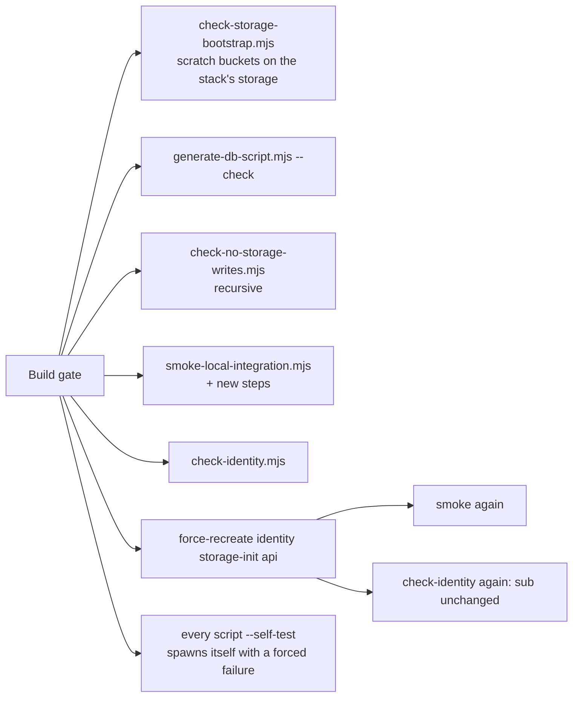

# Platform Gate Hardening Design

**Spec**: `.specs/features/platform-gate-hardening/spec.md`
**Context**: `.specs/features/platform-gate-hardening/context.md`
**Status**: Draft

---

## Architecture Overview

Nothing here changes the running system. It changes what the build gate can fail on. Every check lands in one of three places:

- **Three new gate scripts**, each with its own `--self-test`:
  - `check-storage-bootstrap.mjs`: bucket scenarios.
  - `check-identity.mjs`: identity properties.
  - `generate-db-script.mjs --check`: database-script drift.
- **The smoke**:
  - new named steps;
  - observations that carry the id they were taken for;
  - a dry-run executor so the self-test can prove `main()` runs every step.
- **One bootstrap fix**: the owned rules must carry no extra action (V36).

**Conformance.** All active decisions hold:

- **AD-005, AD-014:** storage is reached only through `aws-cli` in the `storage-init` image.
- **AD-007:** everything lives in this repository.
- **AD-009:** the database script is still generated from the migrations and never hand-edited.

**Confirmed lessons applied:**

| Lesson | How it applies |
| --- | --- |
| L-005 | Not applicable: this feature adds no index |
| L-002, L-007..L-017 (platform candidates) | New checks are named, self-tested, and run through the step list, with near-miss bad inputs, literal negatives, and every matrix check as a gate command |

---

## Spike: the corrupted fixture (GATE-16)

The spike ran on 2026-09-26 with the Worker's own toolchain: `node:22-alpine` plus `apk add ffmpeg`, exactly as `processing-worker/Dockerfile` installs it. It used the Worker's exact arguments:

- **FFprobe:** `-v error -print_format json -show_format -show_streams`.
- **FFmpeg:** `-nostdin -v error -i <f> -vf fps=1 -threads 1 <dir>/frame-%04d.jpg`.

| Candidate | FFprobe | Worker validation verdict | FFmpeg | Worker processing verdict |
| --- | --- | --- | --- | --- |
| **`sample-8s.mp4` with every byte of its `mdat` payload set to 0** (39,863 bytes, same size) | exit 0; `mov,mp4,…`; duration 8.0; video stream | **accepted**: readable, within duration, MP4 family, has video | exit **69**; **0 frames** ("Invalid NAL unit size (0 > …)") | **`PROCESSAMENTO_FALHOU`** (non-zero exit, and the ZIP builder also refuses 0 files) |
| `sample-8s.mp4` re-muxed with `+faststart` and cut 200 bytes into `mdat` (3,947 bytes) | exit 0; same report | accepted | exit 69; 0 frames | `PROCESSAMENTO_FALHOU` |

**Chosen: the zeroed-`mdat` file**, committed as `fixtures/corrupted-8s.mp4`:

- It is derived from the committed fixture by a reviewable transformation: only the `mdat` payload changes.
- FFmpeg fails on the first frame, not on a byte-offset accident.
- The file is deterministic: SHA-256 `24123d94709fc8323c7245e759f4648e60d82427e014890bfe9175ea49259454`.

`fixtures/README.md` records the command, which uses Python in a container, so no host FFmpeg is needed. It also records the three facts the smoke relies on, and why they hold:

- FFprobe reads only the `moov` box.
- FFmpeg decodes the `mdat` payload.
- The Worker fails on a non-zero exit.

**The risk this does not cover.** A future FFmpeg that silently skips undecodable frames and exits 0 would still yield 0 frames, which the ZIP builder refuses. So the fixture keeps failing at processing unless a decoder conjures frames from zeros.

---

## Code Reuse Analysis

### Existing Components to Leverage

| Component | Location | How to Use |
| --- | --- | --- |
| `dockerCompose()` + the `storage-init` aws entrypoint | `scripts/smoke-local-integration.mjs:134`, `:150` | The scenario runner and the lifecycle step reuse the same `docker compose run --rm --no-deps -T` pattern |
| `STORAGE_BUCKET` variable | `storage/bootstrap.sh:10` | The runner calls the real bootstrap with `-e STORAGE_BUCKET=<scratch>`, so no bootstrap change is needed to target a scratch bucket |
| Self-test shape (required names, bad/good inputs, exact messages) | `scripts/check-worker-sizing.mjs`, the smoke's `selfTest` | Copied by the two new scripts |
| `getToken`, `IDENTITY_URL` | `scripts/get-token.mjs` | Used by `check-identity.mjs` |
| `generate-db-script.mjs` generation path | `scripts/generate-db-script.mjs` | The new `--check` mode generates in memory and compares instead of writing |
| `uploadThroughApi`, `confirm`, `putPart` | smoke `:379-431` | The spec B steps and the processing-failure step |
| `waitForTerminalStatus`, `waitForNotificationDelivery`, `countDeliveries`, `listArchives` | smoke `:150-213`, `:646-681` | They now return `{ id, … }` so each check can verify which request was observed |

### Integration Points

| System | Integration Method |
| --- | --- |
| Storage | `aws s3api` through `storage-init`, on scratch buckets `fiapx-scenario-<name>` |
| Identity | Token from inside the network via `docker compose exec -T api node -e …` (the API image has Node); admin REST (`admin`/`admin`, dev only) for `registrationAllowed`; `docker inspect` for `tmpfs`; `docker compose config --format json` for `depends_on` |
| Sibling repositories | The generator reads `../processing-catalog` and `../notification-service` migrations, as it does today |

---

## Components

### `storage/bootstrap.sh` (V36)

- **Change**: each owned rule counts as correct only when it carries nothing but its own action. `correct()` also requires `AbortIncompleteMultipartUpload==null && Transitions==null && NoncurrentVersionExpiration==null`, and `abort_correct()` requires `Expiration==null && Transitions==null && NoncurrentVersionExpiration==null`. A rule failing this is rewritten, like a disabled or wrong one today.
- **Unchanged**: foreign rules are refused, and a policy is refused.

### `scripts/check-storage-bootstrap.mjs` (new; GATE-01, GATE-02)

- **Purpose**: Run the real bootstrap against named scenarios on scratch buckets, and fail naming the scenario.
- **Interfaces**:
  - `node scripts/check-storage-bootstrap.mjs` needs the stack's `storage`. Each scenario:
    1. deletes any leftover `fiapx-scenario-<name>` bucket;
    2. prepares the pre-state with `aws s3api`;
    3. runs `storage-init` with `STORAGE_BUCKET` overridden;
    4. asserts the exit code, the stdout/stderr lines, and the configuration read back;
    5. deletes the bucket.
  - `--self-test`: feeds each scenario's assertion a bad and a good observation, and spawns itself with a forced failure.
- **Scenarios**:

| Scenario | Pre-state | Expectation |
| --- | --- | --- |
| `fresh` | no bucket | exit 0; 3 rules exactly as desired |
| `rerun` | after `fresh` | exit 0; the three "already configured" lines; configuration byte-identical |
| `upgrade` | S5's two rules | exit 0; 3 rules |
| `foreign` | the 3 rules plus `operator-rule` | exit 1; stderr names `operator-rule`; configuration byte-identical |
| `abort-disabled`, `abort-2-days`, `abort-narrowed`, `abort-extra-expiration` | the abort rule altered accordingly | exit 0; 3 rules exactly as desired |
| `expire-extra-abort` | `expire-zips` also carrying an `AbortIncompleteMultipartUpload` action (added in T2: it covers the `correct()` half of V36's fix) | exit 0; 3 rules exactly as desired |
| `policy` | a bucket policy set | exit 1; stderr names the bucket |

### `scripts/generate-db-script.mjs --check` (GATE-04, GATE-05)

- **Purpose**: Fail when the committed script differs from what the migrations generate.
- **Interfaces**: `--check` generates into memory, compares with `db/create-database.sql`, and exits 1 naming the file and the first differing line. `--self-test` covers the comparison (identical passes; one line removed fails with the exact message).
- **First run**: regenerating adds `uq_processing_request_owner_source` (spec B), and that regenerated file is committed.

### `scripts/check-no-storage-writes.mjs` (GATE-06)

- **Change**: walks `scripts/` recursively. Zero files read → exit 1 (`no script was read under scripts/`).
- **Self-test**: runs the real reader on a temporary directory holding `nested/writes.mjs` with an `aws s3 cp … s3://fiapx/sources/…` call. It must fail naming `nested/writes.mjs`. The same directory without that file must pass.

### Smoke: observations that carry their id (GATE-08, GATE-10)

- `countDeliveries(id)` returns `{ id, count }`.
- `listArchives(id)` returns `{ id, keys: [...] }`.
- `waitForNotificationDelivery(id)` keeps the record's own `processingRequestId`.
- Every check first requires the observed id to equal the id under test, then judges the value. The self-test feeds an observation taken for another id and requires the exact "observed for X, expected Y" message.
- **Archive (GATE-10)**: a new step `archive object` requires `keys` to equal exactly `[zipStorageKey]`.

### Smoke: exact comparisons (GATE-07, GATE-09)

- **`download issued`** additionally requires `decodeURIComponent(new URL(url).pathname)` to equal `/${BUCKET}/${zipStorageKey}` of the same request.
- **`assertDeliverySentence`** already compares with `!==`. The self-test gains the four near-misses: a prefix, the sentence without its final period, the sentence plus a space, and an uppercase first word.

### Smoke: `main()` runs every step (GATE-11)

- **Change**: `main()` becomes `await runSteps(SMOKE_STEPS, {}, executorFor(process.env))`, a single line. `executorFor` returns the live executor, or, when `SMOKE_DRY_RUN=1`, one that prints each step's name without observing.
- **Self-test**: spawns `SMOKE_DRY_RUN=1 node scripts/smoke-local-integration.mjs` and requires the printed names to equal `REQUIRED_STEPS` in order. A `slice` or filter in `main()` changes both paths, so it is caught.

### Every gate script exits non-zero (GATE-12)

Each `--self-test` spawns its own script with a forced failure that needs no stack, and requires a non-zero exit and the message on stderr:

| Script | Forced failure |
| --- | --- |
| Smoke | `API_URL=http://127.0.0.1:9 HEALTH_TIMEOUT_MS=1` |
| Worker sizing | An injected `docker compose config` output with mismatched values, via `SIZING_CONFIG_JSON` |
| Storage-write check | `SCRIPTS_DIR` pointed at a temporary directory with a writing script |
| Identity check | `IDENTITY_URL=http://127.0.0.1:9` |
| Scenario runner | `COMPOSE_PROJECT_NAME` of a project with no `storage` service |

### `scripts/check-identity.mjs` (new; GATE-13, GATE-14)

| Check | How | Fails when |
| --- | --- | --- |
| `sub` pinned | `alice`/`bob` tokens from the host; compare `sub` to the ids in `identity/fiapx-realm.json` | Differs. The gate runs it before and after the force-recreate, which is GATE-13 |
| In-network `iss` | `docker compose exec -T api node -e` fetches a token from `http://identity:8080` and prints its `iss` | Not `http://localhost:8080/realms/fiapx` (K2) |
| Registration disabled | Admin token, then `GET /admin/realms/fiapx` | `registrationAllowed !== false` (K4) |
| `tmpfs` | `docker inspect` of the identity container's `HostConfig.Tmpfs` | `/opt/keycloak/data/h2` absent (K5) |
| API after identity | `docker compose config --format json` | `services.api.depends_on.identity.condition !== 'service_healthy'` (K6) |
| `get-token` CLI | Run `node scripts/get-token.mjs alice`; then again with `IDENTITY_URL=http://127.0.0.1:9` | stdout is not exactly one JWT line (T1), or the unreachable message does not name `identity` (T2) |

`--self-test` feeds each check a bad and a good observation, and spawns itself with a forced failure.

### Smoke: new steps (GATE-03, GATE-15, GATE-16)

| Step | Observes | Requires |
| --- | --- | --- |
| `bucket lifecycle` | `get-bucket-lifecycle-configuration` of `fiapx` via `storage-init` | Exactly the three owned rules, compared to the bootstrap's desired JSON after sorting by ID |
| `invalid parts rejected` | `alice` starts a 20 MiB upload, puts 1 byte as part 1 and 4 MiB as part 2, confirms twice | First `400` with the exact message; second `404 Upload not found` |
| `second key replays` | Confirms the fixture's completed upload again with a fresh key | `200`, same `processingRequestId`, `alice`'s total unchanged |
| `processing failure` | Uploads and confirms `fixtures/corrupted-8s.mp4` as `alice`; waits for the terminal status | `FAILED` with `PROCESSAMENTO_FALHOU`; not `FORMATO_INVALIDO` (edge case) |
| `processing failure archive` | `listArchives(id)` | No key |
| `processing failure delivery` | The delivery record and the count | One record whose `failureReason` is exactly `Nao foi possivel processar o video. Tente enviar novamente.` |

### Gate and README (GATE-17)

- **Build-gate command**: `docker compose up -d --wait --force-recreate identity storage-init api`, followed by the smoke and `check-identity.mjs`.
- **README**: describes the three new scripts, the new steps, the fixture and the full gate. Every step name in `SMOKE_STEPS` appears in the README. The self-test checks this by reading `README.md`, so a step added without documentation fails.

---

## Error Handling Strategy

| Error Scenario | Handling | User Impact |
| --- | --- | --- |
| A scenario fails | The runner deletes its scratch bucket, then exits 1 naming the scenario and what differed | Gate red, with the scenario named |
| An interrupted runner left a scratch bucket | Every scenario deletes its bucket first | The next run is clean |
| The corrupted fixture is accepted and completes | `processing failure` fails, naming `COMPLETED` | Gate red |
| The corrupted fixture is rejected at validation | `processing failure` fails, naming `FORMATO_INVALIDO` | Gate red (spec edge case) |
| Identity unreachable during `check-identity` | Exit 1 naming `identity` and the URL | Gate red |

---

## Risks & Concerns

| Concern | Location (file:line) | Impact | Mitigation |
| --- | --- | --- | --- |
| The smoke is 1,411 lines and grows by about a quarter | `scripts/smoke-local-integration.mjs` | Harder to review | New checks are small named functions next to their peers; nothing is restructured beyond `main()` and the id-carrying observations |
| Scenario runs lengthen the gate | Build gate | About 11 `storage-init` runs of roughly 2 s each | Acceptable, and they run in parallel with nothing else; noted in the README |
| Admin credentials in `check-identity` | `compose.yaml` dev admin | Uses `admin`/`admin` | Development-only values already in compose (AD-005); never printed |
| The corrupted fixture depends on FFmpeg behaviour | `fixtures/corrupted-8s.mp4` | A future FFmpeg could decode zeros | Two independent failure causes (exit 69 and 0 frames), recorded in `fixtures/README.md` |
| The self-test reads `README.md` for step names | The smoke's self-test | Couples docs and tests | Intended: this is GATE-17's check, and cheap |

---

## Tech Decisions

| Decision | Choice | Rationale |
| --- | --- | --- |
| Corrupted fixture | Zeroed `mdat` of the committed sample, same size | Reviewable derivation; fails on frame 1; spiked on the Worker's toolchain |
| How the self-test proves `main()` | A dry-run executor selected in the same line that runs the steps | A mutation of that line changes the dry run too |
| Owned-rule exactness | Explicit `==null` checks for the other lifecycle actions in JMESPath | Works in the `aws-cli` image, which has no `jq` |
| `sub` stability | Compare with the ids pinned in the realm file, before and after the recreate | The pinned id is the property; two comparisons prove it across the recreate |
