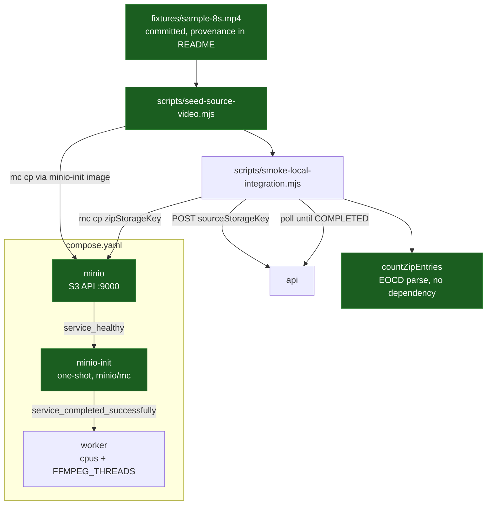

# Real Media Processing Design — platform

**Spec**: `.specs/features/real-media-processing/spec.md`
**Status**: Draft

---

## Project decisions this design conforms to

Read from `.specs/STATE.md` `## Decisions`.

| Decision | How this design conforms |
| --- | --- |
| **AD-005** — local-first, every dependency reached by standard protocol | MinIO is chosen because it *is* the S3 API, so the Worker's adapter is unchanged when the endpoint changes. Nothing above the endpoint knows which implementation answers |
| **AD-006** — explicit `ffmpeg -threads` matched to the pod's CPU limit | RM-05 makes the Compose CPU limit and `FFMPEG_THREADS` derive from one value, and a check fails when they disagree. AD-006 stated the rule; this is the first thing that enforces it |
| **AD-007** — this repository owns the topology, the smoke and the deployment artefacts | The storage service, its bootstrap, the fixture and the smoke assertion all live here. The FFmpeg invocation does not |
| **AD-008** — no cache tier | Nothing here adds one. Retention is the bucket's own lifecycle rule, not a cache eviction policy |

**Decisions recorded by S3.** This branch was rebased onto `main` after `durable-persistence` merged (2026-09-24), so `AD-009` through `AD-011` are now in `STATE.md`. `AD-011` is the one that constrains this repository: shared broker topology is configured as a broker policy in `rabbitmq/definitions.json`. Nothing in this slice touches the broker, so the constraint is untouched rather than honoured by effort.

**No new project-level decision is proposed.**

---

## Revision to a spec assumption

The spec logged *"the fixture is generated by FFmpeg at seed time, with the command versioned"*, on the grounds that a committed binary is opaque in review. Designing the seed showed the cost: generating at seed time requires FFmpeg **on the host**, which nothing else in this repository requires and a fresh machine will not have. The seed would then either fail, or need a throwaway container built from the Worker image just to produce a fixture — a container invocation, a shared volume and a build dependency, to avoid committing 200 KB.

**Revised:** the fixture is committed, and `fixtures/README.md` carries the exact FFmpeg command that produced it plus its asserted properties. Provenance is what the original assumption actually wanted; generating at runtime was a means, and an expensive one. The fixture is synthetic (`testsrc`), so there is no licence question in committing it.

---

## Architecture Overview

Three additions to the topology, then one assertion added to the smoke.



Verde: novo neste slice.

The ordering is the load-bearing part. `minio-init` runs to completion **before** the Worker starts, so the Worker can never come up against a bucket that does not exist — the failure mode where a service is healthy and every job fails for an infrastructure reason.

---

## Code Reuse Analysis

### Existing Components to Leverage

| Component | Location | How to Use |
| --- | --- | --- |
| Health-check and `depends_on: service_healthy` convention | `compose.yaml` | The MinIO service follows the same shape the other six already use |
| Named-volume convention | `compose.yaml` (`postgres-data`) | `minio-data` is declared the same way, so `down -v` starts the next run empty |
| Development-credentials-in-`environment` convention | `compose.yaml` (`postgres`) | Same rule and same comment: nothing here reaches a deployed environment (AD-005) |
| One-shot bootstrap idea | `db/init/01-schemas.sql` | Same intent, different mechanism. The SQL bootstrap runs only on an empty data directory; `minio-init` runs on **every** start, which is why its steps must be idempotent rather than first-run-only |
| Smoke script structure | `scripts/smoke-local-integration.mjs` | Extended, not replaced. Its request creation and polling stay; the archive assertion is appended |
| Dependency-free script convention | `scripts/*.mjs` | This repository has no `package.json`. Both new scripts stay plain Node with no imports outside `node:` |
| AppleDouble cleanup | `../clean-appledouble.mjs` | Already run before every `docker compose up`; the fixture directory is one more place exFAT will litter |

### Integration Points

| System | Integration Method |
| --- | --- |
| MinIO | `minio/mc` in a one-shot service for bootstrap, and for the file transfers the scripts need |
| Worker | Environment variables for endpoint, bucket, credentials and thread count; `cpus` limit in the same service block |
| Catalog | Unchanged. The smoke reads `zipStorageKey` from the status it already polls |

---

## Components

### `minio` service

- **Purpose**: Provides the S3 API locally.
- **Location**: `compose.yaml`
- **Interfaces**: `:9000` S3 API, `:9001` console
- **Dependencies**: `minio-data` volume
- **Reuses**: The health-check and volume conventions already in the file
- **Notes**: Health is `mc ready local`, which the image ships and which reports readiness rather than mere liveness. A plain TCP check would let `minio-init` start against a server that is listening but not yet serving.

### `minio-init` service

- **Purpose**: Makes the bucket, its access posture and its retention true on every start.
- **Location**: `compose.yaml`, with steps inline or in `minio/bootstrap.sh`
- **Interfaces**: Exits 0 when the bucket exists, is private, and carries the retention rules
- **Dependencies**: `minio` healthy
- **Reuses**: The `depends_on` condition pattern
- **Notes**: Every step is idempotent, because unlike the PostgreSQL bootstrap this runs on every start rather than once per volume:
  - `mc alias set local http://minio:9000 <key> <secret>`
  - `mc mb --ignore-existing local/fiapx` — the flag is what makes a second run a no-op
  - `mc anonymous get local/fiapx` must report `none`; the bootstrap **asserts** rather than sets, because MinIO buckets are already private and a `set` would be a write that could only ever loosen things
  - `mc ilm rule add --expire-days 7 --prefix "sources/" local/fiapx` and the same for `zips/`, each guarded by a check for an existing rule on that prefix so a re-run neither fails nor accumulates duplicates

### `fixtures/sample-8s.mp4` and its provenance

- **Purpose**: A real, small MP4 whose expected frame count is known exactly.
- **Location**: `fixtures/sample-8s.mp4`, `fixtures/README.md`
- **Interfaces**: 8 seconds, 320×240, H.264 in MP4 — 8 frames at 1 frame per second
- **Dependencies**: None at run time
- **Reuses**: Nothing
- **Notes**: Generated once with `ffmpeg -f lavfi -i testsrc=duration=8:size=320x240:rate=30 -c:v libx264 -pix_fmt yuv420p fixtures/sample-8s.mp4`, recorded verbatim in the README together with the declared duration and the derived frame count. Eight seconds is chosen so an off-by-one in the frame count is unmistakable; a 10-minute file would make the smoke slow and prove nothing more.

### `scripts/seed-source-video.mjs`

- **Purpose**: Puts the fixture in the bucket and prints the key.
- **Location**: `scripts/seed-source-video.mjs`
- **Interfaces**: Prints the storage key on stdout; exits non-zero with a named cause on failure
- **Dependencies**: A running stack; the `minio/mc` image
- **Reuses**: The dependency-free script convention
- **Notes**: Transfers with `docker compose run --rm -v ./fixtures:/fixtures minio-init mc cp ...` rather than an SDK, because this repository has no `package.json` and adding one to upload a file would be a large change for a small need. Uses a fixed key (`sources/sample-8s.mp4`), which makes running it twice leave exactly one object — RM-04's second criterion is satisfied by the key being deterministic, not by a delete-then-write.

### `countZipEntries` in the smoke

- **Purpose**: Returns how many entries an archive holds, without a dependency.
- **Location**: `scripts/smoke-local-integration.mjs`
- **Interfaces**: `countZipEntries(path): number` — throws with a distinguishable message for unreadable versus empty
- **Dependencies**: `node:fs`
- **Reuses**: Nothing
- **Notes**: Reads the End of Central Directory record: scans backwards for the `0x06054b50` signature and reads the 16-bit total-entries field at offset 10. That is ~20 lines and needs nothing installed, where `unzip` would be another container round-trip and a `package.json` for an unzip library would be a disproportionate change. The three failure outcomes RM-06 distinguishes — absent, unreadable, empty — map to: `mc cp` failing, no EOCD signature found, and an entry count of zero.

### Worker sizing

- **Purpose**: Ties the CPU limit and the thread count to one value.
- **Location**: `compose.yaml`, `scripts/check-worker-sizing.mjs`
- **Interfaces**: The check exits non-zero naming both values when they disagree
- **Dependencies**: None
- **Reuses**: The `docker compose config -q` step already in the topology gate
- **Notes**: Compose has no variable arithmetic, so "one place" means one `.env` value (`WORKER_CPUS`) referenced by both `deploy.resources.limits.cpus` and `FFMPEG_THREADS`, with a script asserting the substitution actually agrees in the rendered configuration. Reading `docker compose config` output is what makes the check real rather than a reading of the template.

---

## Data Models

No persistent model. The bucket layout is the only structure introduced:

```
fiapx/
  sources/<key>     # source videos - 7-day expiry
  zips/<processingRequestId>/<attemptId>/frames.zip   # produced archives - 7-day expiry
```

One bucket with two prefixes rather than two buckets: both are private to the same services, so a second bucket would double the bootstrap and the lifecycle configuration for no isolation gained.

---

## Error Handling Strategy

| Error Scenario | Handling | User Impact |
| --- | --- | --- |
| MinIO unhealthy at start | `minio-init` never runs; the Worker never starts | `docker compose up` fails visibly instead of producing a stack that cannot process |
| Bucket bootstrap fails | `minio-init` exits non-zero, so the Worker's `service_completed_successfully` condition is unmet | Same - the failure is at startup, not per job |
| Stale volume holds a bucket without the retention rules | The bootstrap adds them; existing rules are left alone | None. This is the case the PostgreSQL bootstrap cannot handle, and the reason these steps are idempotent instead of first-run-only |
| Seed script run with the stack down | Exits non-zero naming the unreachable service | The developer is told which service, rather than seeing a transfer error |
| `zipStorageKey` names a missing object | `mc cp` fails; the smoke reports **absent** | Exit non-zero with the distinction named |
| Archive downloads but has no EOCD record | The smoke reports **unreadable** | As above |
| Archive is a valid ZIP with zero entries | The smoke reports **empty** | As above. This is the outcome a stubbed packager would produce, which is the case worth separating |
| Frame count present but wrong | The smoke reports expected versus actual | The failure names both numbers, so an off-by-one is legible |

---

## Risks & Concerns

| Concern | Location (file:line) | Impact | Mitigation |
| --- | --- | --- | --- |
| **The current smoke passes against a fully stubbed slice** — it asserts a status, and every implementation in S4 could be a stub | `scripts/smoke-local-integration.mjs` | A green run would mean nothing, which is exactly how `durable-persistence` shipped a complete unreferenced persistence layer | RM-06 is the answer, and T9 verifies it the only way that counts: by stubbing the packager and confirming the smoke goes red |
| `minio-init` runs on every start, unlike the SQL bootstrap that runs once | `db/init/01-schemas.sql` vs the new service | A non-idempotent step would fail every start after the first — the same class of bug as `CREATE ROLE` failing on a second database | Every step uses an idempotent form (`--ignore-existing`, guarded `ilm rule add`), and T2/T3 are each verified by running the stack up twice |
| Compose cannot compute, so "one value in one place" is a convention a reviewer must trust | `compose.yaml` | The CPU limit and the thread count drift apart silently, and FFmpeg goes back to reading host cores | T6 asserts against `docker compose config` output, not the template, and fails naming both values |
| `deploy.resources.limits` is ignored by `docker compose up` outside Swarm | `compose.yaml` | The declared CPU limit may not be enforced locally, so a local run does not prove the pairing works | Use the top-level `cpus` field, which Compose v2 does honour, and state in the README that the declared value is the contract S9a carries into Kubernetes `limits` |
| exFAT sidecars in a new `fixtures/` directory | `fixtures/` | `mc cp` would upload `._sample-8s.mp4`, and a BuildKit context send would fail | `clean-appledouble.mjs` already runs before `docker compose up`; the seed script names the file explicitly rather than globbing the directory |
| A committed binary cannot be reviewed by reading the diff | `fixtures/sample-8s.mp4` | A reviewer cannot tell what it contains | `fixtures/README.md` carries the generating command and the asserted properties, and the smoke asserts the frame count those properties imply - so a wrong fixture fails the smoke rather than passing unnoticed |
| The smoke can go red for a reason outside the media path | Catalog consumers (gap analysis V3) | `ProcessingCompleted` handled before `ProcessingStarted` commits is dead-lettered, leaving the request in `PROCESSING`; a short fixture makes the window real | Out of this slice's scope. The smoke's timeout message names the last status it saw, so a request stuck in `PROCESSING` is distinguishable from a missing archive |
| A status-only rejection check would pass against the old validator | `scripts/smoke-local-integration.mjs` | The same blindness RM-06 fixes for the archive, on the failure side | RM-19's negative verification in T11: rebind `AcceptAllVideoValidator` and confirm the smoke fails naming `COMPLETED` |

---

## Tech Decisions (only non-obvious ones)

| Decision | Choice | Rationale |
| --- | --- | --- |
| Storage implementation | MinIO | It *is* the S3 API, including presigned and multipart, which S6 needs. LocalStack would bring an emulator of a whole cloud to provide one service |
| Bootstrap mechanism | One-shot `minio/mc` service, not an entry-point script | The image ships `mc`; a hand-rolled script would reimplement the client. `service_completed_successfully` then gives real ordering rather than a sleep |
| Access posture | Assert private, never set | MinIO buckets start private. A `set` could only loosen the posture, and asserting catches a volume someone loosened by hand |
| Retention mechanism | Bucket lifecycle rule | The storage already does this. A cron deleting objects would duplicate it and could disagree with it |
| Bucket count | One bucket, two prefixes | Both are private to the same services; a second bucket doubles the configuration for no isolation |
| Fixture provenance | Committed binary plus the generating command | Generating at seed time needs FFmpeg on the host, which nothing else here needs. See Revision above |
| Reading the archive in the smoke | Parse the EOCD record in plain Node | Keeps the repository dependency-free. `unzip` would be another container round-trip; a library would need a `package.json` this repository does not have |
| Verifying the smoke's new assertion | Stub the packager and require a red run | An assertion that has never failed is not known to work. This is the concrete lesson from the previous slice |
