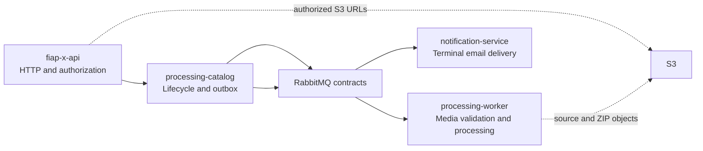

# FIAP X Repository Foundation Design

**Spec**: `.specs/features/repository-foundation/spec.md`
**Status**: Approved from existing FIAP X foundation

## Architecture Overview

The workspace keeps four sibling Git repositories. Each contains only repository-level documentation and ignore rules. The boundaries mirror the approved production topology, while application code, infrastructure, and remote configuration remain deferred.

## Code Reuse Analysis

### Existing Components to Leverage

| Component | Location | How to Use |
| --- | --- | --- |
| Approved architecture foundation | `docs/foudation.md` | Source of truth for repository boundaries, stack, and integrations. |
| Domain language and C4/event-storming diagrams | `docs/FIAP X.pdf` | Source of truth for service ownership and terminology. |
| Challenge requirements | `docs/POSTECH - SOAT - Fase 5 - Hacka.pdf` | Source of truth for versioning, scale, persistence, testing, and delivery expectations. |

### Integration Points

| System | Integration Method |
| --- | --- |
| FIAP X services | Versioned RabbitMQ contracts, defined later in shared API/event documentation. |
| AWS services | Documented ownership only; no credentials or cloud resources are created. |
| Git remote | Deliberately unconfigured; the user will attach the intended remote before pushing. |

## Components

### `fiap-x-api`

- **Purpose**: Own the HTTP edge, JWT/ownership authorization, presigned S3 URL issuance, idempotent upload confirmation, and status/download endpoints.
- **Location**: `fiap-x-api/`
- **Dependencies**: Cognito, S3, Processing Catalog.
- **Reuses**: Architecture terminology from the foundation documents.

### `processing-catalog`

- **Purpose**: Own `ProcessingRequest`, allowed status transitions, PostgreSQL persistence, status queries, and transactional outbox publication.
- **Location**: `processing-catalog/`
- **Dependencies**: PostgreSQL/RDS and RabbitMQ.
- **Reuses**: The Processing Request aggregate and state-machine definition.

### `processing-worker`

- **Purpose**: Validate video binaries, run FFprobe/FFmpeg, package frames as ZIP, store objects in S3, and publish results.
- **Location**: `processing-worker/`
- **Dependencies**: RabbitMQ, S3, FFprobe, and FFmpeg.
- **Reuses**: Worker job and event definitions from the foundation.

### `notification-service`

- **Purpose**: Consume terminal events, send one completion or failure email, and record notification delivery independently.
- **Location**: `notification-service/`
- **Dependencies**: RabbitMQ and Amazon SES.
- **Reuses**: Notification lifecycle ownership from the foundation.

## Data Models

No executable data model is introduced. Future implementation follows the approved ownership: `ProcessingRequest` and outbox belong only to `processing-catalog`; notification delivery records belong only to `notification-service`; binaries remain in S3.

## Error Handling Strategy

| Error Scenario | Handling | User Impact |
| --- | --- | --- |
| Target directory already exists | Stop before changes. | Existing work is preserved. |
| Git identity is absent | Stop before commits. | User receives the configuration issue. |
| Remote is absent | Leave it unconfigured. | User can choose and add the remote before pushing. |

## Risks & Concerns

| Concern | Location | Impact | Mitigation |
| --- | --- | --- | --- |
| No shared contracts repository has been requested | Workspace scope | Future event-contract duplication is possible. | Each boundary document names RabbitMQ contracts as versioned integration points; a dedicated shared-contract strategy is deferred. |
| No remote URLs are supplied | Workspace scope | No remote verification is possible. | Create only local repositories and commits; do not attempt remote operations. |

## Tech Decisions

| Decision | Choice | Rationale |
| --- | --- | --- |
| Repository arrangement | Four sibling repositories | Matches the approved four deployable units. |
| Initial contents | Documentation and ignore rules only | Avoids prematurely selecting dependencies, frameworks, or deployment tooling. |
| Branch | `main` | Provides a standard first-push target. |
