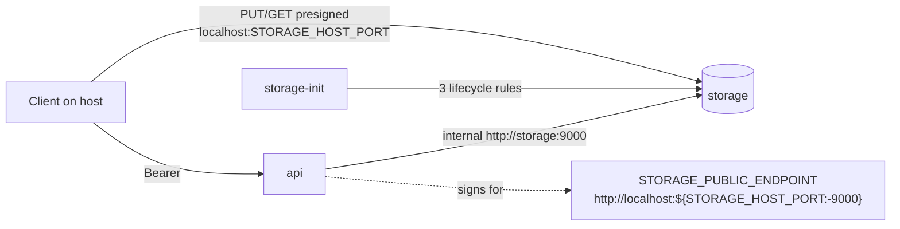

# Upload and Download Design — platform

**Spec**: `.specs/features/upload-download/spec.md`
**Context**: `.specs/features/upload-download/context.md`
**Status**: Draft

---

## Project decisions this design conforms to

| Decision | How this design conforms |
| --- | --- |
| **AD-005** — development credentials in `environment` | The API gets the same development storage credentials as the Worker |
| **AD-007** — this repository owns topology and smoke | Storage wiring, the lifecycle rule and the end-to-end proof live here |
| **AD-014** — RustFS + aws-cli; verify the server first | The abort rule and presigned multipart were exercised against RustFS 1.0.0 (see the API design's spike table) |

**No new project-level decision is proposed.**

---

## Spike evidence relevant here (2026-09-26, RustFS 1.0.0)

| Question | Observed |
| --- | --- |
| Lifecycle rule `AbortIncompleteMultipartUpload` (`DaysAfterInitiation: 1`, `Filter.Prefix: ""`) alongside the two expiry rules | accepted and read back as three rules |
| A presigned URL used on a host other than the one signed | 403 |
| A presigned URL on the signed host, through Docker's port mapping | 200 (the `Host` header the client sends is the one signed) |

---

## Architecture Overview

---

## Components

### API storage wiring

- **Location**: `compose.yaml` (`api` service)
- **Environment**: `STORAGE_ENDPOINT=http://storage:9000`, `STORAGE_PUBLIC_ENDPOINT=http://localhost:${STORAGE_HOST_PORT:-9000}`, `STORAGE_BUCKET=fiapx`, `STORAGE_ACCESS_KEY` / `STORAGE_SECRET_KEY` (development values, same as the Worker's), optional TTL overrides
- **Depends on**: `storage-init: service_completed_successfully`
- **Notes**: The public endpoint is derived from the same variable that publishes the port, so it cannot drift from it.

### Bootstrap: the third owned rule

- **Location**: `storage/bootstrap.sh`
- **Change**: owned IDs become `expire-sources`, `expire-zips`, `abort-incomplete-uploads`; the desired configuration carries all three; `correct()` gains a check for the abort rule (`Status == Enabled`, `AbortIncompleteMultipartUpload.DaysAfterInitiation == 1`); the read-back requires exactly three rules
- **Notes**: Foreign rules are still refused by ID (the S6 AD-014 fix). An existing two-rule bucket is upgraded in place because its rules are all owned.

### Seed removal

- `scripts/seed-source-video.mjs` deleted; the Build gate's seed step removed; README's "Seeding a source video" section replaced by the upload flow.

### Smoke

- **Upload helper** `uploadThroughApi(token, { bytes, fileName, contentType })`: `POST /uploads`, `PUT` each slice to its part URL from the host, return `uploadId`; `confirm(token, uploadId, key)` → `{ status, body }`.
- **New named steps** (each a pure, self-tested `check`, following L-007..L-009):
  - `old create gone` — `POST /processing-requests` with a token → 404
  - `upload confirmed` — fixture as `alice`, confirmation 201
  - `confirmation replay` — same key → 200, same id; `alice`'s total unchanged
  - `key reuse conflict` — a second upload confirmed with the same key → 409
  - `download issued` — poll `GET …/download` (409 while not completed is expected), fetch the URL from the host, count entries with the existing EOCD reader → 8
  - `cross-owner download 404` — `bob` → the constant 404
- The non-video is uploaded and confirmed through the API too; every S4/S5 assertion keeps running on it.
- The archive check reads the ZIP through the download URL instead of `aws s3 cp`, which proves the URL.

### Database script

- Regenerate `db/create-database.sql` after the Catalog's `1789956000000` migration.

---

## Error Handling Strategy

| Scenario | Handling | Impact |
| --- | --- | --- |
| API signs for the wrong host | `upload confirmed` fails on the `PUT` (403), naming the URL host | Visible at once |
| Bootstrap sees a foreign rule | Exit 1 naming it (unchanged) | API never starts |
| Download polled before completion | 409 treated as "not yet", within the smoke's timeout | No false failure |

---

## Risks & Concerns

| Concern | Location | Impact | Mitigation |
| --- | --- | --- | --- |
| **The public endpoint drifts from the published port** | `compose.yaml` | Every URL fails from the host | Both come from `STORAGE_HOST_PORT`; the smoke runs with a non-default port on this machine |
| **Removing the seed breaks the Build gate** | `tasks.md` gate rows (S4, S5) | Gate references a deleted script | Gate rows updated in the same task |
| **Smoke length** | `scripts/smoke-local-integration.mjs` | More steps, more time | Uploads are small (fixture 39 KB, one part each) |
| **A lifecycle abort after 1 day is untestable in real time** | bootstrap | The behaviour cannot be observed in a run | The rule is asserted by read-back, as the 7-day rules are |
