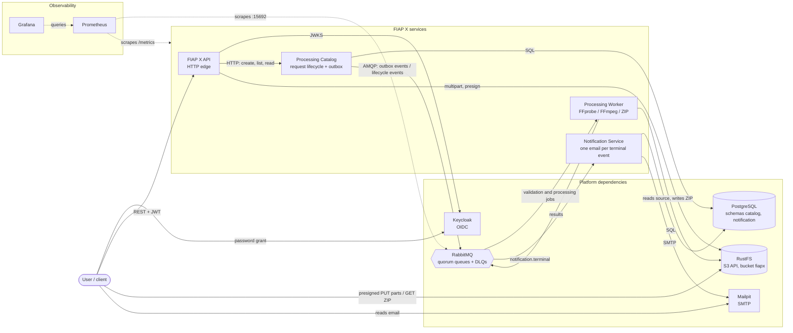
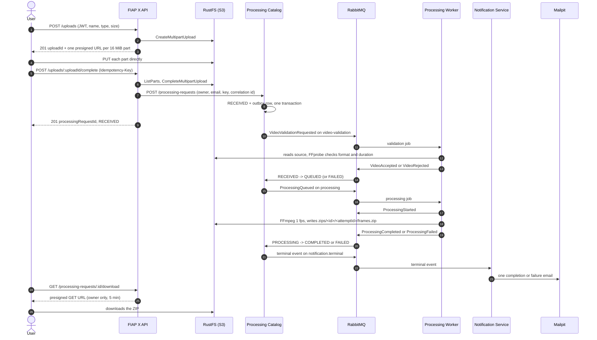

# FIAP X — platform

FIAP X receives an authenticated video, extracts one frame per second, and delivers the frames as a ZIP package to the request owner. Processing is asynchronous, so many videos are handled in parallel and no request is lost during traffic spikes. It is the FIAP POSTECH SOAT phase 5 hackathon, built as four services and this repository.

This repository is the system's entry point. It holds what belongs to the system as a whole rather than to any single service: the architecture documentation, the cross-repository decision log, the local runtime topology (Docker Compose and Kubernetes), observability as code, the end-to-end tests and the CI governance. It is **not a fifth service**: it has no business behaviour, no release cadence, and nothing here is deployed on its own ([AD-007](.specs/STATE.md)).

**Contents**: [The system](#the-system) · [The repositories](#the-repositories) · [Architecture decisions](#architecture-decisions) · [Technology stack](#technology-stack) · [Repository structure](#repository-structure) · [Running locally](#running-locally) · [Verification](#verification) · [Operations and troubleshooting](#operations-and-troubleshooting)

**Quick start** (Docker running, Node 22, the five repositories checked out side by side):

```sh
docker compose up --build -d --wait
node scripts/smoke-local-integration.mjs
```

## The system

The full architecture, with its contracts, state machine and concurrency model, is in [`docs/foudation.md`](docs/foudation.md). The hackathon brief (`POSTECH - SOAT - Fase 5 - Hacka.pdf`) is in [`docs/`](docs/).

### The problem and where each requirement is met

| Rule | Decision |
| --- | --- |
| Accepted files | `.mp4` (`video/mp4`) and `.mov` (`video/quicktime`), up to 500 MB and 10 minutes |
| Extraction | 1 frame per second, packaged as one ZIP per request |
| Retention | Source videos and ZIPs expire after 7 days; history and metadata stay in PostgreSQL |
| Accounts | Provisioned by an administrator in the identity provider; no self-registration |
| Attempts | One business attempt; a validation or processing error ends the request as `FAILED` with a safe reason |
| Binary transfer | Straight to and from object storage, through short-lived URLs the API issues to the owner only |

| Hackathon requirement | Where it is met |
| --- | --- |
| **RF-1** Process more than one video at the same time | Stateless Worker replicas compete on the same queues with a bounded prefetch ([AD-006](.specs/STATE.md)); on Kubernetes, KEDA scales the Worker from 1 to 5 replicas by queue depth ([AD-018](.specs/STATE.md)). Shown by the [load test](#worker-replicas-and-the-load-test) |
| **RF-2** Lose no request during spikes | Uploads go straight to storage; each transition and its events commit together through a transactional outbox ([AD-010](.specs/STATE.md)); durable quorum queues with dead-letter queues and a delivery limit ([AD-012](.specs/STATE.md)); consumers acknowledge only after persisting and deduplicate by `eventId`; confirmation requires an `Idempotency-Key` |
| **RF-3** Protected by username and password | Keycloak (OIDC) issues the token; the API validates it against the realm's JWKS and takes the owner from `sub`. See [demo users](#logging-in-as-a-demo-user) |
| **RF-4** List a user's video statuses | `GET /processing-requests` and `GET /processing-requests/:id`, filtered by owner inside the Catalog's query; the smoke's `lists disjoint` and `cross-owner read 404` prove it |
| **RF-5** Notify the user on error | Every terminal event reaches the Notification Service, which sends exactly one email per request over SMTP (Mailpit locally); the smoke's `failure email` proves it |
| **RT-1** Persist the data | PostgreSQL, one schema and role per service, versioned migrations ([AD-009](.specs/STATE.md)); the [generated database creation script](#the-database-creation-script-is-generated) is the deliverable |
| **RT-2** Scalable architecture | Services split by scaling profile; the Worker scales horizontally by queue depth on the [kind cluster](#local-kubernetes-kind) |
| **RT-3** Versioned on GitHub | Five repositories under [`tech-challenge-workshop`](https://github.com/tech-challenge-workshop), each `main` protected by a ruleset with required checks |
| **RT-4** Tests that guarantee quality | Each service's `quality` job (lint, typecheck, unit and e2e tests); here, the [32-step smoke](#what-the-smoke-proves) against the live stack and a `--self-test` for every check |
| **RT-5** CI/CD | GitHub Actions in every repository; each service publishes its image to GHCR on every merge and the cluster runs it ([CD](#cd-published-images)) |

The recommended stack is used in full (Docker and Kubernetes, RabbitMQ, PostgreSQL, Prometheus and Grafana, GitHub Actions) except the Redis cache, which is deliberately left out ([AD-008](.specs/STATE.md)).

### Containers

Every dependency runs as a container next to the services and is reached through a standard protocol (OIDC/JWKS, S3 API, SQL, AMQP, SMTP), so no provider-specific SDK or claim reaches the application layer ([AD-005](.specs/STATE.md)). The four services share no database tables and no code; they talk over versioned AMQP contracts plus one HTTP call from the API to the Catalog.



### One video, end to end



The state machine is `RECEIVED -> QUEUED -> PROCESSING -> COMPLETED`, and `RECEIVED | QUEUED | PROCESSING -> FAILED`. Failures carry a safe code (`FORMATO_INVALIDO`, `DURACAO_EXCEDIDA` or `PROCESSAMENTO_FALHOU`) and a user-facing sentence; neither is retried. Every event carries an `eventId` for deduplication and an optional `correlationId` that follows the video from upload to email ([AD-016](.specs/STATE.md)).

## The repositories

| Repository | Responsibility | Stack |
| --- | --- | --- |
| [`fiap-x-api`](https://github.com/tech-challenge-workshop/fiap-x-api) | HTTP edge: JWT validation, presigned upload/download URLs, idempotent upload confirmation, owner-scoped status | NestJS 11, `jose`, AWS SDK v3 (S3) |
| [`processing-catalog`](https://github.com/tech-challenge-workshop/processing-catalog) | Owns the `ProcessingRequest` lifecycle, its state machine, and reliable event publication through a transactional outbox | NestJS 11, TypeORM + PostgreSQL, AMQP |
| [`processing-worker`](https://github.com/tech-challenge-workshop/processing-worker) | FFprobe validation, FFmpeg frame extraction, ZIP packaging, and object storage | NestJS 11, FFmpeg, AWS SDK v3 (S3), AMQP |
| [`notification-service`](https://github.com/tech-challenge-workshop/notification-service) | Sends one completion or failure email per terminal event, idempotently | NestJS 11, TypeORM + PostgreSQL, AMQP, Nodemailer |
| [`fiap-x-platform`](https://github.com/tech-challenge-workshop/fiap-x-platform) (this one) | Everything system-wide | Compose, Kubernetes manifests, Node scripts |

Each service repository keeps its own source, Dockerfile, `.specs/features/` and service-local decisions. This repository owns ([AD-007](.specs/STATE.md)):

- the architecture foundation ([`docs/foudation.md`](docs/foudation.md)) and the hackathon brief;
- the cross-repository decision log ([`.specs/STATE.md`](.specs/STATE.md)) and feature specifications ([`.specs/features/`](.specs/features/));
- the Docker Compose topology and the Kubernetes (kind) manifests, including the Worker's KEDA autoscaling;
- the broker definitions, identity realm, storage and database bootstraps, and Prometheus/Grafana as code;
- the smoke and load tests and every topology check;
- the generated database creation script, a hackathon deliverable;
- CI governance: this repository's workflow and the required checks of all five rulesets.

## Architecture decisions

Decisions that span more than one repository live in [`.specs/STATE.md`](.specs/STATE.md), each with its reason, trade-off and scope.

| ID | Decision | Status |
| --- | --- | --- |
| AD-001 | Four independently versioned service repositories | active |
| AD-002 | AWS managed stack (RDS, S3, Cognito, SES, EKS, Terraform) | superseded by AD-005 |
| AD-003 | Root Compose topology with RabbitMQ, local DTOs, no shared contracts package | superseded by AD-004 |
| AD-004 | Local runtime assets owned by `fiap-x-api` | superseded by AD-007 |
| AD-005 | Local-first, self-hosted platform; every dependency behind a standard protocol | active (storage server amended by AD-014) |
| AD-006 | NestJS Worker; FFmpeg in a child process; prefetch, explicit thread count and replicas, no `worker_threads` | active |
| AD-007 | This fifth repository owns everything system-wide | active |
| AD-008 | No cache tier in the MVP; idempotency via PostgreSQL and deterministic object keys | active |
| AD-009 | TypeORM with versioned migrations; one schema and role per service in one database | active |
| AD-010 | The Catalog publishes only through its transactional outbox, marked sent after the broker confirms | active |
| AD-011 | Shared queue behaviour set by broker policy in this repository, never by queue arguments | active |
| AD-012 | Broker definitions own every queue and DLQ; quorum queues, `delivery-limit: 5`; services classify failures | active |
| AD-013 | Lifecycle events applied under a row lock; the state machine tolerates start/completion order | active |
| AD-014 | RustFS replaces MinIO; storage scripts use plain `aws-cli` | active |
| AD-015 | Owner email read once from the token's `email` claim; only the terminal event carries it | active |
| AD-016 | One correlation id from upload to email | active |
| AD-017 | Shared conventions for logs, metrics, health endpoints and monitoring as code | active |
| AD-018 | Local kind cluster in its own kubeconfig, published GHCR images, generated Secrets, KEDA scaling | active |

## Technology stack

Versions are the ones pinned in [`compose.yaml`](compose.yaml), [`k8s/`](k8s/), the scripts and the workflows.

| Concern | Technology | Version | Protocol |
| --- | --- | --- | --- |
| Runtime | Node.js (`node:22-alpine`) | 22 | |
| Framework | NestJS, TypeScript | 11, 5.7 | |
| Messaging | RabbitMQ (`rabbitmq:4-management-alpine`) with the management and `rabbitmq_prometheus` plugins | 4 | AMQP |
| Database | PostgreSQL (`postgres:17-alpine`), TypeORM migrations | 17 | SQL |
| Object storage | RustFS (`rustfs/rustfs`); bootstrap with `amazon/aws-cli` | 1.0.0; 2.37.4 | S3 API |
| Media | FFmpeg / FFprobe (Alpine package in the Worker image) | | |
| Identity | Keycloak (`quay.io/keycloak/keycloak`) | 26.7.4 | OIDC/JWKS |
| Email | Mailpit (`axllent/mailpit`) | v1.31.2 | SMTP |
| Observability | Prometheus (`prom/prometheus`), Grafana (`grafana/grafana`); `prom-client`, `nestjs-pino` in the services | v3.15.0, 13.2.2 | `/metrics` |
| Orchestration | Docker Compose; kind (`kindest/node:v1.36.4`), kubectl, KEDA | kind 0.33, kubectl 1.36+, KEDA v2.21.0 | versioned manifests |
| CI/CD | GitHub Actions (Node 22), kubeconform, GHCR multi-arch images | kubeconform v0.8.0 | |

## Repository structure

```text
fiap-x-platform/
├── README.md                    this file
├── compose.yaml                 local runtime topology (builds the four services from sibling checkouts)
├── docs/
│   ├── foudation.md             architecture foundation: scope, services, flow, state machine, contracts, concurrency
│   ├── POSTECH - SOAT - Fase 5 - Hacka.pdf   the hackathon brief
│   └── superpowers/plans/       implementation plans
├── .specs/
│   ├── STATE.md                 cross-repository decision log (AD-001..AD-018) and handoff
│   ├── LESSONS.md, lessons.json lessons recorded across slices
│   └── features/                cross-repository feature specifications, one folder per slice
├── k8s/                         one kustomization (namespace fiapx), KEDA ScaledObject, kind cluster template
├── rabbitmq/                    broker definitions (queues, DLQs, dead-letter policy), config, enabled plugins
├── identity/fiapx-realm.json    the fiapx realm: demo users and the development client
├── storage/bootstrap.sh         object storage bootstrap (bucket, privacy, lifecycle rules)
├── db/
│   ├── init/01-schemas.sql      schemas and least-privilege roles, run on an empty volume
│   └── create-database.sql      generated database creation script (deliverable)
├── prometheus/                  scrape configuration for Compose and for the cluster
├── grafana/                     provisioned datasource, dashboard provider and the overview dashboard
├── fixtures/                    the sample video, its corrupted copy, and their provenance
├── scripts/                     smoke, load test, token helper, checks, DB script generator, kind up/down
├── ci/required-checks.json      the checks each repository's protect-main ruleset must require
└── .github/workflows/ci.yml     topology, integration, kubernetes and docs-links jobs
```

| Script | Purpose |
| --- | --- |
| `smoke-local-integration.mjs` | [The smoke test](#what-the-smoke-proves), against Compose or the kind cluster |
| `load-test.mjs` | [Concurrent videos through the public API](#worker-replicas-and-the-load-test) |
| `get-token.mjs` | [A demo user's access token](#logging-in-as-a-demo-user) |
| `check-identity.mjs` | [Identity properties](#logging-in-as-a-demo-user) on the live stack |
| `check-storage-bootstrap.mjs` | [Bootstrap scenarios](#object-storage) against the live storage |
| `check-no-storage-writes.mjs` | [No script writes into the bucket](#uploading-a-video-and-downloading-its-frames) |
| `generate-db-script.mjs` | [Generates and drift-checks `db/create-database.sql`](#the-database-creation-script-is-generated) |
| `check-worker-sizing.mjs` | [Worker CPU limit equals its FFmpeg threads](#worker-sizing) |
| `check-observability.mjs` | [Monitoring wiring, offline and `--live`](#observability) |
| `k8s-up.mjs`, `k8s-down.mjs`, `kube.mjs`, `check-kubernetes.mjs` | [The kind cluster](#local-kubernetes-kind) and its rules |
| `check-ci-governance.mjs`, `apply-required-checks.mjs` | [CI governance and rulesets](#ci-and-the-required-checks) |
| `check-docs-links.mjs` | [Relative links in the docs resolve](#ci-and-the-required-checks) |

## Running locally

### Docker Compose

Compose is the everyday loop. It builds each service from its sibling repository, so all five repositories must be checked out under the same parent directory. On an exFAT or external volume, [clean AppleDouble files](#appledouble-files-on-exfat-volumes) first.

```sh
docker compose up --build -d --wait
node scripts/smoke-local-integration.mjs
```

| Service | Host address | Notes |
| --- | --- | --- |
| API | `http://localhost:3000` | Every route except `/health`, `/health/live` and `/metrics` needs a bearer token |
| Catalog | `http://localhost:3001` | `CATALOG_HOST_PORT` |
| Worker | a port in `3010-3019` per replica | `WORKER_HOST_PORT`; `docker compose port --index N worker 3002` |
| Notification | `http://localhost:3003` | |
| Keycloak | `http://localhost:8080` | realm `fiapx`; admin console `admin` / `admin` |
| RustFS (S3 API) | `http://localhost:9000` | `STORAGE_HOST_PORT`; `fiapx-dev` / `fiapx-dev-secret` |
| Mailpit | `http://localhost:8025` | web UI and API; SMTP stays internal (`mailpit:1025`) |
| RabbitMQ | `5672`, `http://localhost:15672`, `:15692/metrics` | AMQP, management (`guest` / `guest`), metrics |
| Prometheus | `http://localhost:9090` | |
| Grafana | `http://localhost:3005` | `admin` / `admin` |
| PostgreSQL | `localhost:5432` | `POSTGRES_HOST_PORT`; `postgres` / `postgres`, database `fiapx` |

Every credential above is a local development fixture; nothing here reaches a deployed environment. When a port is taken, see [Host ports already in use](#host-ports-already-in-use).

#### Logging in as a demo user

The `identity` service (Keycloak, on `localhost:8080`) imports the `fiapx` realm from [`identity/fiapx-realm.json`](identity/fiapx-realm.json) on every start, so nothing changed by hand in its console survives a restart. The realm has two demo users and no self-registration:

| User | Password |
| --- | --- |
| `alice` | `alice-dev-password` |
| `bob` | `bob-dev-password` |

Their ids are pinned in the realm file, so each user's `sub`, which the API records as a request's owner, stays the same across restarts. Get a token with one command; it prints only the access token:

```sh
TOKEN=$(node scripts/get-token.mjs alice)
curl -H "Authorization: Bearer $TOKEN" http://localhost:3000/processing-requests
```

`--password <p>` overrides the demo password, and `IDENTITY_URL` overrides `http://localhost:8080`. A rejected user or password exits 1 naming the user and Keycloak's reason; an unreachable `identity` exits 1 naming the service. A token lasts 5 minutes.

The script uses the OAuth password grant through the public client `fiapx-cli`. OAuth 2.1 discourages that grant. It is acceptable here only because the client and these passwords exist solely in the local development realm; the client has no browser flow and no secret, and nothing here reaches a deployed environment.

`node scripts/check-identity.mjs` proves on the stack the identity properties the rest of the system relies on, and fails naming the first check that does not hold:

- `sub pinned`: `alice`'s and `bob`'s `sub` equal the ids pinned in the realm file. The build gate runs this before and after force-recreating `identity`, so the ids are proven to survive a re-import.
- `in-network iss`: a token requested inside the network, from the `api` container, carries the issuer the API validates.
- `registration disabled`: the realm refuses self-registration.
- `h2 on tmpfs`: Keycloak's embedded database is on tmpfs, so a restart re-imports the realm.
- `api after identity`: compose starts the API only once `identity` is healthy. This is proven by reading `depends_on` … `service_healthy` from the rendered compose, not by observing start times: the rule is declarative, and compose enforces it.
- `get-token cli`: `node scripts/get-token.mjs alice` prints exactly one JWT line, and names the compose service `identity` when it cannot reach it.

A failure message never quotes a token: any JWT in the output it quotes is shown as `<jwt: N chars>`. Its `--self-test` needs no stack. It gives each check a bad, a near-miss and a good observation and requires the exact message, and spawns the script against an identity nothing listens on, which must exit non-zero naming `identity`. CI's `topology` job and the build gate run it.

#### Uploading a video and downloading its frames

A video reaches storage only one way: the client uploads it straight to object storage through short-lived URLs the API issues, then confirms the upload, which creates the processing request. The ZIP comes back the same way, through a short-lived URL issued only to the request's owner. The API never returns a storage key.

```sh
TOKEN=$(node scripts/get-token.mjs alice)

# 1. Start: the API checks the name, type and size, and answers with one URL per 16 MiB part.
curl -s -X POST http://localhost:3000/uploads -H "Authorization: Bearer $TOKEN" \
  -H 'Content-Type: application/json' \
  -d '{"fileName":"sample-8s.mp4","contentType":"video/mp4","sizeBytes":39863}'
# 201 {"uploadId":"…","partSize":16777216,"parts":[{"partNumber":1,"url":"http://localhost:9000/fiapx/sources/…"}],"expiresAt":"…"}

# 2. PUT each part's bytes (bytes (n-1)*partSize up to n*partSize) to its URL, straight to storage.
curl -s -X PUT --upload-file fixtures/sample-8s.mp4 '<parts[0].url>'

# 3. Confirm with an Idempotency-Key: the API lists the uploaded parts itself and creates the request.
curl -s -X POST http://localhost:3000/uploads/<uploadId>/complete \
  -H "Authorization: Bearer $TOKEN" -H 'Idempotency-Key: my-first-upload'
# 201 {"processingRequestId":"…","status":"RECEIVED"}

# 4. Once the request is COMPLETED, ask for the download (409 until then) and GET the URL.
curl -s http://localhost:3000/processing-requests/<processingRequestId>/download -H "Authorization: Bearer $TOKEN"
# 200 {"url":"http://localhost:9000/fiapx/zips/…","expiresAt":"…"}
```

- **Formats and size.** `.mp4` with `video/mp4`, or `.mov` with `video/quicktime`, up to 500 MB (524288000 bytes). A bad field answers 400 naming it. The declared `sizeBytes` must match what was uploaded, or confirmation answers 400, discards the upload and creates nothing.
- **Idempotency.** `Idempotency-Key` is required on confirmation (1 to 255 printable ASCII characters). The same key on the same upload answers 200 with the same request, however often it is retried. The same key on another upload answers 409. Keys are per user and remembered as long as the request exists.
- **URL lifetimes.** Part URLs last 1 hour and the download URL 5 minutes. These are the API's defaults, `UPLOAD_URL_TTL_SECONDS=3600` and `DOWNLOAD_URL_TTL_SECONDS=300`, and compose leaves them unset. Every download request issues a new URL after checking the owner again.
- **Owner only.** Another user's request, an unknown id and a malformed one all answer the same 404 on the download, exactly as on the read. A request that is not `COMPLETED` answers 409.
- **Abandoned uploads.** An upload that is started and never confirmed is aborted by the bucket itself after 1 day (see [Object storage](#object-storage)). There is nothing to clean up by hand.
- **Signed for the host.** The API reaches storage at `storage:9000` inside the network but signs every URL for `http://localhost:${STORAGE_HOST_PORT:-9000}`, because a presigned URL only works on the host it was signed for. Both come from `STORAGE_HOST_PORT` in [`compose.yaml`](compose.yaml), so they cannot drift apart.

S5's `POST /processing-requests {sourceStorageKey}` is gone; it answers 404. So is `scripts/seed-source-video.mjs`, which put the fixture in the bucket behind the API's back until S6. `node scripts/check-no-storage-writes.mjs` fails, naming the file, when any script under `scripts/` writes into the bucket itself: an `aws s3 cp` into it, `mv`, `sync`, `put-object`, the multipart calls or an SDK upload. Its `--self-test` feeds it the deleted seed's calls. Both run in the build gate and in CI.

To follow one video through the logs and the outbox, send your own `X-Correlation-Id` on step 3; see [Correlation id](#correlation-id).

### Local Kubernetes (kind)

The same topology also runs on a local [kind](https://kind.sigs.k8s.io/) cluster named `fiapx`, from the versioned manifests in [`k8s/`](k8s/), with the Worker scaled by queue depth through [KEDA](https://keda.sh/) ([AD-018](.specs/STATE.md)). Compose stays the everyday loop; the cluster is for the scaling scene and for CI's `kubernetes` job.

**Prerequisites**: Docker (running), kind 0.33 or later, and kubectl 1.36 or later on `PATH`. The up command checks all three and the Docker daemon, and names every one that is missing before it creates anything.

```sh
node scripts/k8s-up.mjs                                    # create (or reuse) the cluster, install KEDA, apply k8s/, wait
SMOKE_TARGET=kind node scripts/smoke-local-integration.mjs  # the smoke, observing the cluster instead of Compose
node scripts/check-kubernetes.mjs --live                   # workloads Ready, HPA present, targets up, dashboard served
node scripts/k8s-down.mjs                                  # delete the fiapx cluster and its data
```

`k8s-up` creates the cluster (or reuses a healthy one with the same host ports), installs KEDA v2.21.0 from its release manifest after checking the pinned sha256, generates this cluster's Secrets, applies the kustomization and waits up to 600 s for every Deployment and StatefulSet to be Ready and the `storage-init` Job to complete. On a timeout it exits 1 naming each workload that is not Ready and why its pods are waiting, such as `ImagePullBackOff` with the image. Running it again against a healthy cluster changes nothing: Secrets are created only when absent, and the Worker keeps the replicas KEDA gave it. A cluster that exists but is unhealthy, or was created with other host ports, is refused with a hint to run `k8s-down` first. `k8s-down` deletes the `fiapx` cluster only, and exits 0 when there is none.

**Your kubeconfig is never touched.** This machine's `~/.kube/config` may point at a real cluster. `kind create cluster` always makes the cluster it creates the current context of the kubeconfig it writes, so the scripts keep `fiapx` in a file of its own, `~/.kube/kind-fiapx.config`, and every kubectl call in `scripts/` goes through [`scripts/kube.mjs`](scripts/kube.mjs), which adds `--context kind-fiapx` and sets `KUBECONFIG` to that file alone. `node scripts/check-kubernetes.mjs` fails when any other script spawns kubectl or kind directly. Do the same by hand: prefix every kubectl command with the file and name the context, as all commands below do.

```sh
KUBECONFIG=~/.kube/kind-fiapx.config kubectl --context kind-fiapx -n fiapx get pods
```

**Host ports.** The cluster publishes the host ports Compose uses, through kind port mappings, so the OIDC issuer (`http://localhost:8080/realms/fiapx`), presigned URLs on `localhost:9000`, `get-token`, the smoke and the load test work unchanged:

| Port | Service |
| --- | --- |
| 3000 | API |
| 3001 | Catalog (`CATALOG_HOST_PORT`) |
| 3003 | Notification |
| 8080 | Keycloak |
| 9000 | storage (`STORAGE_HOST_PORT`) |
| 8025 | Mailpit |
| 15672, 15692 | RabbitMQ management and metrics |
| 9090 | Prometheus |
| 3005 | Grafana |

`CATALOG_HOST_PORT` and `STORAGE_HOST_PORT` move the Catalog and storage ports as in [Host ports already in use](#host-ports-already-in-use); set them before creating the cluster, since its port map is fixed at creation. The Worker publishes no host port in the cluster. Because the ports are the same, **the cluster and the Compose stack cannot run at the same time**: `k8s-up` probes every port before creating the cluster and exits 1 naming each busy one. Run `docker compose down` first, and `node scripts/k8s-down.mjs` before going back to Compose.

**Generated credentials.** No credential is versioned. `k8s-up` generates random values per cluster into Secrets and prints how to read them; the demo users `alice` and `bob` and the Postgres roles of `db/init/01-schemas.sql` keep their fixture passwords. Grafana (`http://localhost:3005`, user `admin`), Keycloak's admin and RabbitMQ's management user:

```sh
KUBECONFIG=~/.kube/kind-fiapx.config kubectl --context kind-fiapx -n fiapx get secret fiapx-grafana-admin -o jsonpath='{.data.GF_SECURITY_ADMIN_PASSWORD}' | base64 -d
KUBECONFIG=~/.kube/kind-fiapx.config kubectl --context kind-fiapx -n fiapx get secret fiapx-identity-admin -o jsonpath='{.data.KC_BOOTSTRAP_ADMIN_PASSWORD}' | base64 -d
KUBECONFIG=~/.kube/kind-fiapx.config kubectl --context kind-fiapx -n fiapx get secret fiapx-rabbitmq -o jsonpath='{.data.USERNAME}' | base64 -d
KUBECONFIG=~/.kube/kind-fiapx.config kubectl --context kind-fiapx -n fiapx get secret fiapx-rabbitmq -o jsonpath='{.data.PASSWORD}' | base64 -d
```

**Images.** The cluster builds nothing: it pulls the four services' published `:main` images with `imagePullPolicy: Always` (see [CD](#cd-published-images)). A change to a service therefore reaches the cluster only after it is merged and published. The packages are public, so no pull credential is needed; if a package is ever private, export `GHCR_TOKEN` (a token with `read:packages`; `GHCR_USERNAME` optionally names its owner) before `k8s-up`, and it creates a `ghcr-pull` Secret the namespace's pods pull with.

**The scaling scene.** The Worker runs one replica with 1 CPU (request and limit, `FFMPEG_THREADS=1`). A KEDA `ScaledObject` watches RabbitMQ's management API every 5 s and asks for one replica per 2 messages ready or unacknowledged on `processing`, or per 20 on `video-validation`, from 1 up to 5. KEDA turns it into the HPA `keda-hpa-worker`. Each replica requests a full CPU, so five need five CPUs free in Docker; with fewer, the extra replicas stay `Pending`. In one terminal, watch the HPA; in another, send a burst of 200 videos, four runs of 50 at once:

```sh
KUBECONFIG=~/.kube/kind-fiapx.config kubectl --context kind-fiapx -n fiapx get hpa -w
for run in 1 2 3 4; do node scripts/load-test.mjs --videos 50 & done; wait
```

The replicas column goes 1 → N (up to 5) while the queues fill, each run ends `COMPLETED 50/50`, and the Worker returns to 1 replica within 300 s of the queues emptying (the HPA's scale-down window is 60 s). The overview dashboard on Grafana shows the queue depth and one `worker` target per replica, since Prometheus in the cluster discovers the Worker's pods. A Worker pod removed during scale-in hands its unacknowledged message back to the queue, so the job completes on another replica.

## Verification

| Check | Needs | Runs in |
| --- | --- | --- |
| [Smoke](#what-the-smoke-proves) (`smoke-local-integration.mjs`) | the stack (Compose, or kind with `SMOKE_TARGET=kind`) | `integration`, `kubernetes`, build gate; `--self-test` in `topology` |
| [Load test](#worker-replicas-and-the-load-test) (`load-test.mjs`) | the stack | `integration` (`--videos 3`), build gate; `--self-test` in `topology` |
| [Identity](#logging-in-as-a-demo-user) (`check-identity.mjs`) | the stack | `integration`, build gate; `--self-test` in `topology` |
| [Storage bootstrap scenarios](#object-storage) (`check-storage-bootstrap.mjs`) | the stack | `integration`, build gate; `--self-test` in `topology` |
| [Database script drift](#the-database-creation-script-is-generated) (`generate-db-script.mjs --check`) | the sibling repositories | `integration`, build gate; `--self-test` in `topology` |
| [Observability](#observability) (`check-observability.mjs`) | nothing; `--live` needs the stack | `topology`; `--live` in `integration` |
| [Kubernetes rules](#local-kubernetes-kind) (`check-kubernetes.mjs`) | nothing; `--live` needs the cluster | `topology`; `--live` in `kubernetes` |
| [Worker sizing](#worker-sizing), [no storage writes](#uploading-a-video-and-downloading-its-frames) | Docker (compose render) | `topology`, build gate |
| [CI governance, docs links](#ci-and-the-required-checks) | nothing; governance `--live` needs `gh` | `topology`, `docs-links`, build gate |

Every check has a `--self-test` that needs no stack: it feeds the check bad, near-miss and good observations and requires the exact message, so a check that stops checking fails CI.

### What the smoke proves

Each run confirms three uploads as `alice` (the fixture, a file that is not a video, and the corrupted fixture) and one as `bob`, all through the API, which creates four new requests. It also starts two uploads that must never become a request. It proves three processing outcomes, so none can pass on a status alone, and it proves that the upload and download flow, authentication and owner scope hold.

The smoke is one ordered list of steps, `SMOKE_STEPS`. Each step observes the stack, then checks what it observed; the first step that fails ends the run with exit 1 and its message on stderr. Every observation of a request carries the id it was taken for, and the check requires that id, so a record read for another request fails. The delivery count and the archive listing take that id from their result, each row's `processing_request_id` and each key's `zips/<id>/` segment, so a query that filters on the wrong thing fails naming both ids; only an empty result falls back to the id it was queried with. It runs these thirty-two steps, in this order:

| Step | Proves |
| --- | --- |
| `api health` | The API answers its `/health` route |
| `anonymous refused` | `POST /uploads`, `POST /uploads/:uploadId/complete` and `GET /processing-requests` without a token answer 401 |
| `old create gone` | `alice`'s `POST /processing-requests` answers 404 with `Cannot POST /processing-requests` |
| `upload confirmed` | Every part URL names the storage port published on the host, storage accepts each `PUT` from the host with 200, and the first confirmation answers 201 with the new request, `RECEIVED`. A URL signed for any other host fails naming it |
| `confirmation replay` | Confirming the fixture again with its key answers 200 with the same id, and `alice`'s total does not grow |
| `second key replays` | Confirming the same completed upload with a fresh key also answers 200 with the same id, and the total does not grow |
| `key reuse conflict` | The fixture's key on a second upload answers 409 with `Idempotency-Key is already used for another upload` |
| `invalid parts rejected` | A 20 MiB upload whose part 1 holds 1 byte and part 2 4 MiB: confirmation answers exactly 400 `Uploaded parts are invalid: every part except the last must be 16777216 bytes`, and its retry exactly 404 `Upload not found` |
| `download issued` | Polling `alice`'s download while the video processes, taking 409 as not yet, ends in 200 with a URL on the published storage port that names this request's archive and an `expiresAt` in the future; the smoke fetches the URL from the host |
| `anonymous access` | An anonymous request for the uploaded source and for the bucket listing is refused with 403 |
| `bucket lifecycle` | The bucket carries exactly `expire-sources` and `expire-zips` (7 days) and `abort-incomplete-uploads` (1 day) |
| `video completed` | The fixture's request reaches `COMPLETED` |
| `key scope` | Its archive key lies under `zips/<its id>/` |
| `archive object` | Exactly one object exists under `zips/<id>/`, the one the Catalog names |
| `rejection` | The upload that is not a video reaches `FAILED` with `FORMATO_INVALIDO` |
| `archive count` | The archive the download URL served holds 8 entries: 8 seconds at 1 frame per second. It fails naming which of three things it found: an archive that is absent, one that is unreadable, or one that is empty. A wrong count names both numbers |
| `no archive` | The rejection leaves no archive |
| `video delivery` | The Notification Service records a delivery for the completed request |
| `delivery sentence` | The rejection's delivery carries exactly `O arquivo enviado nao e um video MP4 ou MOV valido.` |
| `single delivery` | The rejection is delivered exactly once |
| `failure email` | Mailpit holds exactly one email for the rejection, even across an accumulating inbox |
| `processing failure` | The [corrupted fixture](fixtures/README.md) passes validation but fails in FFmpeg, so its request reaches `FAILED` with `PROCESSAMENTO_FALHOU`. `COMPLETED` or `FAILED (FORMATO_INVALIDO)` fails naming it |
| `processing failure archive` | That failure leaves no archive under `zips/<id>/` |
| `processing failure delivery` | That failure is delivered exactly once, with exactly `Nao foi possivel processar o video. Tente enviar novamente.` |
| `processing failure email` | Mailpit holds exactly one email for that failure, even across an accumulating inbox |
| `processing failure reason` | `alice` reading that request through `GET /processing-requests/:id` gets 200, the body is that request, and its `failureReason` is exactly `Nao foi possivel processar o video. Tente enviar novamente.` |
| `bob request created` | `bob` uploads and confirms his own video |
| `lists disjoint` | `alice`'s list holds her requests, including the failed one, and not `bob`'s; `bob`'s holds his and none of hers, from this run or an earlier one |
| `cross-owner read 404` | `bob` reading `alice`'s request gets 404 with exactly the body a random id gets |
| `cross-owner download 404` | `bob` asking for the download of `alice`'s completed request gets 404 with exactly the body a random id's download gets |
| `no internal fields` | No item in `alice`'s list carries `sourceStorageKey`, `zipStorageKey`, `failureCode` or `ownerUserId`, and her rejected request carries exactly the user-facing sentence |
| `no leftovers` | The smoke's own temporary directory is gone after cleanup |

The smoke logs in through `getToken` from `scripts/get-token.mjs`. It keeps one token per user, and when the API answers 401 it fetches a fresh token once and retries, so a token that expires during a long run does not fail it. A second 401 fails naming the step. It still reads `zipStorageKey` from the Catalog's local observation endpoint, because the API never exposes it. With `SMOKE_TARGET=kind` it observes the cluster through `scripts/kube.mjs` instead of `docker compose`.

**Self-test.** `node scripts/smoke-local-integration.mjs --self-test` needs no stack:

- It requires all thirty-two steps, by name, in that order.
- It runs each step's own check against bad observations, near-misses among them, and requires the exact failure message, then against good observations and requires a pass. It also calls each assertion helper directly with bad and good inputs.
- It spawns `main()` in a dry run (`SMOKE_DRY_RUN=1`) and requires it to print exactly the required steps in order, so a `main()` that skips or reorders a step fails.
- It spawns a real run against an API nothing listens on and requires exit 1 with `API health check timed out` on stderr.
- It reads this README and requires every step in `SMOKE_STEPS` to be named here in backticks, so a step added without documentation fails naming it.
- It drives the token refresh with an injected token source: a 401 then a 200 must pass with a fresh token, and two 401s must fail.

So a step that is removed, renamed, undocumented, or a check that stops checking, fails the self-test. It does not reach the stack: whether an HTTP call or a `docker compose` command observes the right thing is proved only by the real run. CI's `topology` job and the build gate run it.

**Negative verification.** Every processing assertion was verified by making it fail: a Worker that stores no archive, and a Worker that validates nothing, each turn the smoke red, and so does the valid fixture put in place of the corrupted one, which fails `processing failure` naming `COMPLETED`. The owner-scope assertions were verified the same way, against scratch copies of the API: one that also returns `bob`'s requests to `alice` fails `lists disjoint`, one that answers 403 to a cross-owner read fails `cross-owner read 404`, and one that lets a request without a token in fails `anonymous refused`. The upload and download assertions were verified against scratch copies of the API too:

- one that creates a second request on a replay fails `confirmation replay`
- one that signs its URLs for `storage:9000` fails `upload confirmed`
- one that gives `bob` a URL for `alice`'s archive fails `cross-owner download 404`
- one that answers 502 to invalid parts fails `invalid parts rejected`

**Fixtures.** The smoke uploads its own sources through the API, so it needs nothing but a running stack. Two of those sources are committed videos, documented with their provenance and the command that reproduces each in [`fixtures/README.md`](fixtures/README.md). `fixtures/sample-8s.mp4` is the 8-second video that must complete with 8 frames. `fixtures/corrupted-8s.mp4` is the same file with every byte of its `mdat` payload set to 0 (39,863 bytes, SHA-256 `24123d94709fc8323c7245e759f4648e60d82427e014890bfe9175ea49259454`). FFprobe reads only its `moov` box, so validation accepts it as an 8-second MP4 with a video stream; FFmpeg decodes 0 frames from it, so the Worker fails it with `PROCESSAMENTO_FALHOU`, the code only the processing path emits. That is what `processing failure` requires, and why it cannot pass on the `FORMATO_INVALIDO` path the rejection already covers.

### Worker replicas and the load test

`WORKER_REPLICAS` sets how many Worker containers run under Compose, competing for the same queues. It defaults to 1. Set it in `.env` or the shell:

```sh
WORKER_REPLICAS=3 docker compose up -d --wait worker
```

`node scripts/load-test.mjs` drives several videos through the whole pipeline at once, through the API's public contract only: it gets one token for `alice`, then for each video starts an upload of `fixtures/sample-8s.mp4`, puts its parts, confirms it with an `Idempotency-Key` of its own, and polls the request until it is terminal. It prints each video's latency and final status, then the count per status, and exits 1 naming every video that did not reach `COMPLETED` within its timeout. It reads only the requests it created, so whatever else the stack holds does not change the verdict.

```sh
node scripts/load-test.mjs --videos 6                          # default: 6 videos, 120 s each
node scripts/load-test.mjs --videos 3 --timeout-seconds 180
node scripts/load-test.mjs --token-cmd "node scripts/get-token.mjs bob"
```

`--videos` takes an integer from 1 to 50; `--base-url` overrides `http://localhost:3000`.

To see the scaling on the dashboard, the queue must stay busy across a scrape. The 8-second fixture is processed in well under a second, so a run of 6 videos drains before the broker's 5 s statistics refresh and Prometheus's 15 s scrape, and the queue depth panel stays at 0. A burst of 200 videos, four runs of 50 at once, is enough. Open the dashboard, then run:

```sh
WORKER_REPLICAS=3 docker compose up -d --wait worker
for run in 1 2 3 4; do node scripts/load-test.mjs --videos 50 & done; wait
```

Each run prints its own summary, which must end `COMPLETED 50/50`. During the burst the `processing` queue depth rises above 0 and falls back as the three replicas drain it (22 at its peak on the recorded run), the throughput panel rises by 200 split about evenly across the three replicas, and the Scrape targets row shows three `worker` targets up. This shows the replicas sharing the work. It does not measure a throughput gain per replica: a run is bound by uploading and polling, not by the Worker, and 40 videos took 5 s on one replica and 3 s on three. Back to one Worker with `docker compose up -d --wait worker` and `WORKER_REPLICAS` unset. On the kind cluster, KEDA does the scaling instead; see [the scaling scene](#local-kubernetes-kind).

Its `--self-test` needs no stack. It drives the same functions with an injected HTTP driver and requires that every upload is in flight before the first status read, that each video gets its own `Idempotency-Key`, the status counts, and that a stuck or failed video is named. It also spawns a run against an API nothing listens on, which must exit 1, and a run with `--videos 51`, which must be refused. CI's `topology` job runs the self-test; the `integration` job runs `--videos 3` against the stack with one Worker.

### CI and the required checks

[`.github/workflows/ci.yml`](.github/workflows/ci.yml) runs four jobs on every pull request and every push to `main`:

| Job | What it does |
| --- | --- |
| `topology` | Offline: renders the compose topology and runs every offline check and `--self-test`, the Kubernetes rules, the `kubectl kustomize` render and the `kubeconform` validation (v0.8.0, checksum pinned) against the Kubernetes and KEDA schemas |
| `integration` | After `topology`: builds and exercises the whole Compose stack from the four services' `main` |
| `kubernetes` | After `topology`: a real kind cluster, the smoke against it and the live check |
| `docs-links` | Every relative link in `README.md` and `docs/` resolves |

The `integration` job always runs the stack. It checks out the four service repositories at their `main` with no personal access token or secret, since they are public; `actions/checkout` uses the job's default `GITHUB_TOKEN`. It then runs the build gate's steps 6 to 12 in order: bring the stack up, the bootstrap scenarios, the database drift check, the smoke, the identity check, the force-recreate, the smoke and identity check again, then a load of 3 videos and the live observability check. Any failure fails the job. The container logs are uploaded on failure, and `docker compose down -v` always runs. No step is skipped for lack of a secret, so a green `integration` means the stack was built, exercised and found healthy.

The `kubernetes` job installs kind v0.33.0 (checksum pinned), brings the cluster up with `GHCR_TOKEN` set to the job's `GITHUB_TOKEN`, runs the smoke against it and the live check, uploads the pods' state and logs on failure, and always deletes the cluster. It pulls the services' `:main` images, so it becomes a required check only after its first green run on `main`.

`docs-links` runs `node scripts/check-docs-links.mjs`, which prints each relative link in `README.md` or `docs/` that does not resolve, then `N unresolved link(s)`, and exits 1 when N is not zero. Requiring it keeps the links at zero on every merge. Its `--self-test` writes a broken and a good tree to a temporary directory and requires the exact report and exit code for each, including from a spawned run; CI's `topology` job runs it.

**Governance.** `node scripts/check-ci-governance.mjs` guards that no job can pass without doing its work. It fails, naming the job or step, when:

- the `integration` job sets `if:`, `shell:` or `continue-on-error`, or the workflow sets a default shell;
- a step other than `Collect container logs` and `Upload container logs` (which may carry `failure()`) or `Tear the stack down` (which may carry `always()`) is conditioned, or a step that runs a stack command is;
- a stack command is not the whole one-line `run:` of its own step, so that no `set +e` or `|| true` can surround it;
- the workflow references `SERVICES_READ_TOKEN`;
- the ten stack commands stop running in order;
- the `docs-links` job sets `if:`, `shell:` or `continue-on-error`, conditions a step, or does not run `node scripts/check-docs-links.mjs` as a one-line step;
- the `topology` job sets `if:`, `shell:` or `continue-on-error`, conditions a step, or does not run each of `node scripts/check-observability.mjs`, `node scripts/check-observability.mjs --self-test`, `node scripts/load-test.mjs --self-test` and the Kubernetes offline checks (the `--self-test` of `kube.mjs`, `check-kubernetes.mjs`, `k8s-up.mjs` and `k8s-down.mjs`, `node scripts/check-kubernetes.mjs`, the `kubectl kustomize` render and the `kubeconform` validation) as a one-line step of its own, so none can be removed or masked with `|| true`;
- the `kubernetes` job sets `if:`, `shell:` or `continue-on-error`, does not set `needs: [topology]` exactly, conditions a step other than `Collect cluster state and pod logs` and `Upload cluster logs` (`failure()`) or `Delete the kind cluster` (`always()`), or does not run `node scripts/k8s-up.mjs`, `SMOKE_TARGET=kind node scripts/smoke-local-integration.mjs` and `node scripts/check-kubernetes.mjs --live` as one-line steps of their own.

Renaming one of the conditioned steps means updating the check in the same change. CI's `topology` job runs it and its `--self-test`.

**Required checks.** The checks each repository's `protect main` ruleset must require are versioned in [`ci/required-checks.json`](ci/required-checks.json): `quality` and `image` for the four services, and `topology`, `docs-links` and `integration` for this repository. Each is a `{ "context", "integration_id" }` pair pinned to the GitHub Actions app (`15368`), which posts every one of them, so a check of the same name posted by another app does not satisfy the ruleset. A job renamed in a workflow must be renamed there in the same change.

- `node scripts/check-ci-governance.mjs --live` reads the five rulesets through `gh api` and fails, naming the repository, when one is missing, inactive, not targeting the default branch alone, or requires a different set of checks, compared as `context@integration_id` (`context@-` when a check is pinned to no app): `<repo>: missing [quality@15368], unexpected [quality@-]`. It needs `gh` authenticated, and fails saying so when it is not. It runs in the build gate, not in CI.
- `node scripts/apply-required-checks.mjs --dry-run` prints, per repository, the checks it would add and remove, and changes nothing. `--apply` puts each differing ruleset back with only its required-checks list replaced; every other rule and the strict-policy flag are kept as read. Applying changes GitHub settings: run `--dry-run` first, `--apply` only with an explicit go-ahead, then `--live`.
- Both have a `--self-test` that injects the rulesets and never calls GitHub. CI's `topology` job runs both.

### CD: published images

Each service's workflow has a `quality` job (lint, typecheck, unit and e2e tests, build) and an `image` job after it. On a pull request `image` only builds; on every merge to `main` it pushes `ghcr.io/tech-challenge-workshop/<repo>` for `linux/amd64` and `linux/arm64`, tagged `:<commit sha>` and `:main`, with the workflow's `GITHUB_TOKEN` ([AD-018](.specs/STATE.md)). The multi-arch build is what lets kind run the images on an arm64 Mac. The packages are public.

The kind cluster runs `:main` with `imagePullPolicy: Always`, so it runs exactly what CI built. Because a service change reaches the cluster only once it is published, and because this repository's `integration` job builds the services from their `main`, a feature that touches a service and this repository merges the **service pull requests first** and this repository's last, once the new `:main` images exist.

### The build gate

The last task of each phase runs every check in this order, from the repository with the sibling repositories on `main`. It starts from an empty stack and ends by discarding it:

1. `node clean-appledouble.mjs`, from the workspace root (see [AppleDouble files](#appledouble-files-on-exfat-volumes) for why).
2. `docker compose config -q`.
3. `node scripts/check-worker-sizing.mjs` and its `--self-test`.
4. `node scripts/check-no-storage-writes.mjs` and its `--self-test`.
5. `node scripts/generate-db-script.mjs --check` and its `--self-test`.
6. `docker compose up --build -d --wait`.
7. `node scripts/check-storage-bootstrap.mjs` and its `--self-test`.
8. `node scripts/smoke-local-integration.mjs` and its `--self-test`.
9. `node scripts/check-identity.mjs` and its `--self-test`.
10. `docker compose up -d --wait --force-recreate identity storage-init api`.
11. The smoke and `node scripts/check-identity.mjs` again.
12. `node scripts/load-test.mjs --videos 3`, then `node scripts/check-observability.mjs --live`.
13. `docker compose down -v`.
14. `node scripts/check-docs-links.mjs`, which must report `0 unresolved link(s)`, and its `--self-test`.
15. `node scripts/check-ci-governance.mjs`, its `--self-test` and `--live`, and `node scripts/apply-required-checks.mjs --self-test`.
16. `node scripts/check-observability.mjs` and its `--self-test`, and `node scripts/load-test.mjs --self-test`.

Step 10 recreates rather than restarts. A recreated `identity` starts from an empty database on tmpfs and re-imports the realm, so `sub pinned` proves the demo users' ids survive it; a recreated `storage-init` reruns the bootstrap on a bucket that already exists; and a recreated `api` must find both again. A plain restart would keep each container's state and prove none of that. When a host port is taken, export the variables from [Host ports already in use](#host-ports-already-in-use) first; the same exports run the whole gate.

## Operations and troubleshooting

### Object storage

RustFS serves the S3 API on `localhost:9000`, or on `STORAGE_HOST_PORT` when it is set (development credentials `fiapx-dev` / `fiapx-dev-secret`). The topology's own scripts talk to it with plain `aws-cli`, never a vendor CLI, so the server can be swapped behind the protocol ([AD-014](.specs/STATE.md)). One private bucket, `fiapx`, holds two prefixes:

| Prefix | Holds |
| --- | --- |
| `sources/<sub>/<uploadId>.<ext>` | Source videos, uploaded by their owner through URLs the API issues; the Worker reads them |
| `zips/<processingRequestId>/<attemptId>/frames.zip` | The archive of extracted frames the Worker writes |

Objects under both prefixes expire **7 days** after creation. That is a product rule from [`docs/foudation.md`](docs/foudation.md), not a housekeeping choice, and the bucket's own lifecycle rules enforce it. A third rule aborts any multipart upload still incomplete **1 day** after it was started, so an abandoned upload never occupies storage. No job deletes anything.

`storage/bootstrap.sh` runs in the one-shot `storage-init` service (`amazon/aws-cli`) **on every start**, and the Worker does not start until it has succeeded. That is the opposite of the [database bootstrap](#the-database-bootstrap-runs-only-once), which runs only on an empty volume. So every step is idempotent: it creates the bucket only if it is missing, fails if the bucket has any bucket policy (the only way the S3 API grants anonymous access) without ever setting one, and writes its three lifecycle rules only when one is missing or wrong — refusing, rather than overwriting, any lifecycle rule it does not own. The rules are `expire-sources`, `expire-zips` and `abort-incomplete-uploads`, and a bucket carrying only the first two is upgraded in place. The API also waits for it, because it signs URLs for that bucket. A volume left over from an earlier run is therefore brought up to date instead of failing.

`node scripts/check-storage-bootstrap.mjs` runs the real `storage/bootstrap.sh` through `storage-init` against twelve scenarios, each on its own scratch bucket `fiapx-scenario-<name>` that it deletes before and after; the live `fiapx` bucket is never touched. It fails naming each scenario whose outcome is wrong:

| Scenario | The bootstrap must |
| --- | --- |
| `fresh` | Create the bucket with exactly the three owned rules |
| `rerun` | Report it already configured and change nothing |
| `upgrade` | Add `abort-incomplete-uploads` to a bucket carrying only the two expiry rules |
| `foreign` | Refuse, naming it, a lifecycle rule it does not own, and exit 1 |
| `abort-disabled`, `abort-2-days`, `abort-narrowed` | Rewrite a disabled, lengthened or narrowed abort rule to the owned one |
| `abort-extra-expiration`, `expire-extra-abort` | Rewrite an owned rule that carries an extra action to exactly the owned one |
| `expire-disabled`, `expire-narrowed` | Rewrite a disabled `expire-zips`, or one narrowed to `zips/x/`, to the owned one |
| `policy` | Refuse a bucket that has a bucket policy, and exit 1 |

The owned rules are literals in the runner, so a rule changed in the bootstrap fails instead of moving the expectation. `BOOTSTRAP_UNDER_TEST` mounts another copy of the bootstrap, so a literal negative runs on a scratch copy. Its `--self-test` needs no stack: it gives every assertion a bad, a near-miss and a good observation, and spawns the script with a compose file that has no `storage-init`, which must exit non-zero naming the scenario. CI's `topology` job and the build gate run it.

### The database bootstrap runs only once

`db/init/01-schemas.sql` creates a schema and a least-privilege role for the Catalog and for the Notification Service. PostgreSQL executes it **only when it initialises an empty data directory**, and never again.

So if you have a `postgres-data` volume from before this file existed, the schemas are missing and those two services fail to start with `permission denied for schema` or a missing relation. The fix is to discard the volume:

```sh
docker compose down -v
docker compose up --build
```

This costs you the local data, which is the intent — the volume holds nothing worth keeping between runs.

Each service evolves its own tables through its own migrations. This file only creates the empty schemas and denies each role access to the other's, which is the boundary `docs/foudation.md` requires.

### The database creation script is generated

[`db/create-database.sql`](db/create-database.sql) is generated by `node scripts/generate-db-script.mjs` from `db/init/01-schemas.sql` and each service's own migrations, and is never edited by hand. `node scripts/generate-db-script.mjs --check` generates it in memory and exits 1, naming the file and the first line that differs, when the committed script is not what the migrations generate; so a migration added without regenerating turns the build gate red. It needs the sibling repositories checked out beside this one. Its `--self-test` needs neither them nor Docker: it feeds the comparison good, bad and near-miss scripts, and runs the script on a temporary tree, where `--check` must pass on what it generated and exit 1 once a line is removed. CI's `topology` job and the build gate run it.

### Host ports already in use

Four host ports can be moved when another program on the machine already holds them. Set the variable in `.env` or the shell:

| Variable | Default | Service |
| --- | --- | --- |
| `POSTGRES_HOST_PORT` | 5432 | `postgres` |
| `STORAGE_HOST_PORT` | 9000 | `storage` (the S3 API) |
| `CATALOG_HOST_PORT` | 3001 | `catalog` |
| `WORKER_HOST_PORT` | the range `3010-3019` | `worker` |

```sh
export POSTGRES_HOST_PORT=55432 STORAGE_HOST_PORT=39000 CATALOG_HOST_PORT=33001 WORKER_HOST_PORT=33002
docker compose up --build -d --wait
node scripts/smoke-local-integration.mjs
```

The Worker's default is a range, not a port, because the Worker can run several replicas (see [Worker replicas and the load test](#worker-replicas-and-the-load-test)) and one host port binds one container only. Docker gives each replica a free port from the range, and `docker compose port --index N worker 3002` prints the one replica N got (`--index 1` is the first). A single port, such as `WORKER_HOST_PORT=33002` above, works only while one replica runs. The range starts at 3010 because one starting at 3002 would contain 3003 and 3005, which `notification` and `grafana` publish.

Only the host side moves. The services still reach `postgres:5432`, `storage:9000`, `catalog:3001` and `worker:3002` inside the network, so nothing else changes. The API signs its URLs for `localhost:${STORAGE_HOST_PORT}`, and the smoke reads the same variable to require that port in every URL. The smoke and `node scripts/check-observability.mjs --live` reach the Catalog on `CATALOG_HOST_PORT`, so the same exports run the whole gate. A service's database e2e suite that connects from the host, such as `processing-catalog`'s, needs `DATABASE_PORT` set to the value of `POSTGRES_HOST_PORT`.

### Worker sizing

`WORKER_CPUS` sets both the Worker's CPU limit (`cpus`) and its FFmpeg thread count (`FFMPEG_THREADS`) under Compose. It defaults to 2; set it in `.env` or the shell to change both. FFmpeg reads the host's core count rather than the container's limit, so the two must agree ([AD-006](.specs/STATE.md)). `node scripts/check-worker-sizing.mjs` reads the rendered `docker compose config` and fails, naming both values, when they do not. It also fails when `WORKER_CPUS` exceeds the Docker engine's CPU count, because Docker refuses to start a container with a larger limit. It runs in the build gate and in CI.

`node scripts/check-worker-sizing.mjs --self-test` needs no Docker. It feeds the two comparisons a thread count that differs from the limit, a non-integer or non-positive thread count, and a limit above the engine's count, including one CPU more than the engine has. Each must fail with its exact message. A matching pair, and a limit equal to or below the engine's count, must pass. It does not test reading `docker compose config` or `docker info`; the check itself does that. The build gate and CI run it too.

The same contract carries into the Worker's Kubernetes `limits`: on the kind cluster each replica gets 1 CPU and `FFMPEG_THREADS=1`.

### Observability

`docker compose up --build -d --wait` also starts Prometheus and Grafana, and the broker serves its own metrics. Nothing needs a click in a UI: the scrape configuration, the datasource and the dashboard are files in this repository, mounted read-only, so a removed container comes back with the same state.

| What | Where | Notes |
| --- | --- | --- |
| Prometheus | `http://localhost:9090` | Scrapes every 15 s with a 10 s timeout ([`prometheus/prometheus.yml`](prometheus/prometheus.yml)); `http://localhost:9090/targets` lists every target and whether it is up |
| Grafana | `http://localhost:3005` | `admin` / `admin`. The overview dashboard is `http://localhost:3005/d/fiapx-overview` (uid `fiapx-overview`) |
| RabbitMQ metrics | `http://localhost:15692/metrics` | The broker's built-in `rabbitmq_prometheus` plugin, with one series per queue |
| RabbitMQ management | `http://localhost:15672` | `guest` / `guest` |
| Service metrics | `http://localhost:3000/metrics` (api), `:3001` (catalog, or `CATALOG_HOST_PORT`), `:3003` (notification), the Worker on its [published port](#host-ports-already-in-use) | Prometheus text format, no token |

Prometheus scrapes `api:3000`, `catalog:3001`, `notification:3003` and `rabbitmq:15692` by name. It finds the Worker by a DNS lookup of `worker` every 15 s, so each replica is a target of its own and a replica added while the stack runs is picked up. No business service depends on Prometheus or Grafana, and Prometheus depends on nothing: a service that is not up yet is only a target marked down, retried at the next scrape. On the kind cluster, Prometheus uses [`prometheus/prometheus.k8s.yml`](prometheus/prometheus.k8s.yml) and discovers the Worker's pods.

What the services expose, the same in all four ([AD-017](.specs/STATE.md)):

- **`/metrics`**, unauthenticated. Every metric is named `fiapx_…` and lives in the service's own registry. Labels hold only bounded values, such as an outcome, a queue, a method or a route template (`/processing-requests/:id`, or `unmatched`), never a raw path, a user, an email address or a request id.
- **`/health`** is readiness. The Catalog, the Worker and the Notification Service answer 503 naming the dependency that is down (the broker, the database, FFmpeg or storage) and 200 once it is back; compose's `--wait` probes it. The API has no dependency it must reach to serve, so its `/health` answers 200 while it serves.
- **`/health/live`** is liveness: 200 while the process serves, whatever its dependencies.
- **Logs** are one JSON object per line, each carrying `service`, `timestamp` and, inside a request or a message, `correlationId`. Authorization headers, email addresses and storage keys are removed from every line by the logger configuration, not by each call site. `/metrics`, `/health` and `/health/live` are not written to the access log.

#### Correlation id

Every request the API serves carries an `X-Correlation-Id`: the caller's own when it is 1 to 128 printable ASCII characters, a new UUID otherwise, and the API echoes it on the response. The API passes it to the Catalog, which stores it on the request (`catalog.processing_request.correlation_id`) and puts it on every event it publishes about that request, to the Worker and to the Notification Service ([AD-016](.specs/STATE.md)). The id a request keeps is the one its confirmation carried. To follow one video, send your own id on step 3 of [the upload](#uploading-a-video-and-downloading-its-frames):

```sh
curl -s -X POST http://localhost:3000/uploads/<uploadId>/complete \
  -H "Authorization: Bearer $TOKEN" -H 'Idempotency-Key: my-traced-upload' \
  -H 'X-Correlation-Id: my-trace-1'
# The two request log lines: the API's POST /uploads/<uploadId>/complete and the Catalog's POST /processing-requests.
docker compose logs api catalog | grep my-trace-1
# The request that carries it, and each event the Catalog published with it.
docker compose exec -T postgres psql -U postgres -d fiapx \
  -c "select processing_request_id, status from catalog.processing_request where correlation_id = 'my-trace-1'" \
  -c "select id, queue, pattern from catalog.outbox where payload->>'correlationId' = 'my-trace-1' order by id"
```

For a video that completes, the outbox shows three events with the id: `VideoValidationRequested` on `video-validation`, `ProcessingQueued` on `processing` and `terminal.event` on `notification.terminal`. The Worker and the Notification Service write no log line per message they handle, so their logs do not show the id; the events above are where it travels past the Catalog. The id is optional on every event, and a message without a valid one is still handled.

#### The overview dashboard

| Row | Shows | What it proves |
| --- | --- | --- |
| Traffic | Uploads and downloads by outcome, HTTP requests with 5xx, HTTP p95 latency | The edge is taking uploads and refusing what it must |
| Pipeline | Depth of `video-validation`, `processing` and `notification.terminal`; processing and validation throughput; processing p95 duration; jobs in flight per replica; events the Catalog consumed; outbox pending rows, oldest pending age and publish failures | Work queues up under load, and the Worker replicas drain it |
| Notifications | Email deliveries by outcome, email send p95 duration | Emails go out, and a failed send shows as one; a redelivered event is not counted twice |
| Scrape targets | Prometheus's `up` per job and instance | Every service is scraped; the number of `worker` targets is the number of replicas |

#### The observability check

`node scripts/check-observability.mjs` fails, naming the invariant, when the wiring stops matching this section: a scrape target, interval or credential in `prometheus/prometheus.yml`; the datasource or dashboard provider; a dashboard that does not parse, queries another datasource, uses a metric nothing exports or selects by an owner, email or id label, in a panel or in a query template variable; the broker's plugins or per-queue metrics; compose making a business service wait on monitoring, or running more than one Worker by default. It reads the repository and the rendered compose, so it needs no running stack.

`--live` checks a running one: every service's `/metrics` has a `fiapx_` line, every `/health/live` (each Worker replica on its own published port) answers 200, the broker reports each queue's depth, every Prometheus target is up with one `worker` target per replica, and Grafana serves the provisioned dashboard. Its `--self-test` needs neither: it corrupts an in-memory copy of the repository once per invariant, requires the exact message, and feeds the live checks injected answers. CI's `topology` job runs it and its `--self-test`; the `integration` job runs `--live`.

### AppleDouble files on exFAT volumes

On an external or exFAT volume, macOS writes AppleDouble `._*` files next to the repository's files. Grafana refuses to start when one sits in `grafana/provisioning`, and they break Docker builds, so run `node clean-appledouble.mjs` from the workspace root (the parent directory of the five repositories) before `docker compose up`. A CI checkout never has them.

### The modelling board

`docs/FIAP X.pdf` — the ubiquitous language, event storming, bounded contexts, and C4 diagrams — is being redrawn to match the local-first platform decision and is not yet in this repository. [`docs/foudation.md`](docs/foudation.md) and the diagrams in [The system](#the-system) carry the same decisions in the meantime.
