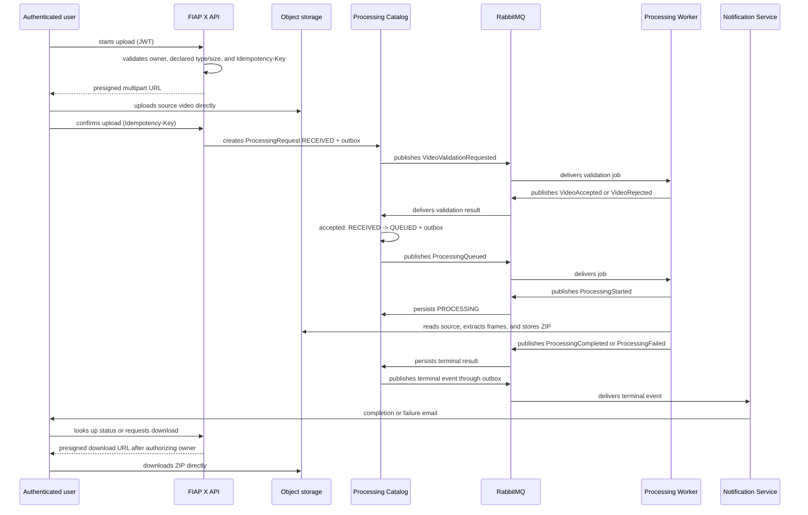

# FIAP X architecture foundation

## Purpose and scope

FIAP X receives an authenticated video, extracts frames, and delivers a ZIP file to the request owner. Processing is asynchronous, allowing multiple videos to be handled in parallel without losing requests during traffic spikes. The first release runs on Kubernetes from versioned manifests, on a local cluster, with every dependency provided by a container in the same topology.

The initial product scope is deliberately conservative:

| Rule                                  | Decision                                                                                   |
| ------------------------------------- | ------------------------------------------------------------------------------------------ |
| Accepted files                        | MP4 and MOV                                                                                |
| Maximum size                          | 500 MB                                                                                     |
| Maximum duration                      | 10 minutes                                                                                 |
| Extraction                            | 1 frame per second                                                                         |
| Source-video and ZIP retention        | 7 days                                                                                     |
| Accounts                              | Provisioned only by an administrator in the OIDC identity provider                         |
| Processing attempts                   | One business attempt; a terminal error results in `FAILED`                                 |
| Actual file validation                | Asynchronous in the Worker with FFprobe, before processing is queued                       |
| Binary transfer                       | Multipart upload and download through short-lived, API-issued presigned object-storage URLs |
| Upload-confirmation idempotency       | Mandatory `Idempotency-Key`                                                                |
| Cancellation                          | Not available in the MVP                                                                   |
| Retention after 7 days                | Object storage removes binaries; history and metadata remain in PostgreSQL                 |
| Runtime                               | Kubernetes with versioned manifests; Docker Compose for the developer loop                 |

Upload, status lookup, and download are allowed only to the user whose JWT `sub` matches the request's `ownerUserId`. In this version, there are no application roles beyond the operational administrator who provisions accounts, and there is no self-registration.

## Platform decision: local-first

Every dependency runs as a container next to the services. This is not a temporary substitute for a cloud environment — it is the target architecture for this release, and it satisfies the challenge's recommended stack directly (Docker/Kubernetes, RabbitMQ, PostgreSQL, Prometheus/Grafana, GitHub Actions).

Each dependency is reached through a port with a single adapter, so the runtime is a configuration choice rather than a design constraint. Two rules keep it that way:

- **Standard protocols only.** OIDC/JWKS for identity, the S3 API for object storage, SMTP for email, AMQP for messaging. No provider-specific SDK reaches the application layer.
- **Standard claims and fields only.** A JWT guard reads `sub`, `iss`, `aud`, and `exp`. Anything proprietary couples the domain to one vendor and turns a configuration change into a code change.

A managed-cloud deployment stays available as a later evolution under these rules: it would replace adapters and environment variables, not services or contracts.

## Services: four deployable units

| Service                  | Single responsibility                                                                                                                                                      | Technology/base                                       | Out of scope                                            |
| ------------------------ | ---------------------------------------------------------------------------------------------------------------------------------------------------------------------------- | ----------------------------------------------------- | ------------------------------------------------------- |
| **FIAP X API**           | HTTP edge: validates JWTs, issues presigned object-storage URLs, confirms uploads idempotently, creates requests, and exposes status/download to the owner.                 | NestJS/TypeScript; OIDC provider; S3-compatible storage | Processing transition rules, FFmpeg, email              |
| **Processing Catalog**   | Owns the `ProcessingRequest` lifecycle, status queries, and reliable event publishing through a transactional outbox. Consumes validation and processing events.            | NestJS/TypeScript; PostgreSQL; RabbitMQ               | Storing binaries, extracting frames, sending email      |
| **Processing Worker**    | Consumes validation and processing jobs, uses FFprobe/FFmpeg, creates the ZIP, stores it in object storage, and publishes result events. Scales horizontally.               | NestJS/TypeScript; FFmpeg; S3-compatible storage; RabbitMQ | Deciding request lifecycle, authenticating users        |
| **Notification Service** | Consumes terminal events and sends completion or failure email; records its own delivery to prevent duplicate notifications.                                                | NestJS/TypeScript; RabbitMQ; SMTP                     | Changing `ProcessingRequest` state                      |

Services are separated by responsibility and scaling profile: the API scales with HTTP traffic; workers scale with queue depth and CPU cost; notifications do not compete with the processing path. This preserves the supplied C4 design instead of consolidating everything into a single deployment.

## Canonical flow

### State machine

`RECEIVED -> QUEUED -> PROCESSING -> COMPLETED`

`RECEIVED | QUEUED | PROCESSING -> FAILED`

`COMPLETED` and `FAILED` are terminal states. The `ProcessingRequest` aggregate is the only place that can validate and persist a transition. Repeated messages must be idempotent: repeating the same terminal update must not create a new state or external effect.

A single business attempt does not eliminate infrastructure reliability: pending outbox publication must be retried until the broker confirms it; consumers must acknowledge a message only after persisting its effect. The Worker uses publisher confirms and acknowledges the job only after publishing its result; a technical redelivery can repeat the message, but does not create a new business attempt. Object keys are deterministic by `processingRequestId` and `attemptId`, and the Catalog deduplicates by `eventId`.

Validation or processing errors are not automatically reprocessed: they record a safe code (`FORMATO_INVALIDO`, `DURACAO_EXCEDIDA`, or `PROCESSAMENTO_FALHOU`) and finalize the request as `FAILED`. Email also has only one attempt; a delivery failure is recorded and monitored, but does not change the video's terminal state.

## Data, integration, and platform resources

| Resource                     | Owner/use                                                                                                                                                                                                                                                                |
| ---------------------------- | -------------------------------------------------------------------------------------------------------------------------------------------------------------------------------------------------------------------------------------------------------------------------- |
| OIDC identity provider       | Authentication. The API validates JWTs through OIDC/JWKS and uses `sub` as the stable identity. Provisioning is administrative. Only standard claims are read.                                                                                                            |
| S3-compatible object storage | Private binaries: source videos and ZIP packages. After authorization, the API issues short-lived presigned URLs for multipart upload and download. PostgreSQL stores only keys, size, checksum, and metadata; lifecycle rules remove objects after 7 days.                |
| PostgreSQL                   | `ProcessingRequest` and the `outbox` table belong to the Processing Catalog. Notifications have their own delivery record. Do not share tables between services.                                                                                                          |
| RabbitMQ                     | Durable asynchronous commands/events. `VideoValidationRequested`, validation results, and the processing lifecycle travel exclusively over AMQP; consumers are idempotent. Each queue has a dead-letter queue.                                                             |
| SMTP mail service            | Success/failure emails sent only by the Notification Service.                                                                                                                                                                                                             |
| Prometheus and Grafana       | Structured logs, metrics, and alerts for all services. Each service exposes `/metrics`.                                                                                                                                                                                   |
| Kubernetes                   | Runs the four containers plus their dependencies, with workers scaled by queue depth. A local cluster is the deployment target for this release.                                                                                                                          |
| Versioned manifests          | Declare namespaces, deployments, services, autoscaling, and secrets for the whole topology. Docker Compose covers the inner developer loop.                                                                                                                                |

Minimum integration contracts:

- `VideoValidationRequested`: `eventId`, `processingRequestId`, `ownerUserId`, `sourceStorageKey`, `occurredAt`.
- `VideoAccepted` or `VideoRejected`: `eventId`, `processingRequestId`, `failureCode` when rejected, `occurredAt`.
- `ProcessingQueued`: `eventId`, `processingRequestId`, `ownerUserId`, `sourceStorageKey`, `attemptId`, `occurredAt`.
- `ProcessingStarted`, `ProcessingCompleted`, or `ProcessingFailed`: `eventId`, `processingRequestId`, `attemptId`, `zipStorageKey` or `failureCode`, `occurredAt`.
- Terminal event: `eventId`, `processingRequestId`, `ownerUserId`, `status`, `zipStorageKey` or `failureReason`, `occurredAt`.

All contracts will be versioned, include an `eventId` for deduplication, and propagate a `correlationId` from upload onward. The API never exposes the storage key; after reauthorizing the owner, it returns a presigned URL with a short TTL. Upload confirmation requires an `Idempotency-Key`: repeating the same key returns the same request, never another processing operation.

## Concurrency and scaling

The Worker's heavy work runs in FFmpeg, an operating-system process with its own threads. The Node event loop supervises it and is never on the critical path, so `worker_threads` adds nothing — it would replicate the JavaScript runtime without replicating the work. Scaling therefore has two axes:

- **Vertical, inside a pod**: a configured `prefetchCount` per queue bounds in-flight messages, and FFmpeg receives an explicit thread count matching the pod's CPU limit. FFmpeg reads the host's core count, not the cgroup's, so an implicit value causes throttling.
- **Horizontal, across pods**: replicas compete on the same queue and are scaled by queue depth. This is the primary axis.

An unbounded `prefetchCount` is a defect, not a default: unacknowledged messages leave the queue depth, which blinds the autoscaler while a single pod holds the backlog.

## Quality, operations, and security

- Immutable containers, health checks, and independent deployment on Kubernetes; worker autoscaling based on queue depth.
- The API pre-validates JWTs, the declared extension/MIME type, and size; the Worker validates actual integrity and duration with FFprobe before queuing processing. Files and metadata are private by default.
- Secrets reside in Kubernetes secrets, never in the repository or images.
- Unit tests cover the state machine and authorization rules; integration tests cover PostgreSQL/outbox, RabbitMQ, object storage, and the terminal flow; end-to-end tests cover upload, status, email, and authorized download.
- CI runs linting, tests, and image analysis; CD publishes images and applies manifests with environment approval.
- Minimum metrics: accepted/rejected uploads, queue depth/age, processing duration and failure rate, email failures, authorized/denied downloads, and outbox failures.

## Explicit MVP boundaries

- No self-registration, user roles, administrative dashboard, billing, ZIP sharing, or user cancellation.
- No automatic business-rule retries or user-initiated reprocessing. A future policy may add administrative reprocessing with a new `attemptId` and audit trail.
- No automatic email-delivery retry; notification failures are recorded, measurable, and investigable.
- Presigned URLs do not make the bucket public: they are temporary permissions scoped to a single object.
- Kubernetes is a fixed decision; the cluster's location is not. Detailed network topology and numeric RTO/RPO targets remain implementation choices.
- Managed-cloud deployment is an available evolution, not a requirement, and must not leak provider-specific details into the domain.

## Traceability to the challenge

| Hackathon requirement               | Foundation response                                                                                      |
| ----------------------------------- | ---------------------------------------------------------------------------------------------------------- |
| More than one video at a time       | Horizontal stateless Workers, bounded prefetch, and RabbitMQ decoupling upload from CPU work.             |
| Do not lose requests during spikes  | PostgreSQL persistence, transactional outbox, durable broker/queues, dead-letter queues, and idempotent effects. |
| Username and password               | OIDC provider; the API validates JWTs and enforces ownership through `sub`.                               |
| Status listing by user              | The API queries the Catalog filtered by `ownerUserId`.                                                    |
| Error notification                  | A `FAILED` event is consumed by the Notification Service and sent over SMTP.                              |
| Persistence, scale, testing, CI/CD  | PostgreSQL/object storage/RabbitMQ, scalable containers, testing strategy, and pipeline defined above.    |

## Sources

- `POSTECH - SOAT - Fase 5 - Hacka.pdf` — functional, technical, and deliverable requirements.
- `docs/FIAP X.pdf` — ubiquitous language, event storming, bounded contexts, and C4 diagrams.
