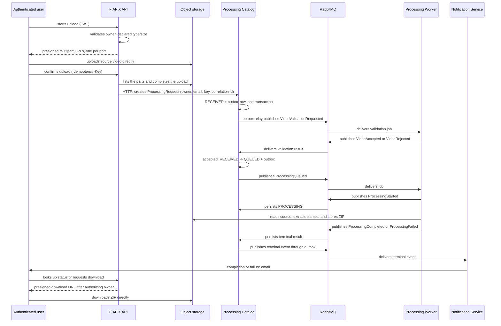

# FIAP X architecture foundation

This document fixes the product rules and the architecture every repository builds against. It was written on 2026-09-19, before the slices were built, and revised on 2026-09-29 to match what S1 to S9a delivered. Where a later decision changed it, the text states the current rule and names the decision (`AD-nnn`) recorded, with its reason and trade-off, in the [cross-repository decision log](../.specs/STATE.md). How to run, test and operate the system is in the [README](../README.md).

## Purpose and scope

FIAP X receives an authenticated video, extracts frames, and delivers a ZIP file to the request owner. Processing is asynchronous, allowing multiple videos to be handled in parallel without losing requests during traffic spikes. Every dependency runs as a container in the same topology, from versioned files: Docker Compose is the everyday loop and CI's integration gate, and the same topology runs on a local Kubernetes cluster (kind) from versioned manifests.

The initial product scope is deliberately conservative:

| Rule                                  | Decision                                                                                   |
| ------------------------------------- | ------------------------------------------------------------------------------------------ |
| Accepted files                        | MP4 (`.mp4`, `video/mp4`) and MOV (`.mov`, `video/quicktime`)                              |
| Maximum size                          | 500 MB                                                                                     |
| Maximum duration                      | 10 minutes                                                                                 |
| Extraction                            | 1 frame per second                                                                         |
| Source-video and ZIP retention        | 7 days                                                                                     |
| Accounts                              | Provisioned only by an administrator in the OIDC identity provider                         |
| Processing attempts                   | One business attempt; a terminal error results in `FAILED`                                 |
| Actual file validation                | Asynchronous in the Worker with FFprobe, before processing is queued                       |
| Binary transfer                       | Multipart upload and download through short-lived, API-issued presigned object-storage URLs |
| Upload-confirmation idempotency       | Mandatory `Idempotency-Key`                                                                |
| Cancellation                          | Not available in the MVP                                                                   |
| Retention after 7 days                | Object storage removes binaries; history and metadata remain in PostgreSQL                 |
| Runtime                               | Docker Compose for the developer loop and CI; a local kind cluster from versioned manifests (AD-018) |

Upload, status lookup, and download are allowed only to the user whose JWT `sub` matches the request's `ownerUserId`. Another user's request is indistinguishable from one that does not exist: both answer 404. In this version, there are no application roles beyond the operational administrator who provisions accounts, and there is no self-registration.

## Platform decision: local-first

Every dependency runs as a container next to the services (AD-005). This is not a temporary substitute for a cloud environment — it is the target architecture for this release, and it satisfies the challenge's recommended stack directly (Docker/Kubernetes, RabbitMQ, PostgreSQL, Prometheus/Grafana, GitHub Actions). The one recommended piece left out is the Redis cache: deduplication and idempotency live in PostgreSQL and in deterministic object keys, because a deduplication record must commit in the same transaction as the transition it guards (AD-008).

| Concern        | Local implementation                                        | Protocol   |
| -------------- | ----------------------------------------------------------- | ---------- |
| Identity       | Keycloak, realm `fiapx`                                     | OIDC/JWKS  |
| Object storage | RustFS, one private bucket `fiapx` (replaced MinIO, AD-014) | S3 API     |
| Database       | PostgreSQL, one schema and role per service (AD-009)        | SQL        |
| Messaging      | RabbitMQ 4, quorum queues                                   | AMQP       |
| Email          | Mailpit                                                     | SMTP       |
| Observability  | Prometheus and Grafana                                      | `/metrics` |

Each dependency is reached through a port with a single adapter, so the runtime is a configuration choice rather than a design constraint. Two rules keep it that way:

- **Standard protocols only.** OIDC/JWKS for identity, the S3 API for object storage, SMTP for email, AMQP for messaging. No provider-specific SDK or CLI reaches the application layer, and the platform's scripts use none either: storage is bootstrapped and inspected with plain `aws-cli`, which is what let RustFS replace MinIO as an image and credentials change when MinIO's images stopped being pullable (AD-014).
- **Standard claims and fields only.** The API verifies the JWT's signature (RS256, against the realm's JWKS), `iss`, `aud` and `exp`, and reads two claims: `sub`, the stable identity and the only authorization input, and the standard OIDC `email` claim, read once at the edge so the owner can be notified (AD-015). Anything proprietary — a vendor claim, or the identity provider's admin API — couples the domain to one vendor and turns a configuration change into a code change.

A managed-cloud deployment stays available as a later evolution under these rules: it would replace adapters and environment variables, not services or contracts.

## Services: four deployable units

The system is four services in four repositories (AD-001), plus `fiap-x-platform`, which holds what belongs to the system as a whole — this document, the decision log, the Compose topology, the Kubernetes manifests, the end-to-end tests and CI governance — and is not a service (AD-007).

| Service                  | Single responsibility                                                                                                                                                      | Technology/base                                       | Out of scope                                            |
| ------------------------ | ---------------------------------------------------------------------------------------------------------------------------------------------------------------------------- | ----------------------------------------------------- | ------------------------------------------------------- |
| **FIAP X API**           | HTTP edge: validates JWTs, issues presigned object-storage URLs, confirms uploads idempotently, creates requests in the Catalog over HTTP, and exposes status/download to the owner. | NestJS/TypeScript; OIDC provider; S3-compatible storage | Processing transition rules, FFmpeg, email              |
| **Processing Catalog**   | Owns the `ProcessingRequest` lifecycle, status queries, and reliable event publishing through a transactional outbox. Consumes validation and processing events.            | NestJS/TypeScript; PostgreSQL (TypeORM); RabbitMQ     | Storing binaries, extracting frames, sending email      |
| **Processing Worker**    | Consumes validation and processing jobs, uses FFprobe/FFmpeg, creates the ZIP, stores it in object storage, and publishes result events. Scales horizontally.               | NestJS/TypeScript; FFmpeg; S3-compatible storage; RabbitMQ | Deciding request lifecycle, authenticating users        |
| **Notification Service** | Consumes terminal events and sends completion or failure email; records its own delivery to prevent duplicate notifications.                                                | NestJS/TypeScript; PostgreSQL (TypeORM); RabbitMQ; SMTP | Changing `ProcessingRequest` state                      |

Services are separated by responsibility and scaling profile: the API scales with HTTP traffic; workers scale with queue depth and CPU cost; notifications do not compete with the processing path. This preserves the supplied C4 design instead of consolidating everything into a single deployment. The services share no tables and no code: each keeps its own copy of the message DTOs it reads or writes.

## Canonical flow

```mermaid
sequenceDiagram
    participant U as Authenticated user
    participant A as FIAP X API
    participant S as Object storage
    participant C as Processing Catalog
    participant B as RabbitMQ
    participant W as Processing Worker
    participant N as Notification Service

    U->>A: starts upload (JWT)
    A->>A: validates owner, declared type/size
    A-->>U: presigned multipart URLs, one per part
    U->>S: uploads source video directly
    U->>A: confirms upload (Idempotency-Key)
    A->>S: lists the parts and completes the upload
    A->>C: HTTP: creates ProcessingRequest (owner, email, key, correlation id)
    C->>C: RECEIVED + outbox row, one transaction
    C->>B: outbox relay publishes VideoValidationRequested
    B->>W: delivers validation job
    W->>B: publishes VideoAccepted or VideoRejected
    B->>C: delivers validation result
    C->>C: accepted: RECEIVED -> QUEUED + outbox
    C->>B: publishes ProcessingQueued
    B->>W: delivers job
    W->>B: publishes ProcessingStarted
    B->>C: persists PROCESSING
    W->>S: reads source, extracts frames, and stores ZIP
    W->>B: publishes ProcessingCompleted or ProcessingFailed
    B->>C: persists terminal result
    C->>B: publishes terminal event through outbox
    B->>N: delivers terminal event
    N->>U: completion or failure email
    U->>A: looks up status or requests download
    A-->>U: presigned download URL after authorizing owner
    U->>S: downloads ZIP directly
```

### State machine

`RECEIVED -> QUEUED -> PROCESSING -> COMPLETED`

`QUEUED -> COMPLETED`

`RECEIVED | QUEUED | PROCESSING -> FAILED`

`COMPLETED` and `FAILED` are terminal states. The `ProcessingRequest` aggregate is the only place that can validate and persist a transition. Repeated messages must be idempotent: repeating the same terminal update must not create a new state or external effect.

`ProcessingStarted` and `ProcessingCompleted` travel on different queues, so the Catalog can receive them in either order. It applies each lifecycle event under a row lock (`SELECT … FOR UPDATE`) and tolerates the order (AD-013): a completion is accepted from `QUEUED`, since the Worker publishes the start first and a completion proves processing began; a start that finds the request already `PROCESSING` or terminal changes nothing; a completion that restates the stored archive key changes nothing and publishes nothing. So `PROCESSING` can be skipped, and a `COMPLETED` request is not proof that its start was observed. Each of these no-ops is still recorded as processed.

A single business attempt does not eliminate infrastructure reliability. Nothing in the Catalog publishes to the broker except the outbox relay: a transition, its deduplication record and the events it emits commit in one transaction, and the relay marks an outbox row sent only after the broker confirms it (AD-010). Delivery is therefore at-least-once, and every consumer deduplicates by `eventId` — the Catalog and the Notification Service in PostgreSQL. Consumers acknowledge a message only after persisting its effect. The Worker acknowledges a job only after its result is published to the broker; its outcome `eventId`s are derived from the consumed event's id, so a technical redelivery republishes the same ids and does not create a new business attempt. Object keys are deterministic by `processingRequestId` and `attemptId` (`zips/<processingRequestId>/<attemptId>/frames.zip`), so a redelivery overwrites the same object.

Validation or processing errors are not automatically reprocessed: they record a safe code (`FORMATO_INVALIDO`, `DURACAO_EXCEDIDA`, or `PROCESSAMENTO_FALHOU`) and finalize the request as `FAILED`. The code stays internal; the owner sees a fixed user-facing sentence (`failureReason`) in the status and in the email. Email also has only one attempt; a delivery failure is recorded and monitored, but does not change the video's terminal state.

### Message failures, retries and dead-lettering

A message that cannot be handled is a technical failure, not a business attempt, and the rule of one business attempt is unaffected by it. The broker's definitions in this repository own every queue that carries traffic and its `<queue>.dlq`, declared before any service connects, as quorum queues (AD-012). Shared queue behaviour is set by broker policy, never by queue arguments in a service, so no declarer can contradict another (AD-011). The `dead-letter` policy routes rejected messages to the DLQ and sets `delivery-limit: 5`, which bounds a message that crashes its consumer.

Every service classifies its own failures the same way:

- **Permanent**: the message itself is wrong (it breaks a domain rule, or its body is not a valid event). It is rejected without requeue, so it lands in the DLQ at once for inspection.
- **Transient**: anything else, such as the database, storage or broker briefly away. It is requeued after a pause (`RABBITMQ_RETRY_BACKOFF_MS`, 1000 ms by default) and retried indefinitely. RabbitMQ does not count an explicit requeue against the delivery limit, so the pause is what keeps the loop from spinning while a dependency is down.

## Data, integration, and platform resources

| Resource                     | Owner/use                                                                                                                                                                                                                                                                |
| ---------------------------- | -------------------------------------------------------------------------------------------------------------------------------------------------------------------------------------------------------------------------------------------------------------------------- |
| OIDC identity provider       | Keycloak. The API validates JWTs through OIDC/JWKS and uses `sub` as the stable identity; the `email` claim is read once for notification (AD-015). Provisioning is administrative; the realm disables self-registration. Only standard claims are read.                  |
| S3-compatible object storage | RustFS (AD-014). Private binaries: source videos (`sources/`) and ZIP packages (`zips/`). After authorization, the API issues short-lived presigned URLs for multipart upload and download. PostgreSQL stores only keys, size, and metadata; the bucket's lifecycle rules remove objects after 7 days and abort an unconfirmed multipart upload after 1 day. The bucket has no policy, so anonymous access is refused. |
| PostgreSQL                   | One database, one schema and least-privilege role per service (`catalog`, `notification`), evolved only by versioned migrations each service runs at boot; `synchronize` is never enabled (AD-009). `ProcessingRequest`, the processed-event records and the `outbox` table belong to the Processing Catalog; the Notification Service has its own delivery record. No service reads another's tables. The database creation script is generated from the migrations. |
| RabbitMQ                     | Durable asynchronous commands/events on quorum queues. `VideoValidationRequested`, validation results, the processing lifecycle and the terminal event travel exclusively over AMQP; consumers are idempotent. Each queue has a dead-letter queue (AD-012).               |
| SMTP mail service            | Mailpit locally. Success/failure emails sent only by the Notification Service, one per terminal event.                                                                                                                                                                   |
| Prometheus and Grafana       | Metrics and a provisioned overview dashboard, versioned as files; each service exposes `/metrics`, `/health` (readiness) and `/health/live` (liveness) and writes structured JSON logs (AD-017). No business service depends on them.                                     |
| Kubernetes                   | A local kind cluster named `fiapx` runs the four services and their dependencies from published images, with the Worker scaled by queue depth through KEDA (AD-018).                                                                                                     |
| Versioned manifests          | One kustomization in `k8s/`: namespace, Deployments, StatefulSets, Services, the storage bootstrap Job and the KEDA `ScaledObject`. Secrets are generated per cluster and never versioned. Docker Compose covers the inner developer loop.                                   |

Minimum integration contracts, as the services implement them. Every event also carries an optional `correlationId` (below).

- `VideoValidationRequested`: `eventId`, `processingRequestId`, `ownerUserId`, `sourceStorageKey`, `occurredAt`.
- `VideoAccepted` or `VideoRejected`: `eventId`, `processingRequestId`, `failureCode` when rejected, `occurredAt`.
- `ProcessingQueued`: `eventId`, `processingRequestId`, `ownerUserId`, `sourceStorageKey`, `attemptId`, `occurredAt`.
- `ProcessingStarted`, `ProcessingCompleted`, or `ProcessingFailed`: `eventId`, `processingRequestId`, `attemptId`, `zipStorageKey` (completed) or `failureCode` (failed), `occurredAt`.
- Terminal event (`terminal.event` on `notification.terminal`): `eventId`, `processingRequestId`, `ownerUserId`, `ownerEmail`, `status`, `zipStorageKey` or `failureReason`, `attemptId` when there is one, `occurredAt`.

The contracts are documented JSON with no shared package and no version field; each service keeps local DTOs, and a contract evolves only by adding optional fields, so messages written before a change keep flowing. Every event includes an `eventId` for deduplication. Only the terminal event carries the owner's email, so the Worker never sees personal data (AD-015). One correlation id follows a video from upload to email: the API assigns it at the edge (the caller's `X-Correlation-Id` when valid, a fresh UUID otherwise), the Catalog stores it with the request and puts it on every event it publishes, and an absent or invalid id never fails a message (AD-016). The API never exposes the storage key; after reauthorizing the owner, it returns a presigned URL with a short TTL. Upload confirmation requires an `Idempotency-Key`: repeating the same key returns the same request, never another processing operation.

## Concurrency and scaling

The Worker's heavy work runs in FFmpeg, an operating-system process with its own threads. The Node event loop supervises it and is never on the critical path, so `worker_threads` adds nothing — it would replicate the JavaScript runtime without replicating the work (AD-006). Scaling therefore has two axes:

- **Vertical, inside a pod**: a configured `prefetchCount` per queue bounds in-flight messages (by default 20 on `video-validation`, where FFprobe is cheap, and 1 on `processing`), and FFmpeg receives an explicit thread count matching the container's CPU limit. FFmpeg reads the host's core count, not the cgroup's, so an implicit value causes throttling. Under Compose, `WORKER_CPUS` sets both the CPU limit and `FFMPEG_THREADS`, and a check fails when they disagree; on the cluster each replica has 1 CPU and `FFMPEG_THREADS=1`.
- **Horizontal, across pods**: replicas compete on the same queue and are scaled by queue depth. This is the primary axis. On the kind cluster, KEDA's RabbitMQ scaler drives the Worker from 1 to 5 replicas, targeting 2 messages per replica on `processing` and 20 on `video-validation` (AD-018); under Compose, `WORKER_REPLICAS` sets a fixed number of replicas.

An unbounded `prefetchCount` is a defect, not a default: unacknowledged messages leave the queue depth, which blinds the autoscaler while a single pod holds the backlog.

## Quality, operations, and security

- Immutable containers with readiness and liveness health checks, deployed independently; worker autoscaling based on queue depth. Each service's CI publishes a multi-arch image to GHCR on every merge to `main`, and the cluster runs exactly those images (AD-018).
- The API pre-validates JWTs, the declared extension/MIME type, and size, and checks the uploaded size against the declared one on confirmation; the Worker validates actual integrity, format and duration with FFprobe before queuing processing. Files and metadata are private by default.
- No credential is versioned for a deployment: on the cluster, secrets are generated at random per cluster into Kubernetes Secrets and never applied from a file (AD-018). The credentials in the Compose topology and the demo realm are local development fixtures.
- Logs carry no tokens, email addresses or storage keys, removed by each logger's configuration, and metric labels hold only bounded values, never a user, an email or an id (AD-017).
- Unit tests cover the state machine and authorization rules; integration tests cover PostgreSQL/outbox, RabbitMQ, object storage, and the terminal flow; an end-to-end smoke against the running stack (Compose and kind) covers upload, status, owner scope, email, and authorized download.
- CI runs linting, type checking, unit and end-to-end tests in every service and exercises the whole stack in this repository; CD publishes the images, which the kind cluster pulls. Each repository's `main` is protected by a ruleset with required checks.
- Minimum metrics: accepted/rejected uploads, queue depth, processing duration and failure rate, email failures, authorized/denied downloads, and outbox pending rows, oldest pending age and publish failures. They are shown on a provisioned Grafana dashboard; no alerting rules are defined in this release.

## Explicit MVP boundaries

- No self-registration, user roles, administrative dashboard, billing, ZIP sharing, or user cancellation.
- No automatic business-rule retries or user-initiated reprocessing. A future policy may add administrative reprocessing with a new `attemptId` and audit trail. Redelivering a message after a technical failure (above) is not a business retry.
- No automatic email-delivery retry; notification failures are recorded, measurable, and investigable.
- Presigned URLs do not make the bucket public: they are temporary permissions scoped to a single object.
- Kubernetes is a fixed decision; the cluster's location is not. This release runs it locally on kind. Detailed network topology and numeric RTO/RPO targets remain implementation choices.
- Managed-cloud deployment is an available evolution, not a requirement, and must not leak provider-specific details into the domain.

## Traceability to the challenge

| Hackathon requirement               | Foundation response                                                                                      |
| ----------------------------------- | ---------------------------------------------------------------------------------------------------------- |
| More than one video at a time       | Horizontal stateless Workers, bounded prefetch, and RabbitMQ decoupling upload from CPU work; KEDA scales the Worker by queue depth on the cluster. |
| Do not lose requests during spikes  | Direct-to-storage uploads, PostgreSQL persistence, transactional outbox, durable quorum queues, dead-letter queues, and idempotent effects. |
| Username and password               | OIDC provider (Keycloak); the API validates JWTs and enforces ownership through `sub`.                    |
| Status listing by user              | The API queries the Catalog filtered by `ownerUserId`.                                                    |
| Error notification                  | A `FAILED` terminal event is consumed by the Notification Service and sent over SMTP to the address from the token's `email` claim. |
| Persistence, scale, testing, CI/CD  | PostgreSQL/object storage/RabbitMQ, scalable containers on Kubernetes, the testing strategy, and GitHub Actions with images published to GHCR, as above. |

## Sources

- `docs/POSTECH - SOAT - Fase 5 - Hacka.pdf` — functional, technical, and deliverable requirements.
- `docs/FIAP X.pdf` — ubiquitous language, event storming, bounded contexts, and C4 diagrams; being redrawn for the local-first platform and not yet in this repository.
- [`.specs/STATE.md`](../.specs/STATE.md) — the cross-repository decisions (AD-001 to AD-018) cited above.
